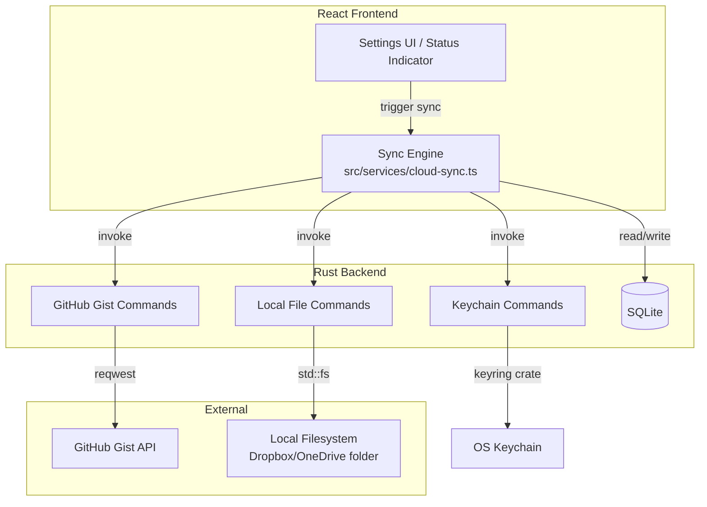
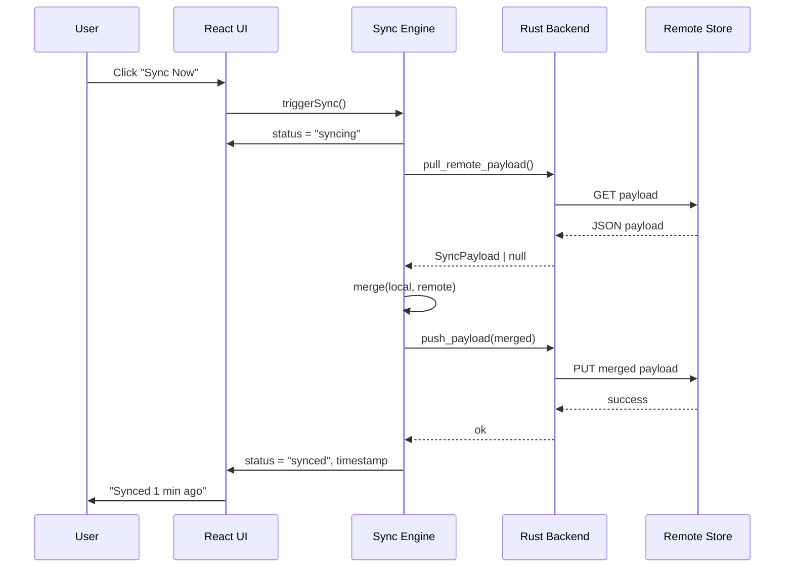
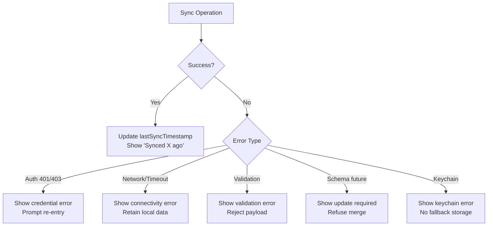

# Design Document: Cloud Sync

## Overview

Cloud Sync adds optional cross-machine data synchronization to D2R Tracker. The system follows an offline-first architecture where SQLite remains the single source of truth and sync operates as a secondary replication layer. Two backends are supported: GitHub Gist (private) for cloud storage, and a local folder path for integration with existing file-sync services (Dropbox, OneDrive, Google Drive).

The sync engine lives in the TypeScript frontend (`src/services/cloud-sync.ts`) and orchestrates a pull → merge → push cycle. Sensitive operations (keychain access, GitHub API calls, atomic file writes) are delegated to Rust commands in the Tauri backend. Conflict resolution uses field-level merging with last-write-wins semantics, ensuring non-conflicting changes from different machines are combined without data loss.

### Design Goals

- **Offline-first**: All local operations succeed regardless of sync state
- **Zero data loss**: Field-level merge preserves non-conflicting edits from both sides
- **Security**: GitHub tokens never reach the JS context; stored in OS keychain
- **Deterministic output**: Lexicographic JSON serialization ensures stable diffs
- **Minimal footprint**: No new JS dependencies; Rust handles HTTP and keychain via `reqwest` and `keyring`

## Architecture



### Sync Cycle Flow



### Key Architectural Decisions

| Decision | Rationale |
|----------|-----------|
| Sync engine in TypeScript | Merge logic benefits from direct SQLite access via existing Tauri commands; keeps Rust layer thin and focused on I/O |
| GitHub API calls in Rust | Token never exposed to JS context; avoids CORS; Rust `reqwest` handles HTTPS natively |
| Atomic writes for local backend | Prevents half-written files from being picked up by Dropbox/OneDrive mid-sync |
| Soft deletes with `deleted_at` | Allows deletion intent to propagate across machines without permanent record loss |
| Schema versioning | Forward-compatible: newer apps reject payloads from future versions gracefully |

## Components and Interfaces

### Sync Engine Service (`src/services/cloud-sync.ts`)

The central orchestrator. Stateless between sync cycles — all persistent state lives in SQLite and localStorage.

```typescript
// Public API
interface SyncEngine {
  triggerSync(): Promise<SyncResult>;
  getStatus(): SyncStatus;
  testConnection(): Promise<TestConnectionResult>;
  pushOnClose(): Promise<void>;
}

interface SyncResult {
  success: boolean;
  recordsMerged: number;
  conflicts: number;
  error?: string;
}

type SyncState = "not_configured" | "synced" | "syncing" | "error";

interface SyncStatus {
  state: SyncState;
  lastSyncAt: string | null;  // ISO 8601
  errorMessage: string | null;
}

interface TestConnectionResult {
  success: boolean;
  error?: string;
}
```

### Rust Commands (Tauri invoke handlers)

New commands added to `src-tauri/src/commands.rs` (or a new `sync.rs` module):

| Command | Signature | Purpose |
|---------|-----------|---------|
| `save_sync_token` | `(service: String, token: String) → Result<()>` | Store token in OS keychain |
| `get_sync_token` | `(service: String) → Result<Option<String>>` | Retrieve token from keychain |
| `delete_sync_token` | `(service: String) → Result<()>` | Remove token from keychain |
| `github_gist_pull` | `(gist_id: Option<String>) → Result<Option<GistPullResult>>` | Fetch payload from Gist (uses keychain token internally) |
| `github_gist_push` | `(gist_id: Option<String>, payload: String) → Result<GistPushResult>` | Create or update Gist with payload |
| `github_gist_test` | `() → Result<TestResult>` | Verify token validity without full sync |
| `local_file_pull` | `(folder_path: String) → Result<Option<String>>` | Read `d2r-tracker-sync.json` from folder |
| `local_file_push` | `(folder_path: String, payload: String) → Result<()>` | Atomic write to folder |
| `local_folder_validate` | `(folder_path: String) → Result<bool>` | Check folder exists and is writable |

### UI Components

#### `CloudSyncSettings` (within Settings page)

Renders in the existing settings section list. Manages backend selection, credential input, folder picker, test connection, and auto-sync toggle.

```typescript
interface CloudSyncConfig {
  backend: "off" | "github_gist" | "local_folder";
  gistId: string | null;
  localFolderPath: string | null;
  autoSyncOnClose: boolean;
}
```

#### `SyncStatusIndicator` (sidebar footer)

Small component in the sidebar footer area (below the existing profile display) showing current sync state and a manual sync button.

```typescript
interface SyncStatusIndicatorProps {
  status: SyncStatus;
  onSync: () => void;
  disabled: boolean;
}
```

### Integration Points

- **App.tsx**: Mount `SyncStatusIndicator` in sidebar footer; wire `beforeunload`/Tauri close event for auto-sync
- **Settings.tsx**: Add `CloudSyncSettings` section after existing sections
- **api.ts**: Add invoke wrappers for new Rust commands

## Data Models

### Sync Payload Schema (v1)

```typescript
interface SyncPayload {
  schema_version: number;  // starts at 1
  timestamp: string;       // ISO 8601 UTC with ms: "2024-01-15T10:30:45.123Z"
  profiles: SyncRecord<ProfileData>[];
  runs: SyncRecord<RunData>[];
  items: SyncRecord<ItemData>[];
  herald_encounters: SyncRecord<HeraldEncounterData>[];
  colossal_ancient_attempts: SyncRecord<ColossalAncientAttemptData>[];
  anni_logs: SyncRecord<AnniLogData>[];
  xp_entries: SyncRecord<XpEntryData>[];
  keybind_profiles: SyncRecord<KeybindProfileData>[];
  routes: SyncRecord<RouteData>[];
  custom_areas: SyncRecord<CustomAreaData>[];
}

interface SyncRecord<T> {
  id: string;
  updated_at: string;      // ISO 8601 UTC with ms
  deleted_at: string | null; // soft-delete timestamp or null
  data: T;
}
```

Each `*Data` type mirrors the existing TypeScript types but without `id` (moved to wrapper) and with `updated_at` tracked at the record level.

### Sync Configuration (persisted in localStorage)

```typescript
interface SyncConfig {
  backend: "off" | "github_gist" | "local_folder";
  gistId: string | null;
  localFolderPath: string | null;
  autoSyncOnClose: boolean;
  lastSyncTimestamp: string | null;
}
```

Key: `d2r_sync_config`

### Merge Algorithm

The merge function operates on two `SyncPayload` objects (local and remote) and produces a merged `SyncPayload`:

```
merge(local, remote) → merged
```

**Per-collection merge**:
1. Build maps keyed by `id` for both local and remote collections
2. For each record present in either side:
   - **Local only**: Include in merged (Requirement 4.3)
   - **Remote only (no `deleted_at`)**: Include in merged (Requirement 4.4)
   - **Both sides modified**: Apply field-level merge (see below)

**Field-level merge for conflicted records**:
1. Compare `updated_at` of local vs remote record
2. For each field in the data object:
   - If field differs between versions, keep the value from the version with the later `updated_at`
   - If `updated_at` is identical, use lexicographically greater `id` as tiebreaker (Requirement 4.7)
3. For deletion conflicts:
   - Remote `deleted_at` > local `updated_at` → apply deletion
   - Local `updated_at` > remote `deleted_at` → preserve local, clear deletion (Requirement 4.8)

### Conflict Detection

A record is considered "conflicted" when:
- It exists in both local and remote payloads
- Both versions have `updated_at` timestamps newer than `lastSyncTimestamp`

### Entity Types Included in Sync

| Entity | Table | ID field | Key data fields |
|--------|-------|----------|-----------------|
| Profile | profiles | uuid | name, class, mode, magic_find |
| Run | runs | uuid | profile_id, area, duration_secs, started_at, finished_at, status, notes, player_count, route_id, tags |
| Item | items | uuid | run_id, profile_id, name, item_type, rarity, found_at, notes |
| Herald Encounter | herald_encounters | uuid | profile_id, tier, area, result, sunder_charm, notes, encountered_at |
| Colossal Ancient Attempt | colossal_ancient_attempts | uuid | profile_id, boss_name, attempt_number, result, drops, duration_secs, notes, attempted_at |
| Anni Log | anni_logs | uuid | profile_id, stats, notes, obtained_at |
| XP Entry | xp_entries | uuid | profile_id, run_id, level, xp_gained, duration_secs, area, notes, recorded_at |
| Keybind Profile | keybind_profiles | uuid | name, bindings |
| Route | routes | uuid | profile_id, name, areas |
| Custom Area | custom_areas | uuid | profile_id, name |

### Rust Keychain Service

```rust
// Uses the `keyring` crate
const SERVICE_NAME: &str = "d2r-tracker";

// Entry keys:
// - "github_token" — GitHub personal access token
```

### Rust Dependencies (additions to Cargo.toml)

```toml
reqwest = { version = "0.12", features = ["json", "rustls-tls"] }
keyring = "3"
```


## Correctness Properties

*A property is a characteristic or behavior that should hold true across all valid executions of a system — essentially, a formal statement about what the system should do. Properties serve as the bridge between human-readable specifications and machine-verifiable correctness guarantees.*

### Property 1: Payload structure completeness

*For any* valid database state containing at least one record, the serialized SyncPayload SHALL contain a positive integer `schema_version`, a valid ISO 8601 UTC timestamp with millisecond precision at the payload level, and every record in every entity collection SHALL have a non-empty `id` string and a valid ISO 8601 UTC `updated_at` timestamp with millisecond precision.

**Validates: Requirements 1.1**

### Property 2: Schema migration preserves data

*For any* valid SyncPayload conforming to schema version N-1, applying the migration function to produce schema version N SHALL result in a payload where every original record is present with all original field values unchanged (no data loss or corruption).

**Validates: Requirements 1.2**

### Property 3: Serialization round-trip

*For any* valid SyncPayload (including records with null-valued optional fields), serializing to JSON and then deserializing back SHALL produce a payload where all field names, values, types, and null optionals are identical to the original — including that null optional fields appear as JSON `null` keys rather than being omitted.

**Validates: Requirements 1.4, 10.4, 10.6**

### Property 4: Payload validation rejects invalid input

*For any* SyncPayload that is missing the schema version field, missing the payload-level timestamp, contains a record with an empty `id`, or contains a record with an invalid `updated_at` timestamp, the validation function SHALL reject the payload and return an error identifying which specific rule was violated.

**Validates: Requirements 1.5, 10.2**

### Property 5: Conflict detection correctness

*For any* pair of local and remote records sharing the same `id`, the merge engine SHALL identify the record as conflicted if and only if both the local `updated_at` and the remote `updated_at` are strictly more recent than the `lastSyncTimestamp`.

**Validates: Requirements 4.1**

### Property 6: Field-level merge for non-conflicting changes

*For any* two versions of the same record where changes are to disjoint sets of fields, the merged result SHALL contain each changed field's value from the version that modified it, and all unchanged fields SHALL retain their original values.

**Validates: Requirements 4.2**

### Property 7: One-sided records preserved

*For any* record that exists in only one side (local-only, or remote-only without a `deleted_at` timestamp), the merged result SHALL include that record unchanged.

**Validates: Requirements 4.3, 4.4**

### Property 8: Last-write-wins for same-field conflicts

*For any* two versions of the same record that modify the same field, the merged result SHALL contain the field value from the version with the more recent `updated_at` timestamp.

**Validates: Requirements 4.6**

### Property 9: Identical timestamp tiebreaker

*For any* two conflicting record versions with identical `updated_at` timestamps, the merged result SHALL use the field values from the version whose record `id` is lexicographically greater.

**Validates: Requirements 4.7**

### Property 10: Deletion vs modification conflict resolution

*For any* record that has been modified locally and carries a remote `deleted_at` timestamp: if `deleted_at` > local `updated_at`, the merged result SHALL mark the record as deleted; if local `updated_at` > `deleted_at`, the merged result SHALL preserve the local modification and clear the deletion marker. Additionally, for any record with a `deleted_at` timestamp on one side and no corresponding record on the other side, the deletion SHALL propagate to the merged result.

**Validates: Requirements 4.5, 4.8**

### Property 11: Token validation

*For any* string that is empty, composed entirely of whitespace characters, or longer than 255 characters, the token validation function SHALL reject it. *For any* non-empty, non-whitespace string of 1 to 255 characters, the token validation function SHALL accept it.

**Validates: Requirements 5.1, 5.6**

### Property 12: Lexicographic key ordering

*For any* valid SyncPayload, the serialized JSON output SHALL have all object keys in lexicographic (alphabetical) order at every nesting level.

**Validates: Requirements 10.1**

### Property 13: Ignore unrecognized fields

*For any* valid SyncPayload that contains additional fields not defined in the current schema version, deserialization SHALL succeed without error, the unrecognized fields SHALL not be persisted locally, and the recognized data SHALL be parsed correctly.

**Validates: Requirements 10.5**

## Error Handling

### Error Categories

| Category | Source | User-Facing Behavior | Recovery |
|----------|--------|---------------------|----------|
| Authentication (401/403) | GitHub API | "Authentication failed. Please re-enter your token." in Status Indicator | Prompt token re-entry in Settings |
| Network (timeout, 5xx) | GitHub API / unreachable host | "Sync failed: [reason]" in Status Indicator | Retry on next manual sync; local data unchanged |
| Rate Limiting (429) | GitHub API | "GitHub rate limit exceeded. Try again later." in Status Indicator | Wait and retry; local data unchanged |
| File I/O | Local folder backend | "Cannot access [path]: [OS error]" in Status Indicator | User fixes path in Settings; local data unchanged |
| Validation | Malformed payload | "Invalid sync data: [specific rule violated]" in Status Indicator | Reject payload; local data unchanged |
| Schema Version | Future schema | "Update required: sync data is from a newer version of D2R Tracker" | User updates app; no merge attempted |
| Keychain | OS keychain unavailable | "Cannot access system keychain: [reason]" in Settings | No fallback; refuse to store credentials elsewhere |
| Timeout | 30s sync / 10s close | "Sync timed out" in Status Indicator | Cancel operation; local data unchanged |

### Error Handling Principles

1. **Never lose local data**: All error paths preserve the local SQLite state unchanged
2. **Never block the UI**: Sync errors display only in the Status Indicator, never as modal dialogs during normal operation
3. **Specific error messages**: Each error identifies what failed and why (path, HTTP status, validation rule)
4. **Graceful degradation**: App continues functioning fully when sync fails; user can retry manually
5. **Log for diagnostics**: All sync errors are written to `console.error` with full context for debugging

### Error Flow



## Testing Strategy

### Unit Tests (Example-Based)

Unit tests cover specific scenarios, edge cases, and integration points:

- **Settings UI**: Correct rendering per backend selection, input masking toggle, folder picker invocation, confirmation dialog on backend change
- **Status Indicator**: Correct state display (not configured, synced, syncing, error), button disable during sync, keyboard accessibility (aria-label, Tab focus, Enter/Space operability)
- **Error conditions**: Auth error prompts re-entry, timeout at 30s, schema version rejection, keychain unavailable handling
- **Auto-sync on close**: Toggle persistence, 10s timeout cancellation, error logging without user interaction
- **Backend operations** (mocked): Gist creation on first sync, atomic write verification for local backend

### Property-Based Tests (Universal Properties)

Property-based tests validate the sync engine's core logic using `fast-check` (TypeScript) for the frontend merge/serialization logic:

- **Library**: `fast-check` (npm package)
- **Minimum iterations**: 100 per property
- **Tag format**: `Feature: cloud-sync, Property {N}: {title}`

Each correctness property (1–13 above) maps to a single property-based test. The generators will produce:
- Random `SyncPayload` objects with varying numbers of entities, field combinations, and timestamp values
- Random record pairs with controlled conflict scenarios (disjoint fields, overlapping fields, identical timestamps)
- Random strings for token validation (empty, whitespace, valid, oversized)
- Random payloads with injected extra fields for forward-compatibility testing

### Integration Tests

Integration tests verify the Rust backend commands with mocked external services:

- GitHub Gist API operations (create, read, update) using a mock HTTP server
- Keychain CRUD via `keyring` crate against the real OS keychain (in CI, can use a test service name)
- Local file operations: atomic write behavior, permission checks, missing folder handling
- Auto-sync lifecycle: Tauri close event → push → timeout handling

### Test File Organization

```
src/services/cloud-sync.test.ts          — Unit tests for sync engine
src/services/cloud-sync.property.test.ts — Property-based tests (Properties 1-13)
src/pages/Settings.test.tsx              — Existing file, add CloudSyncSettings tests
src-tauri/src/sync.rs                    — Rust module (unit tests inline)
```
