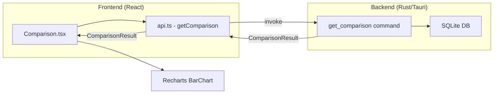

# Design Document: Comparison Mode

## Overview

Comparison Mode adds a dedicated page to the D2R Desktop Tracker that enables side-by-side comparison of farming efficiency between two subjects. A subject is either an area (e.g., "Ancient Tunnels" vs "Mephisto") or a date range (e.g., "last week" vs "this week"). The feature computes metrics such as items per hour, unique items per hour, and average time per run from existing `runs` and `items` tables — no new database tables are needed.

The backend exposes a single `get_comparison` Tauri command that accepts a discriminated input type (`ComparisonRequest`) specifying either an area comparison or a date-range comparison. This keeps the API surface small and allows future comparison types without adding new commands. The frontend adds a new `Comparison` page accessible from the sidebar navigation, using Recharts grouped bar charts for visualization.

### Design Decisions

| Decision | Rationale |
|----------|-----------|
| Single `get_comparison` command with discriminated union input | Fewer commands to register; extensible for future comparison types (e.g., session comparison) |
| Backend computes all metrics in one round-trip | Avoids multiple IPC calls; single DB lock acquisition |
| No new DB tables | All metrics are computed from existing `runs` + `items` data |
| Minimum sample size is a frontend display concern | Backend always returns metrics; frontend decides whether to show a warning |
| Reuse Recharts (already installed) | Consistent charting style with Statistics page |
| Percentage difference computed on frontend | Simple arithmetic; avoids coupling backend to presentation logic |

## Architecture



**Data flow:**
1. User selects comparison type (area or date range) and picks two subjects
2. Frontend calls `getComparison(request)` via Tauri `invoke`
3. Backend queries `runs` (filtered by profile + subject criteria) and joins with `items`
4. Backend computes all metrics for both subjects in a single command execution
5. Result returned to frontend as `ComparisonResult`
6. Frontend renders side-by-side cards, grouped bar chart, and percentage differences

## Components and Interfaces

### Backend: Rust Models

```rust
// New models in src-tauri/src/models.rs

#[derive(Debug, Serialize, Deserialize, Clone)]
#[serde(tag = "type")]
pub enum ComparisonRequest {
    #[serde(rename = "area")]
    Area {
        profile_id: String,
        area_a: String,
        area_b: String,
    },
    #[serde(rename = "date_range")]
    DateRange {
        profile_id: String,
        start_a: String,  // ISO 8601 date string (YYYY-MM-DD)
        end_a: String,
        start_b: String,
        end_b: String,
    },
}

#[derive(Debug, Serialize, Deserialize, Clone)]
pub struct SubjectMetrics {
    pub label: String,
    pub total_runs: i64,
    pub total_items: i64,
    pub total_unique_items: i64,
    pub total_duration_secs: i64,
    pub items_per_hour: f64,
    pub unique_items_per_hour: f64,
    pub items_per_run: f64,
    pub avg_time_per_run: f64,
    pub fastest_run_secs: Option<i64>,
    pub slowest_run_secs: Option<i64>,
}

#[derive(Debug, Serialize, Deserialize, Clone)]
pub struct ComparisonResult {
    pub subject_a: SubjectMetrics,
    pub subject_b: SubjectMetrics,
}
```

### Backend: Command

```rust
// New command in src-tauri/src/commands.rs

#[tauri::command]
pub fn get_comparison(
    state: State<DbState>,
    request: ComparisonRequest,
) -> Result<ComparisonResult, String> {
    // Implementation computes SubjectMetrics for each subject
    // by querying runs + items in a single lock acquisition
}
```

The command will:
1. Acquire the DB mutex once
2. For each subject, query completed runs matching the filter criteria
3. For each subject, count total items and unique items (rarity in ["Unique", "Set", "Runeword"])
4. Compute derived metrics (items_per_hour, avg_time_per_run, etc.)
5. Exclude runs with `duration_secs = 0` from time-based calculations
6. Return both subjects' metrics in a single `ComparisonResult`

### Frontend: TypeScript Types

```typescript
// New types in src/types.ts

export interface ComparisonRequest {
  type: "area" | "date_range";
  profile_id: string;
  area_a?: string;
  area_b?: string;
  start_a?: string;
  end_a?: string;
  start_b?: string;
  end_b?: string;
}

export interface SubjectMetrics {
  label: string;
  total_runs: number;
  total_items: number;
  total_unique_items: number;
  total_duration_secs: number;
  items_per_hour: number;
  unique_items_per_hour: number;
  items_per_run: number;
  avg_time_per_run: number;
  fastest_run_secs: number | null;
  slowest_run_secs: number | null;
}

export interface ComparisonResult {
  subject_a: SubjectMetrics;
  subject_b: SubjectMetrics;
}
```

### Frontend: API Function

```typescript
// New function in src/api.ts

export const getComparison = (request: ComparisonRequest) =>
  invoke<ComparisonResult>("get_comparison", { request });
```

### Frontend: Page Component

New file `src/pages/Comparison.tsx`:

- **ComparisonTypeSelector**: Tab-like toggle between "Area vs Area" and "Date Range vs Date Range"
- **AreaSelectors**: Two dropdowns populated with areas that have ≥1 completed run
- **DateRangeSelectors**: Two pairs of date pickers (start/end for each period)
- **CompareButton**: Triggers the comparison API call
- **MetricsCards**: Side-by-side stat cards with visual highlighting for the winner
- **ComparisonChart**: Recharts `BarChart` with grouped bars comparing key metrics
- **PercentageBadges**: Shows % difference for each metric
- **Warnings**: Minimum sample size warnings, identical-subject notices, no-data messages

### Frontend: Navigation Integration

Add to `src/App.tsx`:
- New page type `"comparison"` in the `Page` union
- New sidebar nav button (⚔️ Compare) after Statistics, disabled when no profile selected
- Route in `renderPage()` switch

## Data Models

No new database tables are introduced. The feature operates entirely on existing data:

### Existing Tables Used

| Table | Columns Used | Purpose |
|-------|-------------|---------|
| `runs` | `id`, `profile_id`, `area`, `duration_secs`, `started_at`, `status` | Filter runs by area/date range, compute time metrics |
| `items` | `id`, `run_id`, `profile_id`, `rarity` | Count total items and unique items per subject |

### Query Strategy

**Area comparison:**
```sql
-- For each area (parameterized):
SELECT r.id, r.duration_secs,
       COUNT(i.id) as item_count,
       SUM(CASE WHEN i.rarity IN ('Unique', 'Set', 'Runeword') THEN 1 ELSE 0 END) as unique_count
FROM runs r
LEFT JOIN items i ON i.run_id = r.id
WHERE r.profile_id = ?1
  AND r.status = 'completed'
  AND r.area = ?2
GROUP BY r.id
```

**Date range comparison:**
```sql
-- For each date range (parameterized):
SELECT r.id, r.duration_secs,
       COUNT(i.id) as item_count,
       SUM(CASE WHEN i.rarity IN ('Unique', 'Set', 'Runeword') THEN 1 ELSE 0 END) as unique_count
FROM runs r
LEFT JOIN items i ON i.run_id = r.id
WHERE r.profile_id = ?1
  AND r.status = 'completed'
  AND r.started_at >= ?2
  AND r.started_at < ?3
GROUP BY r.id
```

### Metric Computation (Backend)

From the per-run data, compute aggregate metrics:

| Metric | Formula |
|--------|---------|
| `items_per_hour` | `(total_items / total_duration_secs) * 3600` |
| `unique_items_per_hour` | `(total_unique_items / total_duration_secs) * 3600` |
| `avg_time_per_run` | `total_duration_secs / count_of_runs_with_nonzero_duration` |
| `items_per_run` | `total_items / total_runs` |
| `fastest_run_secs` | `MIN(duration_secs)` where `duration_secs > 0` |
| `slowest_run_secs` | `MAX(duration_secs)` where `duration_secs > 0` |

Runs with `duration_secs = 0` are excluded from `items_per_hour`, `unique_items_per_hour`, `avg_time_per_run`, `fastest_run_secs`, and `slowest_run_secs` computations, but still counted in `total_runs` and `items_per_run`.


## Correctness Properties

*A property is a characteristic or behavior that should hold true across all valid executions of a system — essentially, a formal statement about what the system should do. Properties serve as the bridge between human-readable specifications and machine-verifiable correctness guarantees.*

### Property 1: Area filtering correctness

*For any* set of completed runs across multiple areas and a comparison request specifying two areas, the returned `SubjectMetrics` for each area SHALL reflect only runs belonging to that specific area within the active profile.

**Validates: Requirements 1.1**

### Property 2: Date range filtering correctness

*For any* set of completed runs with varied `started_at` timestamps and a comparison request specifying two date ranges, the returned `SubjectMetrics` for each range SHALL reflect only runs whose `started_at` falls within the respective date range boundaries.

**Validates: Requirements 2.1**

### Property 3: Date boundary inclusion

*For any* run with a `started_at` timestamp and a date range defined by [start, end), the run is included in that subject's metrics if and only if `started_at >= start_date` AND `started_at < end_date + 1 day`.

**Validates: Requirements 2.4**

### Property 4: Items per hour computation

*For any* set of completed runs (excluding those with `duration_secs = 0` from the time denominator), `items_per_hour` SHALL equal `(total_items / total_nonzero_duration_secs) * 3600`. When all runs have zero duration, `items_per_hour` SHALL be 0.

**Validates: Requirements 3.1, 3.4**

### Property 5: Unique items per hour computation

*For any* set of completed runs (excluding those with `duration_secs = 0` from the time denominator), `unique_items_per_hour` SHALL equal `(count of items with rarity in ["Unique", "Set", "Runeword"] / total_nonzero_duration_secs) * 3600`. When all runs have zero duration, `unique_items_per_hour` SHALL be 0.

**Validates: Requirements 3.2, 3.4**

### Property 6: Average time per run computation

*For any* set of completed runs, `avg_time_per_run` SHALL equal the sum of `duration_secs` for runs with `duration_secs > 0` divided by the count of such runs. When no runs have nonzero duration, `avg_time_per_run` SHALL be 0.

**Validates: Requirements 3.3, 3.4**

### Property 7: Items per run computation

*For any* set of completed runs where `total_runs > 0`, `items_per_run` SHALL equal `total_items / total_runs`. When `total_runs = 0`, `items_per_run` SHALL be 0.

**Validates: Requirements 3.5**

### Property 8: Winner highlighting correctness

*For any* two `SubjectMetrics` values where `items_per_hour` or `unique_items_per_hour` differ, the highlighting function SHALL select the subject with the strictly higher value as the winner. When values are equal, neither subject SHALL be highlighted.

**Validates: Requirements 1.3**

### Property 9: Minimum sample size warning

*For any* `SubjectMetrics` value, the warning indicator is shown if and only if `total_runs < 5`.

**Validates: Requirements 1.4, 5.1**

### Property 10: Area selector population

*For any* set of runs in a profile, the area selector options SHALL equal exactly the set of distinct area values that have at least one completed run.

**Validates: Requirements 4.4**

### Property 11: Percentage difference computation

*For any* two metric values `(a, b)` where `b ≠ 0`, the displayed percentage difference SHALL equal `((a - b) / b) * 100`. When `b = 0` and `a > 0`, the difference SHALL be displayed as "N/A" or "+∞".

**Validates: Requirements 6.2**

### Property 12: Significance threshold emphasis

*For any* computed percentage difference value, visual emphasis SHALL be applied if and only if the absolute value exceeds 20%.

**Validates: Requirements 6.3**

## Error Handling

| Error Condition | Backend Behavior | Frontend Behavior |
|----------------|------------------|-------------------|
| Database connection/query failure | Return `Err(String)` with description | Display error message toast/banner |
| Both subjects identical (same area or fully overlapping ranges) | Return valid `ComparisonResult` (data is technically correct) | Display notice: "Comparing identical subjects yields no meaningful insight" |
| Subject has zero completed runs | Return metrics with all values at 0, `total_runs = 0` | Display "No data for this period/area" message |
| Profile has zero completed runs total | Return both subjects with zeros | Display empty state: "Complete some runs to use comparison mode" |
| Zero total duration across all runs in a subject | Compute `items_per_hour` and `unique_items_per_hour` as 0.0 (avoid division by zero) | Display 0 for rate metrics |
| Invalid date range (start > end) | Frontend prevents submission via validation | Disable Compare button, show inline validation error |

### Frontend Validation (pre-submission)

- Area selectors: require both to be selected before enabling Compare button
- Date pickers: require all four dates, validate `start <= end` for each range
- Same-area detection: if `area_a === area_b`, show notice but still allow comparison
- Overlapping date ranges: allow (user may intentionally compare overlapping periods)

## Testing Strategy

### Property-Based Tests (Backend - Rust)

Use the `proptest` crate for property-based testing of the metric computation logic.

**Configuration:** Minimum 100 iterations per property test.

**Tag format:** `// Feature: comparison-mode, Property {N}: {title}`

Tests will target a pure `compute_subject_metrics(runs: &[Run], items: &[Item]) -> SubjectMetrics` function extracted from the command handler. This function is pure (no DB access) and takes pre-filtered data, making it ideal for property-based testing.

**Properties to implement as PBT:**
- Property 4: Items per hour computation
- Property 5: Unique items per hour computation
- Property 6: Average time per run computation
- Property 7: Items per run computation

**Generators:**
- Random `Run` structs with varied `duration_secs` (including 0), random `area`, random `started_at`
- Random `Item` structs with random `rarity` values from the valid set
- Random date ranges with valid boundaries

### Property-Based Tests (Frontend - TypeScript)

Use `fast-check` for property-based testing of frontend computation helpers.

**Properties to implement as PBT:**
- Property 8: Winner highlighting correctness
- Property 9: Minimum sample size warning
- Property 11: Percentage difference computation
- Property 12: Significance threshold emphasis

**Generators:**
- Random `SubjectMetrics` objects with valid numeric ranges
- Random pairs of numbers for percentage difference testing

### Unit Tests (Example-Based)

- Area filtering (1.1): concrete test with known run data
- Date range filtering (2.1, 2.4): boundary date tests
- Area selector population (4.4): concrete areas with known run counts
- UI rendering: metric cards display all required fields (1.2)
- Empty state display (4.3)
- Date picker presence (2.2)

### Integration Tests

- End-to-end: create runs via `create_run`, finish them, then call `get_comparison` and verify results
- Verify the command is registered and callable via Tauri invoke

### Edge Case Tests

- Zero completed runs in profile (7.3)
- Zero completed runs in one subject (2.3)
- All runs have zero duration
- Single run in an area
- Identical subjects selected (7.2)
- Date range with no runs
- Very large number of runs (performance sanity check)
