# Design Document: Customizable Overlay Layouts

## Overview

This feature transforms the fixed-layout overlay window into a fully customizable widget-based system. Users can create multiple overlay profiles, each with a unique arrangement of widgets selected from a library of 9 data display types. The system introduces a visual drag-and-drop editor in the main application window where users position and style widgets on a preview canvas, with changes reflected live in the overlay window via Tauri events.

The design preserves the existing overlay window architecture (separate Tauri webview communicating via events) and extends it with a profile-driven rendering model. Profiles are stored as JSON blobs in SQLite, and the active profile determines what the overlay renders at any given time.

Key design decisions:
- **JSON blob storage** for profiles (schema-flexible, single table, fast read/write)
- **Tauri event bus** for live sync between editor and overlay (existing pattern, sub-100ms latency)
- **@dnd-kit** for drag-and-drop (already a project dependency)
- **Widget registry pattern** for extensibility (new widget types can be added without changing the layout engine)

## Architecture

```mermaid
graph TD
    subgraph Main Window
        A[Overlay Editor Page] --> B[Preview Canvas]
        A --> C[Widget Library Panel]
        A --> D[Profile Manager]
        A --> E[Property Inspector]
    end

    subgraph Rust Backend
        F[overlay_profile commands]
        G[SQLite - overlay_profiles table]
        F --> G
    end

    subgraph Overlay Window
        H[Profile-Driven Renderer]
        I[Widget Components]
        H --> I
    end

    A -->|invoke| F
    F -->|response| A
    A -->|emit: overlay-profile-update| H
    H -->|listen: overlay-profile-update| H

    style A fill:#1a1a2e
    style H fill:#1a1a2e
    style F fill:#2d2d44
```



**Data flow:**
1. User edits layout in Overlay Editor → changes saved to SQLite via Tauri commands
2. Editor emits `overlay-profile-update` event with the full active profile payload
3. Overlay window listens for the event and re-renders its widget layout
4. On startup, the overlay fetches the active profile directly via a Tauri command

## Components and Interfaces

### Frontend Components

| Component | Location | Responsibility |
|-----------|----------|----------------|
| `OverlayEditor` | `src/pages/OverlayEditor.tsx` | Top-level editor page with canvas, widget library, and property panel |
| `PreviewCanvas` | `src/components/overlay-editor/PreviewCanvas.tsx` | Scaled canvas area where widgets are positioned via drag-and-drop |
| `WidgetLibrary` | `src/components/overlay-editor/WidgetLibrary.tsx` | Displays available widgets as draggable items |
| `PropertyInspector` | `src/components/overlay-editor/PropertyInspector.tsx` | Controls for size, opacity on selected widget |
| `ProfileManager` | `src/components/overlay-editor/ProfileManager.tsx` | Create/rename/delete/switch profiles |
| `BackgroundSettings` | `src/components/overlay-editor/BackgroundSettings.tsx` | Color picker + opacity slider for overlay background |
| `DimensionControls` | `src/components/overlay-editor/DimensionControls.tsx` | Width/height inputs with clamping |
| `OverlayRenderer` | `src/overlay/OverlayRenderer.tsx` | Replaces current fixed Overlay.tsx, renders widgets from active profile |
| `OverlayWidget` | `src/overlay/OverlayWidget.tsx` | Generic widget container handling position, size, opacity |

### Rust Backend Commands

| Command | Input | Output | Description |
|---------|-------|--------|-------------|
| `get_overlay_profiles` | — | `OverlayProfile[]` | Fetch all overlay profiles |
| `get_active_overlay_profile` | — | `OverlayProfile` | Fetch the currently active profile |
| `create_overlay_profile` | `CreateOverlayProfileInput` | `OverlayProfile` | Create a new profile (validates name uniqueness, max 20 limit) |
| `update_overlay_profile` | `id: String, input: UpdateOverlayProfileInput` | `OverlayProfile` | Update profile name or layout JSON |
| `delete_overlay_profile` | `id: String` | `void` | Delete a profile (cannot delete last) |
| `set_active_overlay_profile` | `id: String` | `void` | Switch active profile |
| `init_default_overlay_profiles` | — | `void` | Create defaults if none exist (called on startup) |

### Tauri Events

| Event Name | Direction | Payload | Purpose |
|------------|-----------|---------|---------|
| `overlay-profile-update` | Main → Overlay | `OverlayProfileData` | Live sync of layout changes |
| `overlay-state-update` | Main → Overlay | `OverlayState` | Existing event for session data (unchanged) |

### Widget Type Registry

```typescript
type WidgetType =
  | "timer"           // Session elapsed time
  | "run_timer"       // Current run elapsed
  | "run_count"       // Session + total run count
  | "items_found"     // Session item count
  | "last_item"       // Most recent item name
  | "dry_streak"      // Runs since last item
  | "goal_progress"   // Runs toward session goal
  | "xp_per_hour"     // XP/hour rate
  | "route_step";     // Current step in active route

type WidgetSize = "small" | "medium" | "large";

interface WidgetPlacement {
  id: string;          // Unique instance ID (UUID)
  type: WidgetType;
  x: number;           // Pixels from left edge
  y: number;           // Pixels from top edge
  size: WidgetSize;
  opacity: number;     // 0.1 to 1.0
}
```

### API Layer Extensions (src/api.ts)

```typescript
// Overlay Profiles
export const getOverlayProfiles = () =>
  invoke<OverlayProfile[]>("get_overlay_profiles");

export const getActiveOverlayProfile = () =>
  invoke<OverlayProfile>("get_active_overlay_profile");

export const createOverlayProfile = (input: CreateOverlayProfileInput) =>
  invoke<OverlayProfile>("create_overlay_profile", { input });

export const updateOverlayProfile = (id: string, input: UpdateOverlayProfileInput) =>
  invoke<OverlayProfile>("update_overlay_profile", { id, input });

export const deleteOverlayProfile = (id: string) =>
  invoke<void>("delete_overlay_profile", { id });

export const setActiveOverlayProfile = (id: string) =>
  invoke<void>("set_active_overlay_profile", { id });
```

## Data Models

### SQLite Schema

```sql
CREATE TABLE IF NOT EXISTS overlay_profiles (
    id TEXT PRIMARY KEY,
    name TEXT NOT NULL UNIQUE,
    layout_json TEXT NOT NULL,
    is_active INTEGER NOT NULL DEFAULT 0,
    is_default INTEGER NOT NULL DEFAULT 0,
    created_at TEXT NOT NULL,
    updated_at TEXT NOT NULL
);

CREATE INDEX IF NOT EXISTS idx_overlay_profiles_active ON overlay_profiles(is_active);
```

### Profile JSON Schema (stored in `layout_json`)

```json
{
  "widgets": [
    {
      "id": "uuid-1",
      "type": "timer",
      "x": 10,
      "y": 10,
      "size": "large",
      "opacity": 1.0
    },
    {
      "id": "uuid-2",
      "type": "run_count",
      "x": 10,
      "y": 50,
      "size": "medium",
      "opacity": 0.8
    }
  ],
  "background_color": "#000000",
  "background_opacity": 0.85,
  "width": 400,
  "height": 300
}
```

### TypeScript Types

```typescript
interface OverlayProfile {
  id: string;
  name: string;
  layout: OverlayProfileLayout;
  is_active: boolean;
  is_default: boolean;
  created_at: string;
  updated_at: string;
}

interface OverlayProfileLayout {
  widgets: WidgetPlacement[];
  background_color: string;
  background_opacity: number;
  width: number;
  height: number;
}

interface CreateOverlayProfileInput {
  name: string;
  layout: OverlayProfileLayout;
}

interface UpdateOverlayProfileInput {
  name?: string;
  layout?: OverlayProfileLayout;
}
```

### Rust Models

```rust
#[derive(Debug, Serialize, Deserialize, Clone)]
pub struct OverlayProfile {
    pub id: String,
    pub name: String,
    pub layout: OverlayProfileLayout,
    pub is_active: bool,
    pub is_default: bool,
    pub created_at: String,
    pub updated_at: String,
}

#[derive(Debug, Serialize, Deserialize, Clone)]
pub struct OverlayProfileLayout {
    pub widgets: Vec<WidgetPlacement>,
    pub background_color: String,
    pub background_opacity: f64,
    pub width: u32,
    pub height: u32,
}

#[derive(Debug, Serialize, Deserialize, Clone)]
pub struct WidgetPlacement {
    pub id: String,
    pub widget_type: String,  // "timer", "run_timer", etc.
    pub x: f64,
    pub y: f64,
    pub size: String,         // "small", "medium", "large"
    pub opacity: f64,
}

#[derive(Debug, Serialize, Deserialize, Clone)]
pub struct CreateOverlayProfileInput {
    pub name: String,
    pub layout: OverlayProfileLayout,
}

#[derive(Debug, Serialize, Deserialize, Clone)]
pub struct UpdateOverlayProfileInput {
    pub name: Option<String>,
    pub layout: Option<OverlayProfileLayout>,
}
```

### Widget Size Scale Factors

| Size | Scale | CSS font-size multiplier |
|------|-------|--------------------------|
| small | 0.75 | `0.75em` |
| medium | 1.0 | `1.0em` |
| large | 1.5 | `1.5em` |

### Default Profiles

**Compact** (active by default):
- Widgets: timer, run_timer, run_count (all medium size)
- Dimensions: 300×120
- Background: #000000, opacity 0.85

**Streamer**:
- Widgets: timer, run_timer, run_count, last_item, items_found (medium/large mix)
- Dimensions: 400×200
- Background: #000000, opacity 0.7

**Detailed**:
- Widgets: timer, run_timer, run_count, items_found, last_item, dry_streak, goal_progress, xp_per_hour (all medium)
- Dimensions: 500×400
- Background: #000000, opacity 0.85


## Correctness Properties

*A property is a characteristic or behavior that should hold true across all valid executions of a system—essentially, a formal statement about what the system should do. Properties serve as the bridge between human-readable specifications and machine-verifiable correctness guarantees.*

### Property 1: Widget removal decrements list

*For any* overlay profile with N widgets (N ≥ 1), and any valid widget ID in that profile, removing that widget should produce a widget list of length N-1 that does not contain the removed widget ID.

**Validates: Requirements 1.3**

### Property 2: Widget positions are always within canvas bounds

*For any* widget placement (x, y, size) and any valid canvas dimensions (width ∈ [200, 800], height ∈ [100, 600]), the constraint function should produce coordinates such that the widget's entire bounding box (accounting for its rendered size) remains within (0, 0) to (width, height). This holds for initial placement, repositioning, and canvas resize.

**Validates: Requirements 2.3, 9.2**

### Property 3: Profile name validation accepts valid names and rejects invalid ones

*For any* string, the profile name validation function should accept it if and only if its trimmed length is between 1 and 50 characters inclusive. Additionally, for any set of existing profile names, attempting to create or rename a profile with a name already in the set should be rejected.

**Validates: Requirements 4.1, 4.2, 4.7**

### Property 4: Cannot delete the last remaining profile

*For any* set of overlay profiles, deletion should succeed if and only if more than one profile exists. When the deleted profile was active, the first remaining profile should become active.

**Validates: Requirements 4.3**

### Property 5: Profile count never exceeds 20

*For any* number of existing profiles N, creation should succeed if and only if N < 20.

**Validates: Requirements 4.8**

### Property 6: Widget opacity is always clamped to [0.1, 1.0]

*For any* float value, the widget opacity clamping function should produce a result where result ≥ 0.1 and result ≤ 1.0. Values below 0.1 clamp to 0.1, values above 1.0 clamp to 1.0, and values within range are preserved exactly.

**Validates: Requirements 5.1, 5.6**

### Property 7: Background opacity is always clamped to [0.0, 1.0]

*For any* float value, the background opacity clamping function should produce a result where result ≥ 0.0 and result ≤ 1.0. Values below 0.0 clamp to 0.0, values above 1.0 clamp to 1.0, and values within range are preserved exactly.

**Validates: Requirements 6.2**

### Property 8: Profile serialization round-trip

*For any* valid OverlayProfileLayout (widgets with valid types, positions within dimensions, sizes in {small, medium, large}, opacities in [0.1, 1.0], background color as hex, background opacity in [0.0, 1.0], dimensions in valid range), serializing to JSON and then deserializing should produce an identical layout with all field values preserved exactly.

**Validates: Requirements 8.1, 8.2, 8.4**

### Property 9: Validation rejects malformed profile JSON

*For any* JSON object that is missing a required field (widgets, background_color, background_opacity, width, height), or has a field with wrong type (e.g., string where number expected), or has values outside valid ranges (opacity outside bounds, dimensions outside [200×100, 800×600], size not in {small, medium, large}), the profile validator should reject it.

**Validates: Requirements 8.3**

### Property 10: Unknown fields are ignored during deserialization

*For any* valid profile JSON and any set of additional key-value pairs with keys not in the recognized schema, deserializing the augmented JSON should produce the same profile layout as deserializing the original JSON without the extra fields.

**Validates: Requirements 8.5**

### Property 11: Overlay dimensions are always clamped to valid range

*For any* width value and any height value, the dimension clamping function should produce width ∈ [200, 800] and height ∈ [100, 600]. Values below minimum clamp to minimum, values above maximum clamp to maximum, and values within range are preserved exactly.

**Validates: Requirements 9.1, 9.5**

### Property 12: Widget size is always one of the three valid values

*For any* widget, its size field must be exactly one of "small", "medium", or "large". The size validation function should reject any other string value.

**Validates: Requirements 3.1**

## Error Handling

| Scenario | Behavior |
|----------|----------|
| Profile JSON fails validation on load | Discard corrupted profile, activate "Compact" default, log warning |
| Profile creation with duplicate name | Return error message "Profile name already in use" |
| Profile creation at max capacity (20) | Return error message "Maximum number of profiles reached" |
| Deleting the last profile | Return error message "Cannot delete the last profile" |
| Widget placed outside canvas bounds | Clamp to nearest valid position |
| Opacity value outside valid range | Clamp to nearest bound |
| Dimension value outside valid range | Clamp to nearest bound |
| Overlay window not open during edits | Persist changes; apply on next open |
| Widget depends on unavailable data | Display placeholder text (e.g., "No route active") |
| Database write failure | Show error toast in editor, do not update overlay state |
| Profile switch while session active | Allowed — overlay updates immediately, session data continues |

### Validation Rules Summary

| Field | Valid Range | Clamp Behavior |
|-------|------------|----------------|
| Profile name length | 1–50 characters (trimmed) | Reject (no clamping) |
| Widget opacity | 0.1–1.0 | Clamp to nearest bound |
| Background opacity | 0.0–1.0 | Clamp to nearest bound |
| Canvas width | 200–800 px | Clamp to nearest bound |
| Canvas height | 100–600 px | Clamp to nearest bound |
| Widget size | "small" \| "medium" \| "large" | Reject invalid; default to "medium" on load |
| Widget type | One of 9 defined types | Reject invalid |
| Widget position (x) | 0 to (width - widget_width) | Clamp to nearest bound |
| Widget position (y) | 0 to (height - widget_height) | Clamp to nearest bound |
| Profile count | 1–20 | Reject creation above 20; reject deletion at 1 |

## Testing Strategy

### Property-Based Tests (fast-check)

The project already includes `fast-check` v4.9.0 in devDependencies. Each correctness property will be implemented as a property-based test with a minimum of 100 iterations.

**Test file:** `src/overlay/overlay-profiles.property.test.ts`

Property tests will cover:
- Profile serialization round-trip (Property 8)
- Validation rejection of malformed data (Property 9)
- Unknown fields ignored (Property 10)
- Widget position constraint function (Property 2)
- Dimension clamping (Property 11)
- Opacity clamping — widget and background (Properties 6, 7)
- Name validation (Property 3)
- Widget removal (Property 1)
- Profile count/deletion constraints (Properties 4, 5)
- Size validation (Property 12)

Each test will be tagged with a comment:
```typescript
// Feature: customizable-overlay, Property 8: Profile serialization round-trip
```

**Configuration:** 100+ iterations per property using `fc.assert(fc.property(...), { numRuns: 100 })`.

### Unit Tests (example-based)

**Test file:** `src/overlay/overlay-editor.test.ts`

- Widget registry contains all 9 expected types
- Default widget values (size: medium, opacity: 1.0)
- Default profile creation (Compact, Streamer, Detailed with correct widgets)
- Size-to-scale-factor mapping (small → 0.75, medium → 1.0, large → 1.5)
- Placeholder text generation for each widget type
- Background color default (#000000, opacity 0.85)

### Integration Tests

- Profile CRUD operations via Tauri commands (Rust-side tests)
- Live sync event delivery between editor and overlay
- Migration: default profiles created on first launch
- Database persistence across simulated restarts
- Active profile switch triggers overlay re-render

### Testing Libraries

- **fast-check** (v4.9.0) — property-based testing
- **vitest** (v4.1.9) — test runner
- **@testing-library/react** — component interaction tests
- **jsdom** — DOM environment for unit tests

