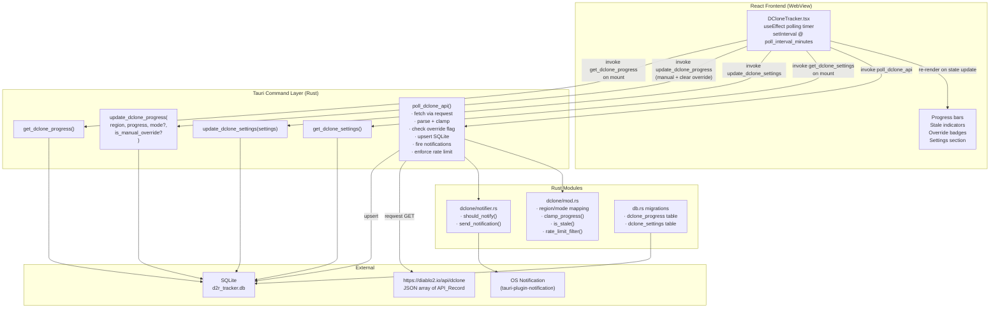
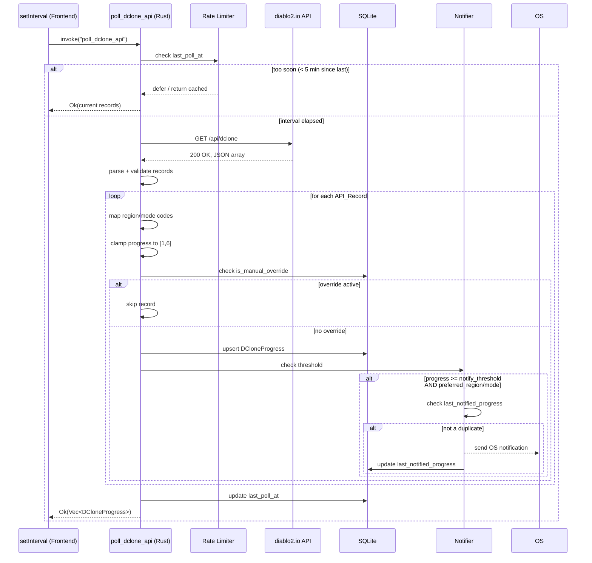

# Design Document: DClone API Integration

## Overview

This feature integrates the D2R Tracker desktop app with the public `diablo2.io` API to automate
Diablo Clone progress tracking. Currently users must manually click buttons to report progress
per region. After this feature ships, the app polls the API on a configurable interval, persists
all data to SQLite, and fires OS-level push notifications when progress crosses a user-defined
threshold.

All HTTP traffic to external origins is routed through a Rust Tauri command so the WebView CSP
is never relaxed. The frontend owns the polling timer via `setInterval` / `useEffect`, and
invokes the Rust command on each tick. This keeps the design simple: no background threads,
no async Tauri side-cars.

Key design goals:
- **Zero manual clicks for live data** — auto-fetch replaces the 1–6 per-region button workflow.
- **Offline resilience** — SQLite persistence means the last known state is always available.
- **Non-destructive** — manual overrides are preserved across API polls; users can always
  correct the tracker when the API lags community reports.
- **Responsible API consumer** — a hard-coded 5-minute minimum interval is enforced
  independently of user-configured settings.

---

## Architecture



### Polling Flow



---

## Components and Interfaces

### Rust: `src-tauri/src/dclone/mod.rs` (new module)

Pure logic functions extracted for testability:

```rust
/// Maps API region code ("1","2","3") to canonical Region_Name.
/// Returns None for unrecognised codes.
pub fn code_to_region_name(code: &str) -> Option<&'static str>;

/// Inverse of code_to_region_name.
pub fn region_name_to_code(name: &str) -> Option<&'static str>;

/// Maps API mode code ("1"–"4") to canonical mode string.
/// Returns None for unrecognised codes.
pub fn code_to_mode_string(code: &str) -> Option<&'static str>;

/// Inverse of code_to_mode_string.
pub fn mode_string_to_code(s: &str) -> Option<&'static str>;

/// Clamps any i64 progress value to the valid [1, 6] range.
pub fn clamp_progress(v: i64) -> u8;

/// Returns true iff the record is considered stale.
/// Stale means: now - last_updated > poll_interval_minutes * 2 minutes (strictly greater).
pub fn is_stale(last_updated: &str, poll_interval_minutes: u32, now_rfc3339: &str) -> bool;

/// Given a list of trigger timestamps (sorted ascending), returns the subset
/// that would actually produce HTTP requests under the 5-minute minimum interval rule.
/// Used for testing the rate-limit invariant.
pub fn filter_by_rate_limit(triggers: &[i64], min_interval_secs: i64) -> Vec<i64>;
```

### Rust: `src-tauri/src/dclone/notifier.rs` (new file)

```rust
/// Determines whether a notification should fire.
/// Returns true iff:
///   - progress >= notify_threshold
///   - region and mode match preferred_region and preferred_mode
///   - progress != last_notified_progress (duplicate suppression)
pub fn should_notify(
    region: &str,
    mode: &str,
    progress: u8,
    settings: &DCloneSettings,
) -> bool;

/// Formats the notification body string from the given fields.
/// Must include: region name, mode string, progress value, progress label.
pub fn format_notification_body(region: &str, mode: &str, progress: u8) -> String;
```

### Rust: New Tauri Commands (in `commands.rs` or `dclone/commands.rs`)

```rust
#[tauri::command]
pub async fn poll_dclone_api(
    state: State<'_, DbState>,
    app: AppHandle,
) -> Result<Vec<DCloneProgress>, String>;

#[tauri::command]
pub fn get_dclone_settings(state: State<DbState>) -> Result<DCloneSettings, String>;

#[tauri::command]
pub fn update_dclone_settings(
    state: State<DbState>,
    settings: DCloneSettings,
) -> Result<DCloneSettings, String>;
```

### Rust: Updated Command Signature

```rust
// Existing command updated to accept mode and is_manual_override parameters:
#[tauri::command]
pub fn update_dclone_progress(
    state: State<DbState>,
    region: String,
    progress: i64,
    mode: Option<String>,          // new
    is_manual_override: Option<bool>, // new
) -> Result<DCloneProgress, String>;
```

### TypeScript: New Types (`src/types.ts`)

```typescript
export interface DCloneProgress {
  region: string;
  mode: string;           // new
  progress: number;
  last_updated: string;
  is_manual_override: boolean; // new
}

export interface DCloneSettings {
  auto_fetch_enabled: boolean;
  poll_interval_minutes: number;  // 5 | 10 | 15 | 30
  notify_threshold: number;       // 3–6
  preferred_region: string;
  preferred_mode: string;
  last_poll_at: string | null;
  last_notified_progress: number | null;
}

export const DCLONE_MODES = [
  "Non-Ladder",
  "Ladder",
  "Hardcore Non-Ladder",
  "Hardcore Ladder",
] as const;

export const DCLONE_POLL_INTERVALS = [5, 10, 15, 30] as const;
```

### TypeScript: New API Functions (`src/api.ts`)

```typescript
export const pollDcloneApi = () =>
  invoke<DCloneProgress[]>("poll_dclone_api");

export const getDcloneSettings = () =>
  invoke<DCloneSettings>("get_dclone_settings");

export const updateDcloneSettings = (settings: DCloneSettings) =>
  invoke<DCloneSettings>("update_dclone_settings", { settings });

// Updated signature:
export const updateDcloneProgress = (
  region: string,
  progress: number,
  mode?: string,
  isManualOverride?: boolean,
) =>
  invoke<DCloneProgress>("update_dclone_progress", {
    region,
    progress,
    mode: mode ?? null,
    isManualOverride: isManualOverride ?? null,
  });
```

### Frontend: `DCloneTracker.tsx` Changes

Key changes to the existing component:

1. **On mount**: call `getDcloneSettings()` and `getDcloneProgress()`, then migrate any
   localStorage values if present (`d2r-dclone-notify-threshold`, `d2r-dclone-preferred-region`).

2. **Polling `useEffect`**: driven by `settings.auto_fetch_enabled` and
   `settings.poll_interval_minutes`. Creates a `setInterval` that calls `pollDcloneApi()` and
   updates local state with the returned records. Cancels the interval on cleanup (unmount or
   settings change).

3. **Stale indicator**: computed per-record in render as
   `Date.now() - new Date(record.last_updated).getTime() > settings.poll_interval_minutes * 2 * 60_000`.
   Rendered as a small clock/warning icon next to the region name.

4. **Manual override badge**: shown when `record.is_manual_override === true`. Includes a
   "Clear override" button that calls `updateDcloneProgress(region, record.progress, mode, false)`
   then reloads settings/progress.

5. **Settings section**: replaces localStorage reads/writes with calls to `getDcloneSettings` /
   `updateDcloneSettings`. Controls:
   - Auto-fetch toggle (`auto_fetch_enabled`)
   - Poll interval select: 5, 10, 15, 30 minutes
   - Notify threshold select: 3–6
   - Preferred region select: Americas, Europe, Asia
   - Preferred mode select: Non-Ladder, Ladder, Hardcore Non-Ladder, Hardcore Ladder

6. **Mode display**: each region card shows one row per mode (or only the preferred mode — TBD
   by user feedback, default to showing all four modes collapsed with an expand control).

---

## Data Models

### Updated `dclone_progress` table

The existing table (keyed on `region TEXT PRIMARY KEY`) must be migrated to a composite key on
`(region, mode)` to support all four game modes per region.

```sql
-- Migration (in migrate_dclone_progress_v2):
CREATE TABLE IF NOT EXISTS dclone_progress_new (
    region              TEXT NOT NULL,
    mode                TEXT NOT NULL DEFAULT 'Non-Ladder',
    progress            INTEGER NOT NULL DEFAULT 1,
    last_updated        TEXT NOT NULL,
    is_manual_override  INTEGER NOT NULL DEFAULT 0,
    PRIMARY KEY (region, mode)
);

-- Copy existing rows (region-only records become Non-Ladder)
INSERT OR IGNORE INTO dclone_progress_new (region, mode, progress, last_updated, is_manual_override)
SELECT region, 'Non-Ladder', progress, last_updated, 0
FROM dclone_progress;

DROP TABLE dclone_progress;
ALTER TABLE dclone_progress_new RENAME TO dclone_progress;
```

### New `dclone_settings` table

```sql
CREATE TABLE IF NOT EXISTS dclone_settings (
    id                      INTEGER PRIMARY KEY CHECK(id = 1),
    auto_fetch_enabled      INTEGER NOT NULL DEFAULT 1,
    poll_interval_minutes   INTEGER NOT NULL DEFAULT 5,
    notify_threshold        INTEGER NOT NULL DEFAULT 5,
    preferred_region        TEXT NOT NULL DEFAULT 'Americas',
    preferred_mode          TEXT NOT NULL DEFAULT 'Non-Ladder',
    last_poll_at            TEXT,
    last_notified_progress  INTEGER DEFAULT NULL
);

-- Seed defaults on first access (INSERT OR IGNORE):
INSERT OR IGNORE INTO dclone_settings
    (id, auto_fetch_enabled, poll_interval_minutes, notify_threshold, preferred_region, preferred_mode)
VALUES (1, 1, 5, 5, 'Americas', 'Non-Ladder');
```

### Rust Models (`models.rs` additions)

```rust
#[derive(Debug, Serialize, Deserialize, Clone)]
pub struct DCloneProgress {
    pub region: String,
    pub mode: String,
    pub progress: i64,
    pub last_updated: String,
    pub is_manual_override: bool,
}

#[derive(Debug, Serialize, Deserialize, Clone)]
pub struct DCloneSettings {
    pub auto_fetch_enabled: bool,
    pub poll_interval_minutes: u32,
    pub notify_threshold: u8,
    pub preferred_region: String,
    pub preferred_mode: String,
    pub last_poll_at: Option<String>,
    pub last_notified_progress: Option<i64>,
}

/// Raw record as returned by diablo2.io API
#[derive(Debug, Deserialize)]
pub struct DCloneApiRecord {
    pub region: String,
    pub mode: String,
    pub progress: String,  // API returns string; we parse to i64 then clamp
    pub updated: String,
}
```

### diablo2.io API Response Shape

```json
[
  { "region": "1", "mode": "1", "progress": "3", "updated": "1720000000" },
  { "region": "1", "mode": "2", "progress": "1", "updated": "1720000000" },
  ...
]
```

`progress` and `updated` come as strings. `updated` is a Unix timestamp. We store our own
`last_updated` as RFC 3339 (matching the rest of the codebase's chrono conventions).

---

## Correctness Properties

*A property is a characteristic or behavior that should hold true across all valid executions
of a system — essentially, a formal statement about what the system should do. Properties serve
as the bridge between human-readable specifications and machine-verifiable correctness guarantees.*

The following properties are derived from the prework analysis of the acceptance criteria.
They are implemented as `proptest!` blocks in `src-tauri/src/dclone/mod.rs`.

### Property 1: Region Code Round-Trip Bijection

*For any* valid Region_Code in `{"1", "2", "3"}`, encoding to Region_Name and back to
Region_Code produces the original code. No valid code maps to `None`, and `region_name_to_code`
is the left-inverse of `code_to_region_name`.

**Validates: Requirements 2.1, 2.2, 2.3, 2.10, 2.11**

### Property 2: Mode Code Round-Trip Bijection

*For any* valid Mode_Code in `{"1", "2", "3", "4"}`, encoding to mode string and back to
Mode_Code produces the original code. No valid code maps to `None`.

**Validates: Requirements 2.4, 2.5, 2.6, 2.7, 2.10**

### Property 3: Progress Clamping Invariant

*For any* integer value `v: i64`, `clamp_progress(v)` is always in the inclusive range `[1, 6]`.
This holds for extreme values (`i64::MIN`, `i64::MAX`), zero, negatives, and any value above 6.

**Validates: Requirements 3.1, 3.7**

### Property 4: Stale Detection Consistency

*For any* `last_updated` RFC 3339 timestamp, `poll_interval_minutes` in `[5, 30]`, and `now`
timestamp, `is_stale(last_updated, poll_interval_minutes, now)` returns `true` if and only if
`now - last_updated > poll_interval_minutes * 2` minutes (strictly greater than — equal age is
not stale).

**Validates: Requirements 5.1, 5.2, 5.3, 5.4, 5.5**

### Property 5: Rate Limit Enforcement

*For any* non-empty sequence of trigger timestamps (as Unix seconds), the list produced by
`filter_by_rate_limit(triggers, 300)` satisfies: for every consecutive pair `(t1, t2)` in the
output, `t2 - t1 >= 300`. The output is a subsequence of the input (triggers are never
fabricated), and the first trigger is always included if the list is non-empty.

**Validates: Requirements 9.1, 9.2, 9.3, 9.4**

### Property 6: Manual Override Blocks API Overwrite

*For any* `(region, mode)` pair whose corresponding `DCloneProgress` record has
`is_manual_override = true`, processing an API poll result for that region/mode SHALL leave
the stored `progress` value unchanged. The `is_manual_override` flag SHALL remain `true` after
the poll.

**Validates: Requirements 3.4, 6.2**

### Property 7: Notification Body Contains Required Fields

*For any* combination of region name, mode string, and progress value `p` in `[1, 6]` where
`p >= notify_threshold`, the string returned by `format_notification_body(region, mode, p)`
contains all of: the region name, the mode string, the progress value as a decimal digit, and
the corresponding progress label (`"Calm"` through `"Diablo Walks!"`).

**Validates: Requirements 7.3**

### Property 8: Notification Deduplication

*For any* sequence of poll results returning the same `(region, mode, progress)` tuple, calling
`should_notify` with a `last_notified_progress` equal to that progress value returns `false`.
Only the first call (when `last_notified_progress != progress`) returns `true`.

**Validates: Requirements 7.4**

### Property 9: Settings Range Validation

*For any* `poll_interval_minutes` value, `update_dclone_settings` accepts it if and only if
it is in `[5, 30]` inclusive. *For any* `notify_threshold` value, it is accepted if and only if
it is in `[3, 6]` inclusive. Values just outside each boundary (`4`, `31`, `2`, `7`) must be
rejected with an error.

**Validates: Requirements 8.3, 4.5**

---

## Error Handling

### API Fetch Errors

`poll_dclone_api` returns `Result<Vec<DCloneProgress>, String>` and propagates all errors as
`String` messages following the existing codebase convention:

| Error Condition | Behaviour |
|---|---|
| Network unreachable | Return `Err("Network error: ...")`, leave DB untouched |
| HTTP non-200 status | Return `Err("API returned HTTP {status}")`, leave DB untouched |
| Response body not valid JSON | Return `Err("Failed to parse API response: ...")`, leave DB untouched |
| Individual record has unknown region/mode code | Log warning (`eprintln!`), skip that record, continue processing remaining records |
| Individual DB upsert fails | Log error, skip that record, continue processing remaining records |
| Rate limit triggered (< 5 min since last poll) | Return `Ok(current_records_from_db)` — not an error, just returns cached data |

The frontend receives `Ok(records)` or `Err(message)`. On `Err`, the UI continues displaying
the last known persisted values and shows stale indicators where applicable.

### Settings Validation Errors

`update_dclone_settings` validates before writing:
- `poll_interval_minutes` not in `[5, 30]` → `Err("poll_interval_minutes must be between 5 and 30")`
- `notify_threshold` not in `[3, 6]` → `Err("notify_threshold must be between 3 and 6")`
- `preferred_region` not one of `"Americas"`, `"Europe"`, `"Asia"` → `Err("Invalid region")`
- `preferred_mode` not one of the four canonical mode strings → `Err("Invalid mode")`

### Migration Error Handling

The DB migration for `dclone_progress` (adding `mode` column and changing primary key) runs in
`init_db` and uses `conn.execute_batch`. If the migration fails, the app panics at startup with
a descriptive message (consistent with all other migrations in `db.rs`). The migration is
idempotent via `IF NOT EXISTS` and `INSERT OR IGNORE`.

### localStorage Migration

On component mount, the frontend checks:
```typescript
const legacyThreshold = localStorage.getItem("d2r-dclone-notify-threshold");
const legacyRegion = localStorage.getItem("d2r-dclone-preferred-region");
```
If either is present, the frontend calls `updateDcloneSettings` with the migrated values and
then `localStorage.removeItem` on each key. If `updateDcloneSettings` fails (returns an error),
the localStorage items are left in place so the migration can be retried on the next launch.

---

## Testing Strategy

### Unit Tests (Rust)

Located in `src-tauri/src/dclone/mod.rs` under `#[cfg(test)]`.

Example-based tests (no proptest):
- `test_region_code_mapping` — verify all 6 valid mappings (3 regions × forward+inverse).
- `test_mode_code_mapping` — verify all 8 valid mappings (4 modes × forward+inverse).
- `test_invalid_region_returns_none` — codes "0", "4", "", "99".
- `test_invalid_mode_returns_none` — codes "0", "5", "", "abc".
- `test_clamp_progress_boundary` — inputs: 0→1, 1→1, 6→6, 7→6, -1→1.
- `test_is_stale_boundary` — exactly equal age is not stale; one second over is stale.
- `test_poll_dclone_api_parse_error` — mock returning malformed JSON; verify `Err` returned.
- `test_poll_dclone_api_non200` — mock returning HTTP 500; verify `Err` returned.
- `test_manual_override_skipped` — upsert with override=true; verify progress unchanged.
- `test_settings_validation_rejects_invalid` — out-of-range values return `Err`.
- `test_settings_migration_idempotent` — running migration twice doesn't corrupt data.

### Property-Based Tests (Rust — `proptest`)

All 9 correctness properties are implemented as `proptest!` blocks. Each runs a minimum of
100 iterations (proptest default). Tag format in comments follows the convention established
in other modules in this codebase:

```
// Feature: dclone-api, Property N: <property text>
proptest! { ... }
```

Per the project's Rust conventions (`rust-conventions.md`), regular comments (`//`) are used
above `proptest!` macro invocations — never doc comments (`///`).

Generator strategies:

| Property | Strategy |
|---|---|
| 1, 2 | `prop_oneof!` over the fixed valid code set |
| 3 | `any::<i64>()` |
| 4 | `(0i64..=i64::MAX, 5u32..=30u32, 0i64..=i64::MAX)` for (last_updated_unix, interval, now_unix) |
| 5 | `prop::collection::vec(0i64..86400i64, 1..20)` sorted ascending as trigger offsets |
| 6 | `(prop_oneof![...valid regions], prop_oneof![...valid modes], 1i64..=6i64)` |
| 7 | `(prop_oneof![...regions], prop_oneof![...modes], 1u8..=6u8)` |
| 8 | `1u8..=6u8` for progress, `1u8..=6u8` for threshold |
| 9 | `any::<i64>()` for interval and threshold candidates |

### Frontend Tests (TypeScript / Vitest)

Following the existing component test convention (`*.test.tsx` for example-based,
`*.property.test.tsx` for property-based):

- `DCloneTracker.test.tsx` — example-based unit tests:
  - Renders last known progress on mount.
  - Settings are loaded from Tauri on mount (mocked `invoke`).
  - localStorage migration fires `updateDcloneSettings` and removes keys.
  - Stale indicator appears when age > interval×2.
  - Manual override badge is shown when `is_manual_override=true`.
  - "Clear override" button calls `updateDcloneProgress` with `isManualOverride=false`.
  - `setInterval` is set up when `auto_fetch_enabled=true`.
  - `clearInterval` is called on unmount.
  - Error from `pollDcloneApi` does not clear existing progress state.

- `DCloneTracker.property.test.tsx` — property-based test using `fast-check`:
  - *For any* `last_updated` ISO string and `poll_interval_minutes`, the stale indicator
    is shown if and only if the computed age strictly exceeds `poll_interval_minutes * 2` minutes.
    (Mirrors Rust Property 4 at the UI layer.)

### Integration Verification

After implementation, manual smoke-test checklist:
1. CSP allows `https://diablo2.io` — verify no console errors when poll fires.
2. `notification` plugin is registered in `lib.rs` — verify notification appears on threshold.
3. DB migration runs cleanly on first launch against an existing DB with old `dclone_progress`
   rows (no `mode` column).
4. `cargo check` reports zero warnings.
