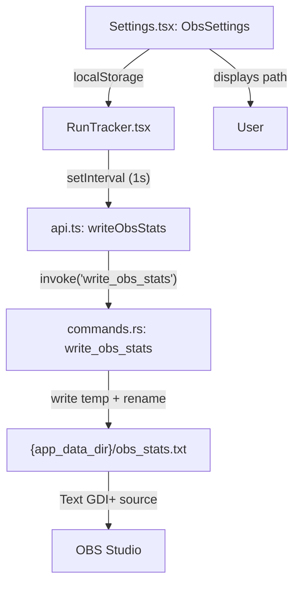
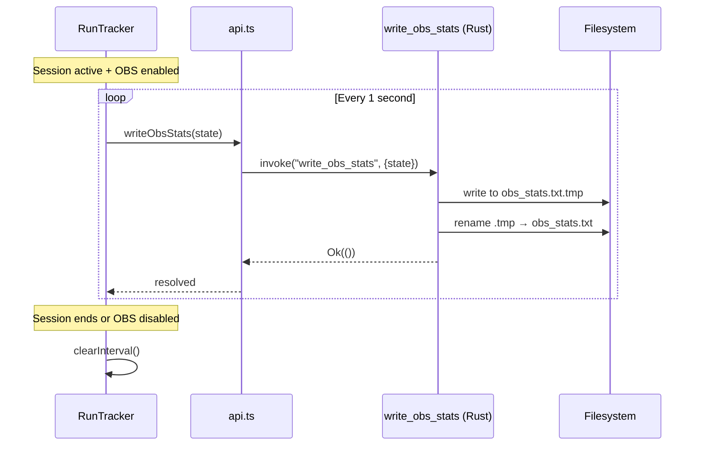

# Design Document: OBS Integration

## Overview

This feature adds OBS Studio integration to the D2R Desktop Tracker by writing live session statistics to a local text file that OBS can read as a Text (GDI+) source. The architecture follows the existing Tauri command pattern: a new `write_obs_stats` Rust command receives session state from the frontend and performs an atomic file write. The frontend drives the write cycle via a 1-second `setInterval` during active sessions when OBS mode is enabled.

The feature is self-contained — no new Tauri plugins or crates are needed. File I/O uses Rust's `std::fs` with a write-to-temp-then-rename strategy for atomicity. Settings are stored in `localStorage` following the same pattern as existing `SoundSettings`.

## Architecture





## Components and Interfaces

### Component 1: write_obs_stats (Rust Command)

**Purpose**: Receives session state from the frontend and atomically writes it to the stats file in the configured format.

**Interface**:
```rust
#[derive(Deserialize)]
pub struct ObsStatsInput {
    pub run_count: i64,
    pub session_time: String,       // pre-formatted "HH:MM:SS"
    pub current_area: String,
    pub last_items: Vec<String>,    // last 3 item names
    pub format: String,             // "text" or "json"
}

#[tauri::command]
pub fn write_obs_stats(
    app_handle: tauri::AppHandle,
    input: ObsStatsInput,
) -> Result<String, String>
```

**Responsibilities**:
- Resolve the output file path: `{app_data_dir}/obs_stats.txt`
- Format content according to `input.format`
- Write to a temp file (`obs_stats.txt.tmp`) then atomically rename
- Return the file path string on success (used by frontend to display path)
- Log errors and return `Err(String)` without panicking

### Component 2: Format_Formatter (Rust, inline in command)

**Purpose**: Converts `ObsStatsInput` into the output string.

**Interface**:
```rust
fn format_plain_text(input: &ObsStatsInput) -> String
fn format_json(input: &ObsStatsInput) -> String
```

**Plain text output**:
```
Run Count: 23
Session Time: 01:45:32
Current Area: Chaos Sanctuary
Last Items: Shako, Ber Rune, Arachnid Mesh
```

**JSON output**:
```json
{"runCount":23,"sessionTime":"01:45:32","currentArea":"Chaos Sanctuary","lastItems":["Shako","Ber Rune","Arachnid Mesh"]}
```

**Responsibilities**:
- Produce deterministic output (no trailing newlines in JSON, single trailing newline in plain text)
- Handle empty `last_items` gracefully (empty line in text, empty array in JSON)

### Component 3: writeObsStats (Frontend API wrapper)

**Purpose**: Thin wrapper in `api.ts` that invokes the backend command.

**Interface**:
```typescript
export interface ObsStatsInput {
  runCount: number;
  sessionTime: string;
  currentArea: string;
  lastItems: string[];
  format: "text" | "json";
}

export const writeObsStats = (input: ObsStatsInput) =>
  invoke<string>("write_obs_stats", { input });
```

### Component 4: OBS Write Interval (RunTracker.tsx)

**Purpose**: Drives the 1-second write cycle during active sessions when OBS mode is enabled.

**Interface** (hook-like pattern inside RunTracker):
```typescript
// Inside RunTracker component
useEffect(() => {
  if (!sessionActive || !obsEnabled) return;

  const interval = setInterval(() => {
    writeObsStats({
      runCount: sessionRunCount,
      sessionTime: formatSessionTime(sessionElapsed),
      currentArea: area,
      lastItems: getLastItems(),
      format: obsFormat,
    }).catch(console.error);
  }, 1000);

  return () => clearInterval(interval);
}, [sessionActive, obsEnabled, /* deps */]);
```

**Responsibilities**:
- Start interval only when session is active AND OBS mode is enabled
- Stop interval when session ends, is paused-then-stopped, or OBS mode is toggled off
- Continue interval during pause (writes last known state)
- Swallow write errors (log to console, don't disrupt session)

### Component 5: ObsSettings (Settings.tsx)

**Purpose**: Settings UI section for OBS integration, following the existing `SoundSettings` pattern.

**Interface**:
```typescript
interface ObsPrefs {
  enabled: boolean;
  format: "text" | "json";
}

function ObsSettings(): JSX.Element
```

**Responsibilities**:
- Toggle to enable/disable OBS mode (persists to localStorage key `d2r_obs_prefs`)
- Dropdown to select format ("Plain Text" / "JSON")
- Display the file path when enabled (fetched once via `writeObsStats` with current state, or resolved from known path pattern)
- "Copy path" button using `navigator.clipboard.writeText()`
- Follow the same visual structure as `SoundSettings`

## Data Models

### ObsStatsInput (Rust)

```rust
#[derive(Debug, Deserialize)]
#[serde(rename_all = "camelCase")]
pub struct ObsStatsInput {
    pub run_count: i64,
    pub session_time: String,
    pub current_area: String,
    pub last_items: Vec<String>,
    pub format: String,
}
```

**Validation Rules**:
- `run_count` must be non-negative (enforced by i64, frontend always sends ≥ 0)
- `session_time` is a pre-formatted string, no parsing needed
- `current_area` may be empty string (valid, written as-is)
- `last_items` length 0–3 (frontend truncates before sending)
- `format` must be "text" or "json" (default to "text" if unrecognized)

### ObsPrefs (Frontend localStorage)

```typescript
interface ObsPrefs {
  enabled: boolean;
  format: "text" | "json";
}
```

**Storage key**: `d2r_obs_prefs`

**Default value**: `{ enabled: false, format: "text" }`

## Error Handling

### Error Scenario 1: File write failure (permission denied, disk full)

**Condition**: `std::fs::write` or `std::fs::rename` returns an error
**Response**: The command returns `Err(error_message)` to the frontend; the frontend logs via `console.error` and continues the interval
**Recovery**: Next tick retries the write; no user-facing alert (OBS simply shows stale data)

### Error Scenario 2: App data directory does not exist

**Condition**: `app_handle.path().app_data_dir()` returns a path that doesn't exist yet
**Response**: The command creates the directory with `std::fs::create_dir_all` before writing
**Recovery**: Automatic — directory is created on first write attempt

### Error Scenario 3: Temp file rename fails (Windows file locking)

**Condition**: On Windows, OBS may hold a read lock on the file during rename
**Response**: Fall back to a direct overwrite (`std::fs::write` to the final path) if rename fails
**Recovery**: Automatic fallback; minor risk of OBS reading partial content (acceptable trade-off)

## Testing Strategy

### Unit Testing Approach

- **format_plain_text**: Verify output matches expected format for various input combinations (full items, partial items, zero items, empty area)
- **format_json**: Verify output is valid JSON and contains correct field values
- **ObsSettings component**: Verify toggle persists state, format dropdown updates, copy button works

### Property-Based Testing Approach

**Property Test Library**: fast-check (already available via vitest ecosystem)

Property tests will focus on the formatting logic since it's a pure function with clear input/output behavior.

### Integration Testing Approach

- Verify the full cycle: frontend constructs state → invoke → file written → file content matches expected format
- Verify interval starts/stops correctly with session lifecycle

## Performance Considerations

- The 1-second interval is deliberately coarse to minimize IPC overhead (Tauri invoke has ~1ms overhead)
- File writes are small (< 500 bytes) — negligible disk I/O
- The Rust command does NOT acquire the database `Mutex` — it only uses `app_handle` for path resolution
- When OBS mode is disabled, zero resources are consumed (no interval, no IPC calls)

## Security Considerations

- File path is deterministic and scoped to Tauri's app data directory — no user-supplied paths
- No sensitive data is written (run count, time, area, item names are not PII)
- The `format` field is validated server-side; unrecognized values fall back to "text"

## Dependencies

- **No new crates**: Uses `std::fs`, `serde`, `serde_json` (already in Cargo.toml)
- **No new npm packages**: Uses existing `@tauri-apps/api/core` invoke
- **Tauri path API**: `app_handle.path().app_data_dir()` from `tauri::Manager` (already imported)

## Correctness Properties

*A property is a characteristic or behavior that should hold true across all valid executions of a system — essentially, a formal statement about what the system should do. Properties serve as the bridge between human-readable specifications and machine-verifiable correctness guarantees.*

### Property 1: Plain text format round-trip

For any valid `ObsStatsInput`, formatting as plain text and then parsing the labeled lines back should recover the original run count, session time, current area, and items list.

**Validates: Requirements 2.1, 2.3**

### Property 2: JSON format produces valid JSON with correct fields

For any valid `ObsStatsInput`, formatting as JSON should produce a string that parses as valid JSON and contains exactly the fields `runCount` (number), `sessionTime` (string), `currentArea` (string), and `lastItems` (array of strings) with values matching the input.

**Validates: Requirements 2.2, 2.3**

### Property 3: Items list truncation

For any list of item names (0 to N items), the formatted output should contain at most 3 items, and when fewer than 3 are available, only the available items appear without padding.

**Validates: Requirements 2.4**

### Property 4: Format selection consistency

For any `ObsStatsInput` with format "text", the output should contain labeled lines (no curly braces). For any input with format "json", the output should start with `{` and end with `}`.

**Validates: Requirements 2.1, 2.2**
