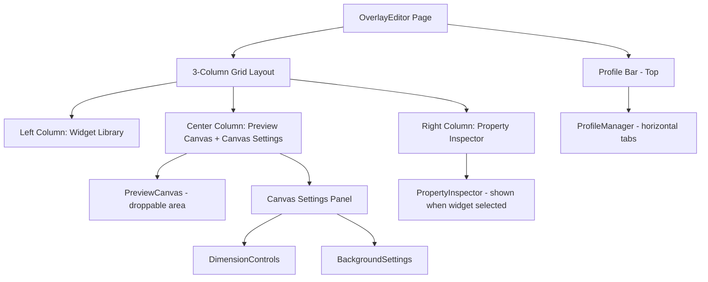

# Design Document: Overlay Editor Fix & Beautification

## Overview

The Overlay Editor page has all functional components (DnD, state management, profiles) working correctly but is visually broken because no CSS exists for its layout classes. The page currently renders as an unstructured single-column dump of components. This design restructures the page into a professional 3-column layout matching the project's mockup (`docs/mockups/overlay-editor.svg`) and adds all missing CSS for every overlay editor component.

The fix involves two changes: (1) restructuring `OverlayEditor.tsx` to use a 3-column layout with a top profile bar, and (2) adding comprehensive CSS for all overlay editor classes to `App.css`.

## Architecture



## Components and Interfaces

### Component Layout Structure

### Current Structure (Broken)

```typescript
// Single sidebar with everything crammed in
<div className="overlay-editor">
  <div className="overlay-editor-layout">
    <aside className="overlay-editor-sidebar">
      <ProfileManager />      // Should be top bar
      <WidgetLibrary />        // Should be left column
      <PropertyInspector />    // Should be right column
      <BackgroundSettings />   // Should be below canvas
      <DimensionControls />    // Should be below canvas
    </aside>
    <main className="overlay-editor-main">
      <PreviewCanvas />
    </main>
  </div>
</div>
```

### Target Structure (Matching Mockup)

```typescript
<DndContext>
  <div className="overlay-editor">
    {/* Error banner */}
    {error && <div className="overlay-editor-error">{error}</div>}

    {/* Page header */}
    <header className="overlay-editor-header">
      <h1 className="overlay-editor-title">Overlay Editor</h1>
      <p className="overlay-editor-subtitle">
        Customize what your overlay shows and how it's arranged
      </p>
    </header>

    {/* Profile bar - horizontal */}
    <div className="overlay-editor-profile-bar">
      <ProfileManager />
    </div>

    {/* 3-column layout */}
    <div className="overlay-editor-grid">
      {/* Left: Widget Library */}
      <aside className="overlay-editor-left">
        <WidgetLibrary />
      </aside>

      {/* Center: Canvas + Settings */}
      <section className="overlay-editor-center">
        <PreviewCanvas />
        <div className="overlay-editor-canvas-settings">
          <DimensionControls />
          <BackgroundSettings />
        </div>
      </section>

      {/* Right: Property Inspector */}
      <aside className="overlay-editor-right">
        <PropertyInspector />
      </aside>
    </div>
  </div>
</DndContext>
```

## Data Models

### CSS Architecture

### Layout Grid

The main editor uses CSS Grid with three columns:

```css
.overlay-editor-grid {
  display: grid;
  grid-template-columns: 200px 1fr 200px;
  gap: 1rem;
  flex: 1;
  min-height: 0;
}
```

### Component Hierarchy

| CSS Class | Component | Purpose |
|-----------|-----------|---------|
| `.overlay-editor` | Page wrapper | Full-height flex container |
| `.overlay-editor-header` | Page title area | Title + subtitle |
| `.overlay-editor-profile-bar` | Profile selector | Horizontal profile tabs |
| `.overlay-editor-grid` | 3-col grid | Main content area |
| `.overlay-editor-left` | Left column | Widget Library wrapper |
| `.overlay-editor-center` | Center column | Canvas + settings |
| `.overlay-editor-right` | Right column | Property inspector |
| `.overlay-editor-canvas-settings` | Below canvas | Dimension + background controls |
| `.profile-manager` | ProfileManager | Horizontal profile bar styling |
| `.preview-canvas-container` | Canvas wrapper | Centering and padding |
| `.preview-canvas` | Canvas itself | The droppable area |
| `.property-inspector` | Widget properties | Right panel when widget selected |
| `.background-settings` | BG controls | Color + opacity inputs |
| `.dimension-controls` | Size controls | Width/height inputs |

### Color & Style Tokens

All components use existing CSS variables:
- Backgrounds: `--bg-card` for panels, `--bg-dark` for inputs
- Borders: `--border` with `1px solid`
- Accent colors: `--success` (#4ecdc4) for active/interactive elements
- Text: `--text` for primary, `--text-muted` for labels
- Danger: `--danger` for delete actions
- Border radius: `8px` for panels, `6px` for items, `4px` for inputs

### ProfileManager Restyling

The ProfileManager transitions from a vertical list component to a horizontal bar:

```css
.profile-manager {
  display: flex;
  align-items: center;
  gap: 0.5rem;
  background: var(--bg-card);
  border: 1px solid var(--border);
  border-radius: 8px;
  padding: 0.5rem 1rem;
}

.profile-manager-list {
  display: flex;
  flex-direction: row;
  gap: 0.4rem;
  flex: 1;
  overflow-x: auto;
}

.profile-manager-item {
  /* Tab-like appearance */
  padding: 0.35rem 0.75rem;
  border: 1px solid var(--border);
  border-radius: 6px;
  cursor: pointer;
  white-space: nowrap;
}

.profile-manager-item--active {
  border-color: var(--success);
  background: rgba(78, 205, 196, 0.1);
}
```

### Preview Canvas Styling

The canvas has a dark background with dashed accent-colored border and proper visual hierarchy:

```css
.preview-canvas-container {
  display: flex;
  align-items: center;
  justify-content: center;
  padding: 1rem;
  flex: 1;
}

.preview-canvas {
  position: relative;
  border: 2px dashed var(--success);
  border-radius: 4px;
  overflow: hidden;
}
```

### Canvas Settings Panel

The settings below the canvas combine DimensionControls and BackgroundSettings in a horizontal layout:

```css
.overlay-editor-canvas-settings {
  display: flex;
  gap: 1.5rem;
  padding: 1rem;
  background: var(--bg-card);
  border: 1px solid var(--border);
  border-radius: 8px;
}
```

### Property Inspector (Right Panel)

Shows widget properties when a widget is selected, otherwise shows a placeholder:

```css
.property-inspector {
  background: var(--bg-card);
  border: 1px solid var(--border);
  border-radius: 8px;
  padding: 1rem;
}

.property-inspector--empty {
  display: flex;
  align-items: center;
  justify-content: center;
  min-height: 200px;
  opacity: 0.6;
}
```

## Key Design Decisions

1. **3-column CSS Grid**: Matches the mockup's layout. Left and right columns are fixed 200px, center is flexible.

2. **Profile bar as horizontal tabs**: The mockup shows profiles as a horizontal bar above the 3-column grid, not buried in a sidebar. The ProfileManager component's internal layout changes from vertical list to horizontal flex.

3. **Canvas settings below canvas**: DimensionControls and BackgroundSettings sit in a card below the preview canvas (matching the mockup's "Canvas Settings" section).

4. **Right panel context-sensitive**: When no widget is selected, shows an instructional placeholder. When a widget is selected, shows its properties.

5. **No functional code changes**: All hooks, DnD logic, state management remain untouched. Only the JSX structure of `OverlayEditor.tsx` changes and CSS is added.

6. **Consistent styling**: Every new CSS class uses the same variables and patterns established in the existing `App.css` (same border-radius, paddings, color variables).

## Error Handling

| Scenario | Behavior |
|----------|----------|
| No active profile loaded | Display "No active profile" placeholder, hide grid |
| Profile update fails | Show error banner at top of page |
| Widget drag outside canvas bounds | Clamp position to canvas edges |
| Invalid canvas dimensions | DimensionControls enforce min/max bounds (200–800 width, 100–600 height) |

## Testing Strategy

- Property-based tests validate DnD correctness (widget placement, repositioning, clamping)
- Unit tests verify DOM structure renders in correct 3-column layout
- Visual regression: manual comparison against mockup SVG
- All existing functional tests must continue passing unchanged

## Example Usage

After the fix, opening the Overlay Editor page produces:
- A page title "Overlay Editor" with subtitle
- A horizontal profile bar showing all profiles as clickable tabs with a "+ New" button
- A 3-column layout where widgets can be dragged from left panel to center canvas
- Canvas settings (dimensions + background) shown below the canvas
- Property inspector on the right showing details when a canvas widget is clicked
- All interactive elements have hover/active/focus states with smooth transitions

## Correctness Properties

*A property is a characteristic or behavior that should hold true across all valid executions of a system — essentially, a formal statement about what the system should do. Properties serve as the bridge between human-readable specifications and machine-verifiable correctness guarantees.*

### Property 1: Canvas background reflects configured values

*For any* valid hex color string and opacity value between 0 and 1, the Preview Canvas background layer SHALL render with those exact color and opacity values applied as inline styles.

**Validates: Requirements 4.3**

### Property 2: Selected widget gets visual distinction

*For any* widget placed on the canvas, when that widget's ID matches the selectedWidgetId, the widget element SHALL have a selection indicator (distinct border/outline) applied, and no other widget SHALL have that indicator.

**Validates: Requirements 4.4**

### Property 3: Drag-drop from library adds widget to layout

*For any* widget type from the Widget Library, when a drag-end event completes over the canvas droppable area, the layout's widget array SHALL contain a new widget of that type with valid coordinates within the canvas bounds.

**Validates: Requirements 9.1**

### Property 4: Widget repositioning updates coordinates

*For any* widget at position (x, y) on the canvas and any drag delta (dx, dy), after a successful drag-end event, the widget's position SHALL be updated to clamped(x + dx, y + dy) where clamping ensures the widget stays within canvas bounds.

**Validates: Requirements 9.2**

### Property 5: Property Inspector shows correct widget type label

*For any* widget type, when a widget of that type is selected, the Property Inspector title SHALL display the corresponding human-readable label from the WIDGET_LABELS mapping.

**Validates: Requirements 5.3**

### Property 6: Canvas dimension label accuracy

*For any* valid width (200–800) and height (100–600) dimensions, the Preview Canvas SHALL display a label showing "{width}×{height}" that matches the current layout dimensions.

**Validates: Requirements 4.6**
