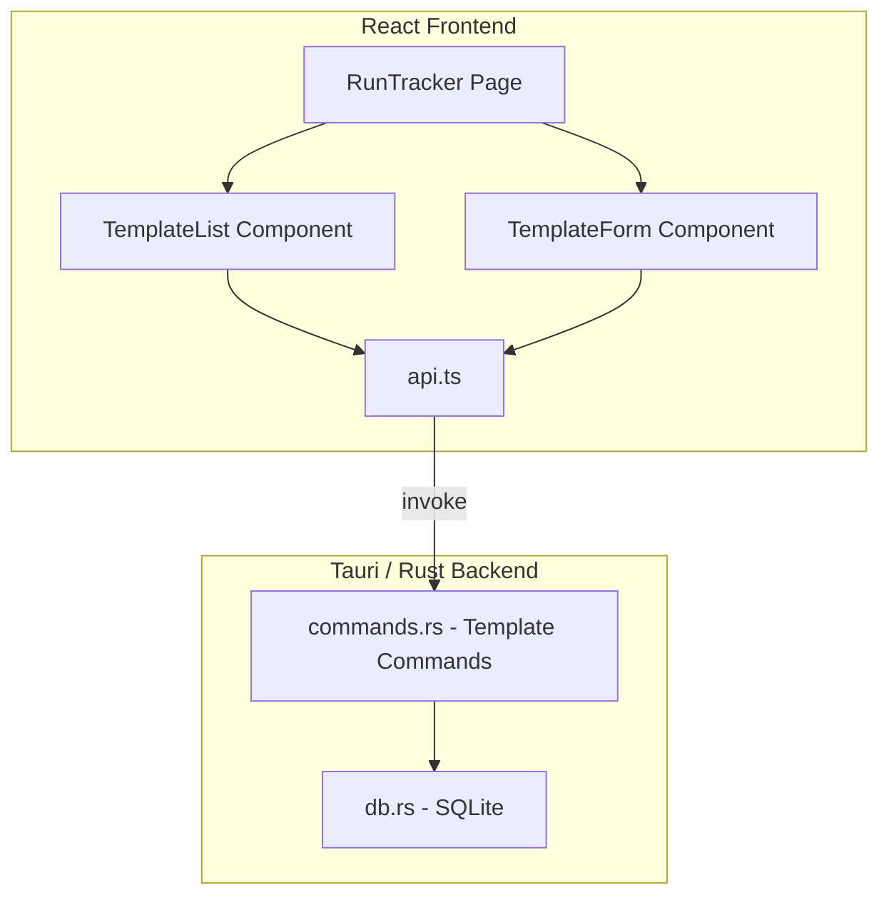

# Design Document: Quick-Start Templates

## Overview

Quick-Start Templates add a lightweight template layer to the Run Tracker that lets users save named session configurations and start sessions with a single click. The feature follows the existing Tauri command → SQLite pattern used by routes, custom areas, and other profile-scoped entities. Templates are stored in a new `templates` table, exposed via five Tauri commands (CRUD + list), and rendered in the Run Tracker page above the existing start controls.

The design intentionally keeps templates as a flat data structure (no nesting, no inheritance) to match the simplicity of the existing codebase and avoid over-engineering what is fundamentally a "saved preset" feature.

## Architecture



The architecture mirrors the existing pattern used by Routes, Custom Areas, and other profile-scoped features:

1. **UI Components** render template list and form within RunTracker
2. **API Layer** (`src/api.ts`) wraps `invoke()` calls to Tauri commands
3. **Tauri Commands** (`commands.rs`) validate input and call database functions
4. **Database** (`db.rs`) handles persistence with parameterized SQL

### Key Design Decisions

| Decision | Rationale |
|----------|-----------|
| Store templates in SQLite (not localStorage) | Consistency with all other persistent data; supports export/import and cloud sync |
| Per-profile scoping via `profile_id` FK | Different characters farm different areas; matches routes and custom areas pattern |
| Case-insensitive name uniqueness per profile | Prevents confusion between "Pit Runs" and "pit runs" |
| `last_used_at` timestamp for ordering | Most-recently-used ordering provides fastest access to frequently used templates |
| Optional `route_id` (nullable FK) | Templates can work with or without route mode; graceful handling if route is deleted |
| Tags stored as JSON array string | Matches existing tags storage pattern in runs table |
| Validation in Rust backend | Single source of truth for validation; frontend shows errors returned from backend |

## Components and Interfaces

### Backend Components

#### Rust Model: `Template`

```rust
#[derive(Debug, Serialize, Deserialize, Clone)]
pub struct Template {
    pub id: String,
    pub profile_id: String,
    pub name: String,
    pub area: String,
    pub player_count: i64,
    pub route_id: Option<String>,
    pub session_goal_type: String,    // "none" | "runs" | "time"
    pub session_goal_value: Option<i64>,
    pub tags: Option<String>,         // JSON array string, e.g. '["mf","tz"]'
    pub last_used_at: Option<String>, // ISO 8601 timestamp
    pub created_at: String,
    pub updated_at: String,
}
```

#### Rust Model: `CreateTemplateInput`

```rust
#[derive(Debug, Serialize, Deserialize, Clone)]
pub struct CreateTemplateInput {
    pub profile_id: String,
    pub name: String,
    pub area: String,
    pub player_count: i64,
    pub route_id: Option<String>,
    pub session_goal_type: String,
    pub session_goal_value: Option<i64>,
    pub tags: Option<Vec<String>>,
}
```

#### Rust Model: `UpdateTemplateInput`

```rust
#[derive(Debug, Serialize, Deserialize, Clone)]
pub struct UpdateTemplateInput {
    pub name: String,
    pub area: String,
    pub player_count: i64,
    pub route_id: Option<String>,
    pub session_goal_type: String,
    pub session_goal_value: Option<i64>,
    pub tags: Option<Vec<String>>,
}
```

#### Tauri Commands

| Command | Input | Output | Description |
|---------|-------|--------|-------------|
| `create_template` | `CreateTemplateInput` | `Template` | Validates and persists a new template |
| `get_templates` | `profile_id: String` | `Vec<Template>` | Returns all templates for a profile, ordered by last_used_at DESC then created_at DESC |
| `update_template` | `id: String, input: UpdateTemplateInput` | `Template` | Updates an existing template's fields |
| `delete_template` | `id: String` | `()` | Removes a template by ID |
| `touch_template` | `id: String` | `()` | Updates `last_used_at` to current timestamp |

### Frontend Components

#### TypeScript Types (`src/types.ts`)

```typescript
export interface Template {
  id: string;
  profile_id: string;
  name: string;
  area: string;
  player_count: number;
  route_id: string | null;
  session_goal_type: string; // "none" | "runs" | "time"
  session_goal_value: number | null;
  tags: string | null;       // JSON array string
  last_used_at: string | null;
  created_at: string;
  updated_at: string;
}

export interface CreateTemplateInput {
  profile_id: string;
  name: string;
  area: string;
  player_count: number;
  route_id?: string;
  session_goal_type: string;
  session_goal_value?: number;
  tags?: string[];
}

export interface UpdateTemplateInput {
  name: string;
  area: string;
  player_count: number;
  route_id?: string;
  session_goal_type: string;
  session_goal_value?: number;
  tags?: string[];
}
```

#### API Functions (`src/api.ts`)

```typescript
export const createTemplate = (input: CreateTemplateInput) =>
  invoke<Template>("create_template", { input });

export const getTemplates = (profileId: string) =>
  invoke<Template[]>("get_templates", { profileId });

export const updateTemplate = (id: string, input: UpdateTemplateInput) =>
  invoke<Template>("update_template", { id, input });

export const deleteTemplate = (id: string) =>
  invoke<void>("delete_template", { id });

export const touchTemplate = (id: string) =>
  invoke<void>("touch_template", { id });
```

#### UI Components

| Component | Responsibility |
|-----------|----------------|
| `TemplateList` | Displays templates above start controls; handles one-click start; shows edit/delete actions |
| `TemplateForm` | Modal/inline form for creating and editing templates; field validation feedback |

#### TemplateList Behavior

- Rendered inside `RunTracker` when `!sessionActive` and templates exist
- Shows up to 3 most-recently-used templates prominently, then remaining templates
- Each template card shows: name, area, player count
- Clicking a template card triggers one-click session start
- Edit (pencil icon) and Delete (trash icon) buttons on each card
- Hidden when a session is active

#### TemplateForm Behavior

- Shown as a modal or inline expansion
- Pre-populates with current session configuration values for "create" mode
- Pre-populates with existing template values for "edit" mode
- Fields: name (text), area (dropdown), player count (dropdown), route (dropdown, optional), goal type (dropdown), goal value (number, conditional), tags (multi-select)
- Real-time validation with error messages per field
- Save button disabled until all required fields valid
- On duplicate name error from backend, shows inline error on name field without clearing other fields

## Data Models

### SQLite Schema

```sql
CREATE TABLE IF NOT EXISTS templates (
    id TEXT PRIMARY KEY,
    profile_id TEXT NOT NULL,
    name TEXT NOT NULL,
    area TEXT NOT NULL,
    player_count INTEGER NOT NULL DEFAULT 1,
    route_id TEXT,
    session_goal_type TEXT NOT NULL DEFAULT 'none',
    session_goal_value INTEGER,
    tags TEXT,
    last_used_at TEXT,
    created_at TEXT NOT NULL,
    updated_at TEXT NOT NULL,
    FOREIGN KEY (profile_id) REFERENCES profiles(id) ON DELETE CASCADE,
    FOREIGN KEY (route_id) REFERENCES routes(id) ON DELETE SET NULL
);

CREATE INDEX IF NOT EXISTS idx_templates_profile ON templates(profile_id);
CREATE UNIQUE INDEX IF NOT EXISTS idx_templates_profile_name ON templates(profile_id, name COLLATE NOCASE);
```

Key schema decisions:
- `ON DELETE CASCADE` for profile_id: deleting a profile removes its templates
- `ON DELETE SET NULL` for route_id: deleting a route nullifies the reference rather than deleting the template
- Case-insensitive unique index on (profile_id, name) enforces uniqueness at the database level
- `tags` stored as JSON string (same pattern as `runs.tags`)

### Migration Strategy

Add a new migration function `migrate_templates` in `db.rs`, called from `init_db`. The migration checks if the `templates` table exists and creates it if missing. This follows the exact pattern of `migrate_routes`, `migrate_herald_encounters`, etc.

### Export/Import Extension

The `ExportData` struct gets a new optional field:

```rust
pub struct ExportData {
    pub version: String,
    pub exported_at: String,
    pub profiles: Vec<Profile>,
    pub runs: Vec<Run>,
    pub items: Vec<Item>,
    pub templates: Option<Vec<Template>>, // New — Option for backward compatibility
}
```

- Export: include all templates
- Import: if `templates` field present, insert each template; skip if ID already exists (increment skipped counter)
- Backward-compatible: older exports without `templates` field import fine (field is `Option`)

## Correctness Properties

*A property is a characteristic or behavior that should hold true across all valid executions of a system — essentially, a formal statement about what the system should do. Properties serve as the bridge between human-readable specifications and machine-verifiable correctness guarantees.*

### Property 1: Template name uniqueness per profile

*For any* profile and any two templates belonging to that profile, their names compared case-insensitively SHALL be distinct.

**Validates: Requirements 1.3, 4.2**

### Property 2: Template creation round-trip

*For any* valid `CreateTemplateInput`, creating a template and then retrieving templates for that profile SHALL return a template whose name, area, player_count, route_id, session_goal_type, session_goal_value, and tags match the input values.

**Validates: Requirements 1.1, 6.2**

### Property 3: Invalid names are rejected

*For any* string that is empty, contains only whitespace, or exceeds 100 characters, attempting to create or update a template with that name SHALL return an error and leave existing data unchanged.

**Validates: Requirements 7.1**

### Property 4: Player count bounds

*For any* integer value outside the range [1, 8], attempting to create or update a template with that player_count SHALL return an error and leave existing data unchanged.

**Validates: Requirements 7.3**

### Property 5: Session goal bounds

*For any* integer value outside the range [1, 9999], attempting to create or update a template with that session_goal_value SHALL return an error and leave existing data unchanged.

**Validates: Requirements 7.4**

### Property 6: Delete removes exactly one template

*For any* template list of length N, deleting one template by ID SHALL result in a list of length N-1 that does not contain the deleted template's ID, while all other templates remain unchanged.

**Validates: Requirements 5.2**

### Property 7: Touch updates only last_used_at

*For any* template, calling touch_template SHALL update only the `last_used_at` field and leave all other fields (name, area, player_count, route_id, session_goal_type, session_goal_value, tags, created_at) unchanged.

**Validates: Requirements 3.2**

### Property 8: Template ordering — MRU first, then creation date

*For any* set of templates for a profile, `get_templates` SHALL return them ordered such that templates with non-null `last_used_at` appear before templates with null `last_used_at`, the first group is sorted by `last_used_at` descending, and the second group is sorted by `created_at` descending.

**Validates: Requirements 2.2, 2.4**

### Property 9: Export/import round-trip preserves templates

*For any* set of templates in the database, exporting and then importing into a fresh database SHALL produce the same set of templates with all fields matching.

**Validates: Requirements 6.3, 6.4**

## Error Handling

| Scenario | Behavior |
|----------|----------|
| Duplicate template name (create/update) | Return error string: "A template with this name already exists" — frontend shows on name field |
| Invalid name (empty/whitespace/too long) | Return error string describing the violation |
| Invalid player_count (outside 1–8) | Return error string: "Player count must be between 1 and 8" |
| Invalid session_goal_value (outside 1–9999) | Return error string: "Session goal must be between 1 and 9999" |
| Invalid area (not in AREAS or custom_areas) | Return error string: "Invalid area" |
| Route not found (route_id references deleted route) | Set `route_id` to NULL in template; start session without route mode |
| Database lock/corruption | Return error string from rusqlite; frontend shows generic toast |
| Template not found (delete/update/touch with bad ID) | Return error string: "Template not found" |
| No active profile when creating template | Frontend prevents this (button disabled); backend rejects if profile_id doesn't exist |

All errors are returned as `Result<T, String>` from Tauri commands, matching the existing error handling pattern in the codebase.

## Testing Strategy

### Property-Based Tests (fast-check)

The following properties will be tested using `fast-check` with minimum 100 iterations each. These test the pure validation and data transformation logic.

| Property | What's Generated | What's Verified |
|----------|-----------------|-----------------|
| P1: Name uniqueness | Random profile + pairs of template names | Case-insensitive collision detected |
| P2: Creation round-trip | Random valid CreateTemplateInput | Retrieved template matches input |
| P3: Invalid names rejected | Random whitespace-only strings, empty string, >100 char strings | Error returned, no side effects |
| P4: Player count bounds | Random integers outside [1, 8] | Error returned |
| P5: Session goal bounds | Random integers outside [1, 9999] | Error returned |
| P6: Delete removes exactly one | Random list of templates + random deletion target | List shrinks by 1, others untouched |
| P7: Touch preserves fields | Random template + touch operation | Only last_used_at changes |
| P8: Ordering invariant | Random set of templates with varying last_used_at | Correct sort order |
| P9: Export/import round-trip | Random set of templates | All fields preserved |

**Configuration:**
- Library: `fast-check` (already in devDependencies)
- Runner: `vitest run`
- Minimum iterations: 100
- Tag format: `Feature: quick-start-templates, Property {N}: {description}`

### Unit Tests (vitest)

- Template form validation displays correct error messages for each field
- TemplateList renders empty state when no templates exist
- TemplateList renders MRU section correctly
- One-click start populates all session fields correctly
- Edit form pre-populates with existing values
- Delete confirmation dialog shows template name
- Deleted route handled gracefully (route_id cleared, session starts without route)

### Integration Tests

- Full create → list → update → delete lifecycle via Tauri commands
- Export includes templates; import skips duplicates
- Cascade delete: deleting a profile removes associated templates
- Route deletion sets template.route_id to NULL (FK ON DELETE SET NULL)
