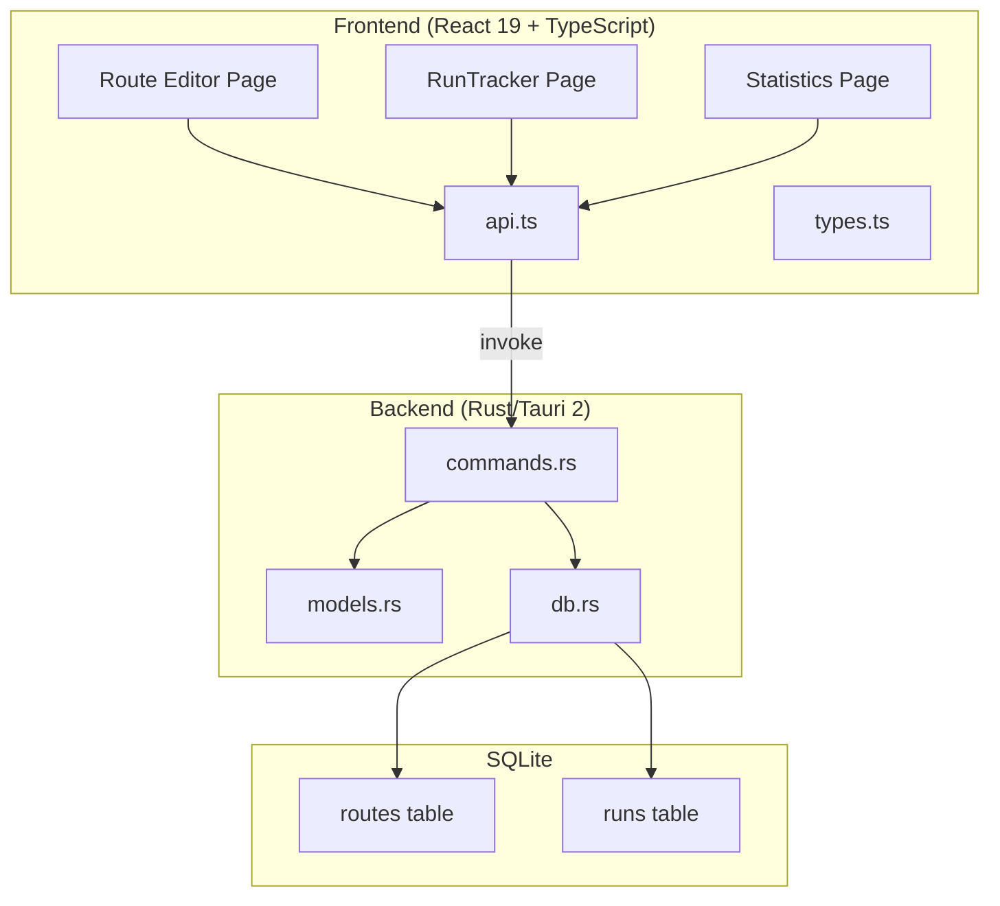

# Design Document: Multi-Area Route Tracking

## Overview

This feature adds multi-area farming route support to the D2R Desktop Tracker. Users can define ordered sequences of areas (e.g., Mephisto → Pindleskin → Andariel), activate routes during Run Tracker sessions to auto-advance through steps on split, and view cycle-level statistics.

The implementation follows existing architectural patterns: Rust/Tauri commands for backend CRUD, SQLite for persistence, React components for UI, and the `invoke()` API bridge. A new `routes` table stores route definitions with areas as a JSON text column. The existing `runs` table gains nullable `route_id` and `route_step_index` columns via migration. The Route Editor is a new sidebar-navigable page, while Route Mode integrates into the existing RunTracker session start screen.

**Key design decisions:**
- **JSON text column for areas**: Simple, no join tables needed. Routes rarely exceed 10 areas so query performance is irrelevant.
- **No foreign key on runs.route_id**: Deleted routes shouldn't cascade-delete historical runs. The route_id is kept for historical grouping.
- **HTML5 native DnD via `@dnd-kit/core`**: The native HTML5 DnD API has poor accessibility and inconsistent UX across platforms. `@dnd-kit` is small (~15KB), accessible, and well-maintained with keyboard support.
- **Route Editor as separate page**: Keeps RunTracker focused on session management. Route configuration is an infrequent activity that doesn't belong inline.
- **Route Mode state in RunTracker component**: Existing session state pattern (useState + useRef) extends naturally for step tracking.

## Architecture



### Data Flow

1. **Route CRUD**: Route Editor → `api.ts` → Tauri `invoke()` → `commands.rs` → SQLite `routes` table
2. **Route Mode Session**: RunTracker loads routes → user selects route → session starts at step 0 → split advances step → cycle wraps at end
3. **Statistics**: Statistics page queries runs WHERE route_id = X → groups by cycle boundaries (step_index wraps from max to 0) → computes per-cycle aggregates

## Components and Interfaces

### Backend Components

#### Route Commands (commands.rs)

```rust
// New commands following existing CRUD pattern
#[tauri::command]
pub fn create_route(state: State<DbState>, input: CreateRouteInput) -> Result<Route, String>

#[tauri::command]
pub fn get_routes(state: State<DbState>, profile_id: String) -> Result<Vec<Route>, String>

#[tauri::command]
pub fn update_route(state: State<DbState>, id: String, input: UpdateRouteInput) -> Result<Route, String>

#[tauri::command]
pub fn delete_route(state: State<DbState>, id: String) -> Result<(), String>

#[tauri::command]
pub fn get_route_stats(state: State<DbState>, route_id: String) -> Result<RouteStats, String>
```

#### Validation Rules
- `name`: non-empty after trim, max 100 chars
- `areas`: JSON array with minimum 2 entries, each entry must be a non-empty string
- `id` on update/delete: must exist in database

### Frontend Components

#### Route Editor Page (`src/pages/RouteEditor.tsx`)

- **Props**: `{ profile: Profile }`
- **State**: route list, current edit form (name + areas array), drag state
- **Responsibilities**: CRUD UI for routes, drag-to-reorder areas, area picker from combined AREAS + custom areas
- **Library**: `@dnd-kit/core` + `@dnd-kit/sortable` for accessible drag-and-drop

#### RunTracker Route Mode Integration (`src/pages/RunTracker.tsx`)

Extends existing RunTracker with:
- **New state**: `routeMode: boolean`, `selectedRoute: Route | null`, `currentStepIndex: number`, `cycleCount: number`
- **Modified `splitRun()`**: When in route mode, advances `currentStepIndex`, wraps to 0 on cycle completion, increments `cycleCount`
- **Modified `createRun()`**: When in route mode, passes `route_id` and `route_step_index` to backend
- **Route step indicator UI**: Shows "Step X/Y: AreaName" during active session

#### Route Statistics Section (`src/pages/Statistics.tsx`)

Extends existing Statistics page with a route-specific section:
- Route selector dropdown
- Displays: total cycles, average cycle time, items per cycle
- Excludes partial cycles from averages

### API Layer (`src/api.ts`)

```typescript
// Route CRUD
export const createRoute = (input: CreateRouteInput) =>
  invoke<Route>("create_route", { input });

export const getRoutes = (profileId: string) =>
  invoke<Route[]>("get_routes", { profileId });

export const updateRoute = (id: string, input: UpdateRouteInput) =>
  invoke<Route>("update_route", { id, input });

export const deleteRoute = (id: string) =>
  invoke<void>("delete_route", { id });

export const getRouteStats = (routeId: string) =>
  invoke<RouteStats>("get_route_stats", { routeId });
```

## Data Models

### Backend Models (models.rs)

```rust
#[derive(Debug, Serialize, Deserialize, Clone)]
pub struct Route {
    pub id: String,
    pub profile_id: String,
    pub name: String,
    pub areas: Vec<String>,   // Deserialized from JSON text column
    pub created_at: String,
}

#[derive(Debug, Serialize, Deserialize, Clone)]
pub struct CreateRouteInput {
    pub profile_id: String,
    pub name: String,
    pub areas: Vec<String>,
}

#[derive(Debug, Serialize, Deserialize, Clone)]
pub struct UpdateRouteInput {
    pub name: String,
    pub areas: Vec<String>,
}

#[derive(Debug, Serialize, Deserialize, Clone)]
pub struct RouteStats {
    pub route_id: String,
    pub route_name: String,
    pub total_cycles: i64,
    pub avg_cycle_time_secs: f64,
    pub total_items: i64,
    pub items_per_cycle: f64,
}
```

### Frontend Types (types.ts)

```typescript
export interface Route {
  id: string;
  profile_id: string;
  name: string;
  areas: string[];
  created_at: string;
}

export interface CreateRouteInput {
  profile_id: string;
  name: string;
  areas: string[];
}

export interface UpdateRouteInput {
  name: string;
  areas: string[];
}

export interface RouteStats {
  route_id: string;
  route_name: string;
  total_cycles: number;
  avg_cycle_time_secs: number;
  total_items: number;
  items_per_cycle: number;
}
```

### Database Schema

#### New Table: `routes`

```sql
CREATE TABLE IF NOT EXISTS routes (
    id TEXT PRIMARY KEY,
    profile_id TEXT NOT NULL,
    name TEXT NOT NULL,
    areas TEXT NOT NULL,  -- JSON array of area strings
    created_at TEXT NOT NULL,
    FOREIGN KEY (profile_id) REFERENCES profiles(id) ON DELETE CASCADE
);

CREATE INDEX IF NOT EXISTS idx_routes_profile ON routes(profile_id);
```

#### Migration: Add columns to `runs`

```sql
ALTER TABLE runs ADD COLUMN route_id TEXT DEFAULT NULL;
ALTER TABLE runs ADD COLUMN route_step_index INTEGER DEFAULT NULL;

CREATE INDEX IF NOT EXISTS idx_runs_route ON runs(route_id);
```

### Serialization Strategy

The `areas` column stores a JSON array as text. On read, the Rust command deserializes it via `serde_json::from_str`. On write, it serializes the `Vec<String>` via `serde_json::to_string`. This keeps the table flat and avoids a join table for what is always read/written as a unit.

```rust
// Write: serde_json::to_string(&input.areas)
// Read:  serde_json::from_str::<Vec<String>>(&areas_json)
```

### Run Record with Route Context

When creating a run in Route Mode, the `CreateRunInput` is extended:

```rust
pub struct CreateRunInput {
    pub profile_id: String,
    pub area: String,
    pub notes: Option<String>,
    pub player_count: Option<i64>,
    pub route_id: Option<String>,          // NEW
    pub route_step_index: Option<i64>,     // NEW
}
```

The frontend passes these when in route mode. Existing single-area runs continue to pass `None` for both fields.


## Correctness Properties

*A property is a characteristic or behavior that should hold true across all valid executions of a system — essentially, a formal statement about what the system should do. Properties serve as the bridge between human-readable specifications and machine-verifiable correctness guarantees.*

### Property 1: Route creation round-trip

*For any* valid CreateRouteInput (non-empty name ≤ 100 chars, areas array with ≥ 2 entries), creating a route SHALL return a Route object where `name` equals the input name, `areas` equals the input areas, `profile_id` equals the input profile_id, `id` is a valid UUID v4, and `created_at` is a valid ISO 8601 timestamp.

**Validates: Requirements 1.3, 2.1**

### Property 2: Route input validation

*For any* string `name` and any array `areas`, the route creation SHALL succeed if and only if `name.trim()` is non-empty AND `name.length <= 100` AND `areas.length >= 2`. All other inputs SHALL be rejected with an error.

**Validates: Requirements 1.4, 1.5**

### Property 3: Route listing order

*For any* profile with N routes (N ≥ 0), calling get_routes SHALL return all N routes in descending order of `created_at` (most recent first).

**Validates: Requirements 2.2**

### Property 4: Route update round-trip

*For any* existing route and any valid UpdateRouteInput (non-empty name ≤ 100 chars, areas with ≥ 2 entries), updating the route and then fetching it SHALL return a route where `name` and `areas` match the update input.

**Validates: Requirements 2.3**

### Property 5: Save button validation state

*For any* form state in the Route Editor where `name` is a string and `areas` is an array, the save button SHALL be disabled if and only if `name.trim() === ""` OR `areas.length < 2`.

**Validates: Requirements 3.7**

### Property 6: Route Mode step advancement with wrap

*For any* route with N areas (N ≥ 2) and any current step index `i` (0 ≤ i < N), after a split the new step index SHALL be `(i + 1) % N` and the current area SHALL be `route.areas[(i + 1) % N]`. When `i === N - 1`, the cycle count SHALL increment by 1.

**Validates: Requirements 4.3, 4.4, 4.5**

### Property 7: Cycle time computation

*For any* route with completed cycles, the average cycle time SHALL equal the sum of all individual cycle times divided by the number of completed cycles, where each cycle time is the sum of `duration_secs` for all runs in that cycle.

**Validates: Requirements 5.1, 5.3**

### Property 8: Partial cycle exclusion

*For any* route's run history, the total completed cycles count SHALL only include cycles where all steps (0 through N-1) have a completed run. Partial cycles (missing steps or session ended mid-cycle) SHALL NOT be counted in totals or included in per-cycle averages.

**Validates: Requirements 5.4, 5.5**

### Property 9: Items per cycle computation

*For any* route with completed cycles, items per cycle SHALL equal the total count of items across all runs in completed cycles divided by the number of completed cycles.

**Validates: Requirements 5.2**

### Property 10: Run stores route context

*For any* run created in Route Mode with a given `route_id` and `route_step_index`, fetching that run SHALL return a record where `route_id` and `route_step_index` match the values provided at creation time.

**Validates: Requirements 6.1**

### Property 11: Run grouping by route

*For any* sequence of completed runs, consecutive runs that share the same non-null `route_id` with step indices forming a contiguous ascending sequence (wrapping from max to 0 marks a cycle boundary) SHALL be grouped into the same cycle.

**Validates: Requirements 6.3**

## Error Handling

### Backend Error Strategy

All Tauri commands return `Result<T, String>` following existing patterns. Errors are returned as descriptive strings that the frontend displays to users.

| Scenario | Error Message |
|----------|--------------|
| Empty route name | "Route name cannot be empty" |
| Name too long | "Route name is too long (max 100 characters)" |
| Areas < 2 | "Route must contain at least 2 areas" |
| Route not found (update/delete) | "Route not found" |
| DB lock poisoned | Mutex error string (existing pattern) |
| Invalid areas JSON (read) | "Failed to parse route areas" |

### Frontend Error Handling

- API call failures display a toast/alert message (existing pattern: `alert("Error: " + e)`)
- Form validation errors prevent submission (disabled save button)
- Route Mode gracefully handles deleted routes: if selected route is deleted while RunTracker is open, the session falls back to single-area mode with a notification

### Database Integrity

- Foreign key CASCADE on `routes.profile_id` → deleting a profile removes its routes
- NO foreign key on `runs.route_id` → deleting a route preserves historical run data
- Migration is backward-compatible: new nullable columns don't affect existing runs

## Testing Strategy

### Property-Based Testing

**Library:** `fast-check` (TypeScript) for frontend logic properties, Rust unit tests with manual randomization for backend.

Since the core logic (step advancement, cycle computation, input validation) lives in well-defined pure functions, property-based testing is highly appropriate for this feature.

**Configuration:**
- Minimum 100 iterations per property test
- Each test tagged with: `Feature: route-tracking, Property {N}: {description}`

**Frontend properties to test with fast-check:**
- Property 5 (save button state): Generate random form states, verify disabled logic
- Property 6 (step advancement): Generate random routes and step indices, verify wrap behavior
- Property 7, 8, 9 (statistics computation): Generate random run arrays, verify aggregate calculations
- Property 11 (run grouping): Generate random run sequences, verify cycle boundaries

**Backend properties to test in Rust:**
- Property 1 (creation round-trip): Generate random valid inputs, verify returned object
- Property 2 (input validation): Generate random strings and arrays, verify accept/reject
- Property 3 (listing order): Create multiple routes, verify ordering
- Property 4 (update round-trip): Create then update, verify final state
- Property 10 (run route context): Create runs with route info, verify persistence

### Unit Tests (Example-Based)

- Route Editor renders form elements (3.1, 3.2)
- Route Editor add/remove area interactions (3.3)
- Route Editor displays existing routes with actions (3.5, 3.6)
- Route Mode toggle presence (4.1)
- Route dropdown appears when toggle enabled (4.2)
- Step indicator display format (4.6)
- Default single-area mode (4.7)
- Delete route preserves runs (6.4)
- Delete non-existent route returns error (2.5)
- FK cascade: profile delete removes routes (1.2)

### Integration Tests

- Full CRUD flow: create → list → update → delete route
- Route Mode session: start → split through full cycle → verify statistics
- Migration: existing DB without route columns → init_db adds them without data loss

### Test File Locations

- Frontend: `src/pages/RouteEditor.test.tsx`, `src/pages/RunTracker.test.tsx` (extend), `src/utils/route-logic.test.ts`
- Backend: Rust tests in `src-tauri/src/commands.rs` (using `#[cfg(test)]` module)
