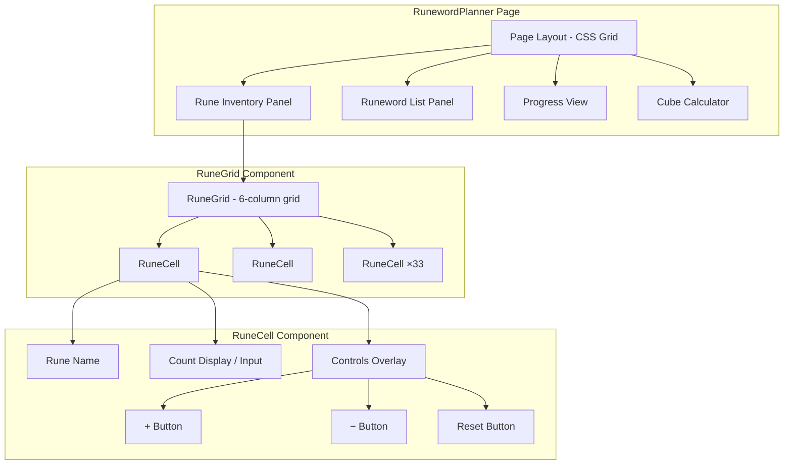

# Design Document: Runeword Planner UI Refinement

## Overview

This design refines the Runeword Planner page to match the SVG prototype mockup (`docs/mockups/runeword-planner.svg`). The core changes are:

1. **Side-by-side layout** — Rune Inventory and Available Runewords panels sit horizontally at the top, with Progress and Cube Calculator spanning full width below.
2. **Compact rune cells** — Cells shrink to ~50×40px with no inline controls, showing only rune name and count.
3. **High rune visual tiers** — Runes at level 21+ get distinct border and count colors based on their tier.
4. **Hover/focus overlay** — +/−/reset controls appear as a floating overlay on interaction, keeping cells compact.
5. **Direct number input** — Click the count to type a value directly (0–99), avoiding repeated +/− clicks.
6. **New callback interface** — `onSetCount(rune, value)` and `onReset(rune)` replace the increment-only model for the new interactions.

The existing `RuneGrid` component is refactored into a new `RuneCell` sub-component while the page layout moves from a single-column flex to a CSS grid.

## Architecture



The page uses a CSS grid with named areas:

```
| inventory | eligibility |   (row 1, side-by-side)
| progress  | progress    |   (row 2, full width)
| cube      | cube        |   (row 3, full width)
```

At viewports below 700px, the grid collapses to a single column.

## Components and Interfaces

### RuneCell (new component)

Extracted from RuneGrid, this handles a single rune's display, tier styling, hover overlay, and click-to-edit input.

```typescript
interface RuneCellProps {
  readonly runeName: string;
  readonly runeLevel: number;
  readonly count: number;
  readonly onIncrement: (runeName: string) => void;
  readonly onDecrement: (runeName: string) => void;
  readonly onSetCount: (runeName: string, value: number) => void;
  readonly onReset: (runeName: string) => void;
}
```

**State:**
- `isEditing: boolean` — whether the count input is active
- `editValue: string` — current text in the input field
- `isHovered: boolean` — whether overlay controls are shown

**Behavior:**
- Default: shows rune name + count, no controls visible
- On hover/focus: overlay with +, −, reset appears outside cell bounds
- On count click: switches to input mode with value pre-selected
- On Enter/blur: validates and commits or reverts
- On Escape: discards edit, returns to display mode

### RuneGrid (refactored)

```typescript
interface RuneGridProps {
  readonly inventory: RuneInventory;
  readonly onIncrement: (runeName: string) => void;
  readonly onDecrement: (runeName: string) => void;
  readonly onSetCount: (runeName: string, value: number) => void;
  readonly onReset: (runeName: string) => void;
}
```

The grid becomes a container with `grid-template-columns: repeat(6, 1fr)` and delegates all per-cell logic to `RuneCell`.

### RunewordPlanner Page (updated layout)

```typescript
// New handler added to page:
const handleSetCount = async (runeName: string, value: number) => {
  // Calls API to set absolute count, then reloads inventory
};

const handleReset = async (runeName: string) => {
  // Calls handleSetCount(runeName, 0)
};
```

### Tier Classification Utility (new)

```typescript
// src/lib/rune-tier.ts

export type RuneTier = "normal" | "mid-high" | "ultra-high";

export interface RuneCellStyle {
  tier: RuneTier;
  borderClass: string;    // "" | "rune-cell--high"
  countColorClass: string; // "" | "rune-cell__count--success" | "rune-cell__count--unique"
  isZero: boolean;
}

/**
 * Pure function: given a rune level and count, compute the styling classification.
 * - level < 21: normal (default border, default text color)
 * - level 21-29: mid-high (accent border at 40%, count in --success when count > 0)
 * - level >= 30: ultra-high (accent border at 40%, count in --unique when count > 0)
 * - count === 0: opacity 0.35 regardless of tier
 */
export function classifyRuneCell(level: number, count: number): RuneCellStyle;
```

### Input Validation Utility (new)

```typescript
// src/lib/rune-input-validation.ts

/**
 * Validates a string as a rune count input.
 * Returns the parsed integer if valid (0-99 inclusive, non-negative integer),
 * or null if invalid (empty, non-numeric, negative, > 99, decimal).
 */
export function validateRuneCountInput(value: string): number | null;
```

## Data Models

No new data models are introduced. The existing types are reused:

- `RuneInventory = Record<string, number>` — unchanged
- `RuneDefinition` from `src/data/runes.ts` — used for level lookups
- `RUNE_DEFINITIONS` array — iterated for grid rendering (provides both name and level)

The API layer (`src/api.ts`) needs a new function or modification to support setting an absolute count rather than a delta:

```typescript
// New API function (or reuse updateRuneCount with absolute mode)
export async function setRuneCount(profileId: string, runeName: string, count: number): Promise<void>;
```

This maps to a Tauri command that does `UPDATE rune_inventory SET count = ? WHERE profile_id = ? AND rune_name = ?`.

## Correctness Properties

*A property is a characteristic or behavior that should hold true across all valid executions of a system — essentially, a formal statement about what the system should do. Properties serve as the bridge between human-readable specifications and machine-verifiable correctness guarantees.*

### Property 1: Tier classification is consistent with rune level and count

*For any* rune definition (with level 1–33) and *for any* count value (0–99), `classifyRuneCell(level, count)` SHALL return:
- `borderClass` containing "high" if and only if `level >= 21`
- `countColorClass` containing "success" if and only if `level >= 21 && level <= 29 && count > 0`
- `countColorClass` containing "unique" if and only if `level >= 30 && count > 0`
- `countColorClass` being empty when `count === 0` or `level < 21`
- `isZero` being `true` if and only if `count === 0`

**Validates: Requirements 2.3, 3.1, 3.2, 3.3, 3.4**

### Property 2: Reset visibility and behavior

*For any* rune name and *for any* count value (0–99):
- When `count === 0`, the reset control SHALL be hidden (not interactive)
- When `count > 0` and the user activates the reset control, `onReset` SHALL be called with that rune name, resulting in count becoming 0

**Validates: Requirements 4.2, 4.3, 4.6**

### Property 3: Reset control accessibility labels

*For any* rune name from the 33 runes in RUNE_ORDER, the reset control's `aria-label` SHALL contain both the rune name and the word "Reset" (case-insensitive match).

**Validates: Requirements 4.5**

### Property 4: Click-to-edit initializes with current count

*For any* rune cell with a count value in [0, 99], when the user activates edit mode (clicks the count display), the input field SHALL be pre-filled with the string representation of the current count value.

**Validates: Requirements 5.1**

### Property 5: Input validation accepts valid integers and rejects invalid strings

*For any* string `s`:
- `validateRuneCountInput(s)` returns a number `n` (where 0 ≤ n ≤ 99) if and only if `s` represents a non-negative integer in [0, 99] with no leading/trailing whitespace beyond the digits
- `validateRuneCountInput(s)` returns `null` for empty strings, non-numeric strings, negative numbers, decimals, and integers > 99
- When the input is valid and confirmed, `onSetCount` SHALL be called with the parsed value
- When the input is invalid and confirmed, the count SHALL revert to its previous value without calling `onSetCount`

**Validates: Requirements 5.2, 5.3, 5.4**

### Property 6: Escape key discards edits

*For any* rune cell in edit mode with any in-progress edit value, pressing Escape SHALL:
- Revert the displayed value to the count that was showing before edit mode was entered
- NOT invoke `onSetCount`
- Exit edit mode (return to static count display)

**Validates: Requirements 5.6**

## Error Handling

| Scenario | Handling |
|----------|----------|
| API call to `setRuneCount` fails | Log error, do not update local state, show no visual change (optimistic update NOT used) |
| Invalid input confirmed | Silently revert to previous valid count — no error toast needed |
| RUNE_DEFINITIONS lookup fails for unknown rune name | Treat as level 0 (normal tier), log a warning |
| Count exceeds 99 via API response | Clamp display to 99, log warning |
| Overlay would overflow viewport | Reposition overlay to opposite side of cell |

The error handling is intentionally minimal and non-disruptive — the app simply doesn't apply the change if something goes wrong, preserving the last known good state.

## Testing Strategy

### Unit Tests (example-based)

- **Layout structure**: Verify the page renders the four sections in correct DOM order (inventory, eligibility side-by-side; progress, cube full-width)
- **Cell rendering**: Verify a cell with count 0 has opacity class; a cell with count 5 does not
- **Overlay timing**: Mock timers, verify controls appear/disappear within specified delays (150ms show, 300ms hide)
- **Keyboard navigation**: Verify Tab order through cells and their controls
- **Edit mode visual state**: Verify accent border class is applied when input is active
- **Responsive breakpoint**: Verify CSS class changes at 700px (if using container queries or JS)

### Property-Based Tests (fast-check, minimum 100 iterations each)

The project already uses `fast-check` (v4.9.0) with `vitest`.

Each property test maps to a correctness property above:

1. **Tier classification** — Generate random (level: 1–33, count: 0–99) pairs, verify `classifyRuneCell` output matches the tier rules
2. **Reset visibility** — Generate random (runeName, count) pairs, verify reset button hidden ↔ count === 0, and that activation calls onReset
3. **Accessibility labels** — Generate random rune names from RUNE_ORDER, verify aria-label format
4. **Edit initialization** — Generate random counts (0–99), verify input pre-fill value matches
5. **Input validation** — Generate arbitrary strings (valid integers, empty, decimals, negatives, large numbers, non-numeric), verify `validateRuneCountInput` returns correct result
6. **Escape discards** — Generate random (original count, edit value) pairs, verify Escape reverts without callback

**Test tagging format:**
```typescript
// Feature: runeword-planner-ui-refinement, Property 1: Tier classification is consistent with rune level and count
```

### Integration Tests

- Full page render with mocked API: verify inventory updates propagate through to eligibility list
- Keyboard-only workflow: tab into cell → edit → confirm → verify count updated
