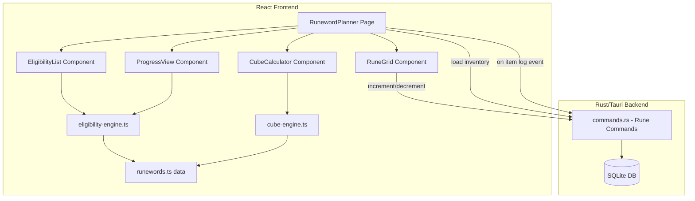

# Design Document: Runeword Planner

## Overview

The Runeword Planner adds a dedicated "Runes" page to the D2R Desktop application that provides per-profile rune inventory management, runeword eligibility calculation, progress tracking toward target runewords, and a Horadric Cube upgrade path calculator. It integrates with the existing item logging system to auto-update rune counts when runes are found or deleted during farming runs.

The feature follows the established architecture: a SQLite-backed Rust backend exposes Tauri commands consumed by a React frontend page. Static game data (runeword recipes, rune tiers, cube upgrade ratios) lives in `src/data/` as TypeScript constants. The page is lazy-loaded and uses `react-i18next` for UI labels.

### Key Design Decisions

1. **Derived inventory model**: Rune counts are stored in a dedicated `rune_inventory` table (not computed from items). This allows manual adjustments (e.g., user traded a rune outside the app) while still auto-syncing with the item log.
2. **Frontend eligibility engine**: Runeword eligibility and progress calculations run client-side since the recipe data is static and the inventory is small (33 integers). No need to burden the Rust backend with this logic.
3. **Static recipe data in TypeScript**: Runeword recipes are compile-time constants in `src/data/runewords.ts`. This keeps them version-controlled, easily testable, and avoids database schema changes for game content.
4. **Target runeword persistence**: Selected target runewords are stored in a lightweight SQLite table (`runeword_targets`) to survive restarts and sync across devices.

## Architecture



### Data Flow

1. Page loads → calls `get_rune_inventory(profile_id)` → receives `RuneInventory` (map of rune name → count)
2. User clicks +/- → calls `update_rune_count(profile_id, rune, delta)` → backend updates DB → frontend re-fetches inventory
3. Item log event (rune found) → existing `create_item` command triggers → frontend listens and calls `increment_rune_count` automatically
4. Item deletion (rune removed) → existing `delete_item` flow → frontend calls `decrement_rune_count`
5. Eligibility engine receives inventory → compares against all recipes → returns categorized list (craftable / partial)
6. Cube calculator receives target rune + current inventory → computes upgrade path → returns breakdown

## Components and Interfaces

### Backend (Rust)

#### New Tauri Commands

```rust
#[tauri::command]
fn get_rune_inventory(state: State<DbState>, profile_id: String) -> Result<Vec<RuneCount>, String>;

#[tauri::command]
fn update_rune_count(state: State<DbState>, profile_id: String, rune_name: String, delta: i32) -> Result<RuneCount, String>;

#[tauri::command]
fn set_rune_count(state: State<DbState>, profile_id: String, rune_name: String, count: i32) -> Result<RuneCount, String>;

#[tauri::command]
fn get_runeword_targets(state: State<DbState>, profile_id: String) -> Result<Vec<RunewordTarget>, String>;

#[tauri::command]
fn add_runeword_target(state: State<DbState>, profile_id: String, runeword_name: String) -> Result<RunewordTarget, String>;

#[tauri::command]
fn remove_runeword_target(state: State<DbState>, id: String) -> Result<(), String>;
```

#### Rust Models

```rust
#[derive(Serialize, Clone)]
pub struct RuneCount {
    pub profile_id: String,
    pub rune_name: String,
    pub count: i32,
}

#[derive(Serialize, Clone)]
pub struct RunewordTarget {
    pub id: String,
    pub profile_id: String,
    pub runeword_name: String,
    pub created_at: String,
}
```

### Frontend Components

#### `src/pages/RunewordPlanner.tsx`

Top-level page component. Receives `profile: Profile` prop. Orchestrates data loading and passes inventory state down to children.

```typescript
interface Props {
  readonly profile: Profile;
}
```

#### `src/components/RuneGrid.tsx`

Displays all 33 runes in a responsive grid. Each cell shows rune name, count, and +/- buttons.

```typescript
interface RuneGridProps {
  inventory: RuneInventory;
  onIncrement: (runeName: string) => void;
  onDecrement: (runeName: string) => void;
}
```

#### `src/components/EligibilityList.tsx`

Shows runewords grouped as "Craftable" (all runes available) with option to filter/search.

```typescript
interface EligibilityListProps {
  inventory: RuneInventory;
  recipes: RunewordRecipe[];
}
```

#### `src/components/ProgressView.tsx`

Shows selected target runewords with completion percentage and per-rune breakdown.

```typescript
interface ProgressViewProps {
  inventory: RuneInventory;
  targets: RunewordTarget[];
  recipes: RunewordRecipe[];
  onRemoveTarget: (id: string) => void;
  onAddTarget: (runewordName: string) => void;
}
```

#### `src/components/CubeCalculator.tsx`

Accepts a target rune selection, computes upgrade path from lower runes accounting for current inventory.

```typescript
interface CubeCalculatorProps {
  inventory: RuneInventory;
  targetRune: string | null;
  onSelectRune: (runeName: string) => void;
}
```

### Frontend Logic Modules

#### `src/data/runewords.ts`

Static runeword recipe database.

```typescript
export interface RunewordRecipe {
  name: string;
  runes: string[];           // Ordered rune sequence, e.g. ["Jah", "Ith", "Ber"]
  bases: string[];           // Valid base types: "weapon", "armor", "shield", "helmet"
  sockets: number;           // Required socket count
}

export const RUNEWORD_RECIPES: RunewordRecipe[] = [/* ~99 entries */];
```

#### `src/data/runes.ts`

Rune tier and cube recipe data.

```typescript
export interface RuneDefinition {
  name: string;
  level: number;             // 1 (El) to 33 (Zod)
  upgradeRatio: number;      // 3 for El-Sol, 2 for Pul-Zod
  requiresGem: boolean;      // true for Amn+ upgrades
}

export const RUNE_DEFINITIONS: RuneDefinition[] = [/* 33 entries */];
export const RUNE_ORDER: string[] = [/* El through Zod */];
```

#### `src/lib/eligibility-engine.ts`

Pure function module for runeword eligibility calculations.

```typescript
export type RuneInventory = Record<string, number>;

export interface EligibilityResult {
  runeword: RunewordRecipe;
  craftable: boolean;
  percentComplete: number;   // 0-100
  missingRunes: { rune: string; needed: number; have: number }[];
}

export function calculateEligibility(
  inventory: RuneInventory,
  recipes: RunewordRecipe[]
): EligibilityResult[];

export function calculateProgress(
  inventory: RuneInventory,
  recipe: RunewordRecipe
): EligibilityResult;
```

#### `src/lib/cube-engine.ts`

Pure function module for cube upgrade path computation.

```typescript
export interface UpgradeStep {
  rune: string;
  level: number;
  needed: number;            // Total needed at this tier
  have: number;              // Currently in inventory
  remaining: number;         // needed - have (min 0)
}

export interface UpgradePath {
  targetRune: string;
  steps: UpgradeStep[];      // From lowest needed tier up to target
  alreadyOwned: boolean;     // True if user already has target rune
  totalBaseRunes: number;    // Total El-equivalent runes needed
}

export function calculateUpgradePath(
  targetRune: string,
  inventory: RuneInventory
): UpgradePath;
```

## Data Models

### SQLite Tables

#### `rune_inventory`

```sql
CREATE TABLE IF NOT EXISTS rune_inventory (
    profile_id TEXT NOT NULL,
    rune_name TEXT NOT NULL,
    count INTEGER NOT NULL DEFAULT 0,
    PRIMARY KEY (profile_id, rune_name),
    FOREIGN KEY (profile_id) REFERENCES profiles(id) ON DELETE CASCADE
);
CREATE INDEX IF NOT EXISTS idx_rune_inventory_profile ON rune_inventory(profile_id);
```

#### `runeword_targets`

```sql
CREATE TABLE IF NOT EXISTS runeword_targets (
    id TEXT PRIMARY KEY,
    profile_id TEXT NOT NULL,
    runeword_name TEXT NOT NULL,
    created_at TEXT NOT NULL,
    FOREIGN KEY (profile_id) REFERENCES profiles(id) ON DELETE CASCADE
);
CREATE INDEX IF NOT EXISTS idx_runeword_targets_profile ON runeword_targets(profile_id);
```

### TypeScript Types (`src/types.ts` additions)

```typescript
export interface RuneCount {
  profile_id: string;
  rune_name: string;
  count: number;
}

export interface RunewordTarget {
  id: string;
  profile_id: string;
  runeword_name: string;
  created_at: string;
}
```

### Cloud Sync Payload Extension

Add to `SyncPayload`:

```typescript
export interface RuneInventoryData {
  profile_id: string;
  rune_name: string;
  count: number;
}

export interface RunewordTargetData {
  profile_id: string;
  runeword_name: string;
  created_at: string;
}

// Added to SyncPayload interface:
rune_inventory: SyncRecord<RuneInventoryData>[];
runeword_targets: SyncRecord<RunewordTargetData>[];
```

The sync ID for `rune_inventory` records uses a composite key format: `{profile_id}:{rune_name}`.


## Correctness Properties

*A property is a characteristic or behavior that should hold true across all valid executions of a system — essentially, a formal statement about what the system should do. Properties serve as the bridge between human-readable specifications and machine-verifiable correctness guarantees.*

### Property 1: Inventory operations preserve invariants

*For any* rune inventory and any sequence of increment/decrement operations applied to any rune, the resulting count for that rune SHALL equal the initial count plus the sum of deltas, clamped to a minimum of zero. No operation shall cause any count to become negative.

**Validates: Requirements 1.3, 1.4, 1.5**

### Property 2: Rune name parsing correctness

*For any* rune name from the set of 33 valid runes, appending the suffix " Rune" and then stripping that suffix SHALL produce the original rune name. Conversely, for any item name that does NOT match the "{Name} Rune" pattern, the parser SHALL not match to any valid rune.

**Validates: Requirements 2.3**

### Property 3: Auto-sync with item log

*For any* rune item logged with item_type "Rune" and rarity "Rune" and a valid name of the form "{RuneName} Rune", the rune inventory count for the parsed rune SHALL increase by one. For any such rune item subsequently deleted, the count SHALL decrease by one (clamped at zero).

**Validates: Requirements 2.1, 2.2**

### Property 4: Eligibility classification correctness

*For any* rune inventory state and any runeword recipe, the eligibility engine SHALL mark the recipe as "craftable" if and only if for every rune in the recipe, the inventory count for that rune is greater than or equal to the number of times that rune appears in the recipe.

**Validates: Requirements 4.2, 4.3**

### Property 5: Progress calculation accuracy

*For any* rune inventory and any runeword recipe, the progress calculation SHALL produce: (a) a percentComplete equal to (sum of min(have, needed) for each distinct rune / sum of needed for each distinct rune) × 100, (b) a missingRunes list containing exactly those runes where have < needed, and (c) for each rune in the recipe, correct needed and have values.

**Validates: Requirements 5.2, 5.3, 5.4**

### Property 6: Cube upgrade path correctness

*For any* target rune above level 1 and an empty inventory, the cube calculator SHALL produce an upgrade path where each step uses the correct upgrade ratio for its tier (3:1 for levels 1–10, 3:1 for levels 11–20, 2:1 for levels 21–33), the path includes all intermediate tiers from the lowest needed tier up to the target, and the quantities at each tier are consistent (tier N needed = ceil(tier N+1 needed / ratio)).

**Validates: Requirements 6.1, 6.2, 6.3**

### Property 7: Inventory reduces cube path cost (metamorphic)

*For any* target rune and any non-empty inventory containing at least one rune that appears in the upgrade path, the total base runes needed SHALL be strictly less than or equal to the total needed with an empty inventory.

**Validates: Requirements 6.4**

### Property 8: Inventory persistence round-trip

*For any* valid rune inventory state (33 runes with non-negative integer counts), writing the inventory to the database and reading it back SHALL produce an identical inventory.

**Validates: Requirements 1.6**

### Property 9: Sync serialization round-trip

*For any* valid rune inventory data set, serializing it into the sync payload format and deserializing it back SHALL produce an identical data set with all per-profile rune counts preserved.

**Validates: Requirements 9.4**

## Error Handling

### Backend Errors

| Error Condition | Handling |
|---|---|
| Invalid rune name passed to `update_rune_count` | Return `Err("Invalid rune name: {name}")` — validate against known 33 rune names |
| Decrement below zero | Clamp to zero in SQL: `UPDATE ... SET count = MAX(0, count + ?1)` |
| Profile not found | Return `Err("Profile not found")` — FK constraint prevents orphan data |
| Database lock contention | Standard Mutex-based serialization (existing pattern) |
| Invalid runeword name for target | Return `Err("Unknown runeword: {name}")` — validate against recipe list |

### Frontend Errors

| Error Condition | Handling |
|---|---|
| Tauri command fails | Show toast notification with error message, maintain last-known-good state |
| Inventory load fails on page mount | Show error state with retry button |
| Recipe data inconsistency | Log warning, skip invalid recipe in eligibility calculation |
| Cube calculator receives invalid rune | Disable calculate button, show "Select a rune" prompt |

### Data Integrity

- The `rune_inventory` table uses a composite primary key `(profile_id, rune_name)` preventing duplicate entries
- FK constraint on `profile_id` with `ON DELETE CASCADE` ensures cleanup when profiles are deleted
- The `count` field uses a CHECK constraint or application-level clamping to prevent negative values
- The `update_rune_count` command uses `INSERT OR REPLACE` (upsert) to handle first-time vs subsequent updates atomically

## Testing Strategy

### Unit Tests (Example-Based)

- **Recipe data validation**: Verify all ~99 runeword recipes are present, have correct socket counts matching rune array lengths, include valid base types, and include the 5 RotW runewords
- **Rune definitions**: Verify all 33 runes are defined with correct levels 1-33 in order
- **UI rendering**: Verify grid renders 33 runes in order, zero-count styling, button presence
- **Navigation**: Verify sidebar entry exists and routes correctly
- **Integration points**: Verify auto-increment triggers on item creation, auto-decrement on item deletion

### Property-Based Tests

Property-based testing is appropriate for this feature because the eligibility engine, cube calculator, and inventory operations are pure functions with clear input/output behavior and large input spaces (arbitrary inventory states × all recipes).

**Library**: `fast-check` (already available in the Node.js/TypeScript ecosystem, integrates with Vitest)

**Configuration**: Minimum 100 iterations per property test.

**Tag format**: `Feature: runeword-planner, Property {N}: {description}`

Each correctness property above maps to a single property-based test:
- Property 1 → Test with arbitrary rune names and operation sequences
- Property 2 → Test with arbitrary strings to verify parsing/round-trip
- Property 3 → Test with arbitrary rune items logged and deleted
- Property 4 → Test with arbitrary inventories × all recipes
- Property 5 → Test with arbitrary inventories × arbitrary recipes
- Property 6 → Test with arbitrary target runes and empty inventory
- Property 7 → Test with arbitrary target runes × non-empty inventories (metamorphic: compare with empty)
- Property 8 → Test with arbitrary inventory states → DB write → DB read → compare
- Property 9 → Test with arbitrary inventory data → serialize → deserialize → compare

### Integration Tests

- Cloud sync push includes rune inventory data
- Cloud sync pull restores rune inventory correctly
- Profile deletion cascades to rune inventory and runeword targets
- Auto-increment via item log event end-to-end
