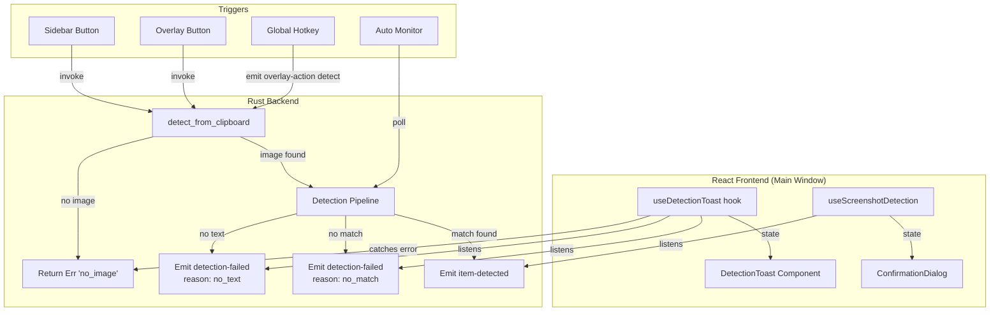

# Design Document: Screenshot Detection UX Improvements

## Overview

This design extends the existing screenshot detection system with three UX improvements: (1) toast notifications for detection failure/success feedback, (2) a detection trigger button in the overlay window, and (3) a configurable global hotkey for triggering detection from anywhere.

The existing pipeline (`detect_from_clipboard` → OCR → parse → match → emit `screenshot:item-detected`) currently silently fails when no image is found, no text is extracted, or no match is produced. This design modifies the backend to emit a new `screenshot:detection-failed` event with structured reason codes, and adds frontend infrastructure to display toast notifications in response.

Key design decisions:
- **Backend emits failure events**: Rather than relying solely on command return values, the backend emits `screenshot:detection-failed` events so both the monitor (automatic) and manual paths share the same notification mechanism
- **Toast component is app-level**: A single `DetectionToast` component lives in `App.tsx`, driven by a lightweight hook that listens for failure events
- **Overlay communicates via Tauri events**: The overlay button invokes `detect_from_clipboard` directly (same as sidebar button), and failure toasts appear in the main window since the overlay is intentionally minimal
- **Hotkey reuses existing pattern**: The detection hotkey integrates into the existing `loadHotkeys` / `saveHotkeys` / `registerHotkeys` system in `Settings.tsx` with conflict detection added

## Architecture



### Component Communication

| Source | Target | Mechanism | Payload |
|--------|--------|-----------|---------|
| Overlay Button | Backend | `invoke("detect_from_clipboard")` | None |
| Global Hotkey | Backend | `emit("overlay-action", "detect")` → overlay_action handler | None |
| Backend (failure) | Frontend | Event `screenshot:detection-failed` | `{ reason, message }` |
| Backend (no image) | Frontend | Command error return | String containing "no_image" |
| Frontend toast hook | Toast UI | React state | `{ message, visible }` |
| Settings | Global Shortcut API | `register()` / `unregister()` | Key combination string |

## Components and Interfaces

### Backend Changes (`src-tauri/src/screenshot/monitor.rs`)

The `process_image` method and `detect_once` method are modified to emit failure events instead of silently returning:

```rust
/// Event payload for detection failures
#[derive(Debug, Serialize, Deserialize, Clone)]
pub struct DetectionFailedPayload {
    pub reason: String,   // "no_image" | "no_text" | "no_match"
    pub message: String,  // Human-readable description
}
```

Changes to `detect_once`:
- When clipboard has no image → return `Err("no_image: No image found in clipboard")`
- Success path delegates to `process_image` which handles the rest

Changes to `process_image`:
- When OCR returns empty text → emit `screenshot:detection-failed` with reason `"no_text"`
- When all match scores ≤ 30 → emit `screenshot:detection-failed` with reason `"no_match"`
- Success path unchanged (still emits `screenshot:item-detected`)

### Frontend: `useDetectionToast` Hook

New hook at `src/hooks/useDetectionToast.ts`:

```typescript
interface ToastState {
  message: string;
  visible: boolean;
}

interface UseDetectionToast {
  toast: ToastState | null;
  showToast: (message: string) => void;
  dismissToast: () => void;
}

export function useDetectionToast(): UseDetectionToast;
```

Responsibilities:
- Listens for `screenshot:detection-failed` events and maps reason to message
- Provides `showToast(message)` for imperative triggers (e.g., "no profile" case)
- Auto-dismisses after 4 seconds
- Replaces previous toast when a new one is triggered (resets timer)

### Frontend: `DetectionToast` Component

New component at `src/components/DetectionToast.tsx`:

```typescript
interface DetectionToastProps {
  message: string;
  onDismiss: () => void;
}
```

- Renders in bottom-right of main window via fixed positioning
- Shows close button (keyboard-focusable, activatable with Enter/Space)
- 4-second auto-dismiss (handled by the hook, not the component)

### Frontend: Overlay Button Addition (`src/overlay/Overlay.tsx`)

Add a camera icon button (◫) to the overlay:
- In the **idle state** (no session): render in the `overlay-header` area
- In the **active state** (session running): render in the `overlay-controls` bar alongside existing split/pause/stop/item buttons

```typescript
const handleDetect = async () => {
  try {
    await invoke("detect_from_clipboard");
  } catch (error) {
    // Error contains "no_image" → the main window hook handles toasts
    // via the event system; overlay doesn't show its own toast
  }
};
```

The button uses CSS class `ov-btn ov-detect` with the same 44×30px dimensions.

### Frontend: Hotkey Settings Extension (`src/pages/Settings.tsx`)

Extend the hotkey config type:

```typescript
const DEFAULT_HOTKEYS = {
  nextRun: "F9",
  pause: "F10",
  endSession: "F11",
  detectScreenshot: "",  // default: unset
};
```

Changes to `registerHotkeys()`:
- If `detectScreenshot` is non-empty, register it as a global shortcut
- On press, invoke `detect_from_clipboard` directly (or emit an internal event)
- Conflict detection: before saving a new binding, check if the key combination is already used by another hotkey in the config

### Frontend: Profile Check Integration

Both the overlay button handler and the hotkey handler need to check whether a profile is selected before invoking detection. Since the overlay and hotkey run outside the component tree that holds `selectedProfile`:

- The **hotkey handler** runs inside `registerHotkeys()` which is called from `App.tsx` on mount. We pass a profile-check mechanism: read from a shared state (localStorage key `d2r_active_profile_id` that's set when a profile is selected).
- The **overlay button** invokes `detect_from_clipboard` regardless; the main window's `useDetectionToast` hook checks profile state and shows the "Select a profile first" toast if needed (by listening to a `screenshot:detect-triggered` event the overlay emits before invoking).

Simpler approach chosen: The overlay button and hotkey both invoke `detect_from_clipboard` directly. The `useScreenshotDetection` hook in the main window is extended to:
1. Before calling `detectFromClipboard()`, check if `profileId` is null
2. If null, call `showToast("Select a profile first to log items")` and skip the command

For the hotkey path, since it bypasses React entirely, we store the selected profile ID in localStorage. The hotkey handler reads it before invoking the command.

## Data Models

### New Event: `screenshot:detection-failed`

```typescript
interface DetectionFailedPayload {
  reason: "no_image" | "no_text" | "no_match";
  message: string;
}
```

Emitted by the Rust backend. The frontend maps `reason` to user-facing toast messages:
- `"no_image"` → "No image found in clipboard"
- `"no_text"` → "No text detected in screenshot"
- `"no_match"` → "No item detected in screenshot"

### Hotkey Config (localStorage)

Extended shape stored under `d2r_hotkeys`:

```typescript
interface HotkeyConfig {
  nextRun: string;       // e.g. "F9"
  pause: string;         // e.g. "F10"
  endSession: string;    // e.g. "F11"
  detectScreenshot: string; // e.g. "" (unset) or "Ctrl+Shift+D"
}
```

### Toast State

```typescript
interface DetectionToastState {
  message: string;
  timestamp: number;  // for replacement logic
}
```

### CSS: New overlay button variant

```css
.ov-detect {
  background: var(--ov-item-bg);
  color: var(--ov-text);
}
```

Reuses the same dimensions (44×30px) and hover behavior as existing `ov-btn` buttons.

## Correctness Properties

*A property is a characteristic or behavior that should hold true across all valid executions of a system — essentially, a formal statement about what the system should do. Properties serve as the bridge between human-readable specifications and machine-verifiable correctness guarantees.*

### Property 1: Hotkey configuration persistence round-trip

*For any* valid `HotkeyConfig` object (where each field is either an empty string or a non-empty key combination string composed of modifier prefixes and a key name), saving the config to localStorage via `saveHotkeys` and then loading it via `loadHotkeys` SHALL produce an identical `HotkeyConfig` value.

**Validates: Requirements 4.6**

### Property 2: Hotkey conflict detection prevents duplicate bindings

*For any* hotkey configuration state and any non-empty key combination string K, if K is already assigned to one hotkey slot (nextRun, pause, endSession, or detectScreenshot), attempting to assign K to a different slot SHALL be rejected and the target slot SHALL retain its previous value.

**Validates: Requirements 4.9**

## Error Handling

### Backend Error Reporting

| Error Condition | Event/Return | Payload |
|----------------|-------------|---------|
| No image in clipboard | Command returns `Err("no_image: ...")` | Error string containing "no_image" |
| OCR extracts no text | Emits `screenshot:detection-failed` | `{ reason: "no_text", message: "No readable text found in the clipboard image" }` |
| No match above score 30 | Emits `screenshot:detection-failed` | `{ reason: "no_match", message: "No item matched the detected text" }` |

### Frontend Toast Error Handling

| Error Condition | Response | Recovery |
|----------------|----------|----------|
| `detect_from_clipboard` rejects with "no_image" | Show toast immediately from catch block | Toast auto-dismisses in 4s |
| `detection-failed` event with "no_text" | Show "No text detected in screenshot" toast | Toast auto-dismisses in 4s |
| `detection-failed` event with "no_match" | Show "No item detected in screenshot" toast | Toast auto-dismisses in 4s |
| No profile selected on any trigger | Show "Select a profile first to log items" toast | Toast auto-dismisses in 4s |
| Global shortcut registration fails | Show status message in Settings, retain previous binding | User can try a different combination |
| Duplicate hotkey binding attempted | Show "Key combination already in use" status | Previous binding retained |

### Toast Lifecycle Rules

- Only one toast visible at a time (latest replaces previous)
- Timer resets on replacement
- Close button always available for manual dismiss
- Toast does not block any UI interaction (no overlay/backdrop)

### Overlay Button Errors

The overlay button always invokes `detect_from_clipboard`. If the command fails:
- The overlay itself does not show error UI (it's intentionally minimal)
- The main window's `useDetectionToast` hook picks up the failure event and shows the toast there
- If the main window is minimized, the toast queues and appears when restored

## Testing Strategy

### Unit Tests (Vitest)

**Toast Hook (`useDetectionToast`):**
- Listens for `screenshot:detection-failed` events and maps reason to message
- `showToast` sets message state
- Auto-dismisses after 4000ms (fake timers)
- Replacing a toast resets the timer
- `dismissToast` clears state immediately

**Toast Component (`DetectionToast`):**
- Renders message text and close button
- Close button is keyboard-focusable (tabIndex)
- Close button responds to Enter and Space keydown
- Fixed positioning in bottom-right (style assertions)

**Overlay Button:**
- Renders in idle state (overlay-header area)
- Renders in active state (overlay-controls bar)
- Click invokes `detect_from_clipboard` (mocked)
- Uses `ov-btn ov-detect` classes with ◫ icon
- Keyboard accessible (Enter/Space activate)

**Hotkey Settings:**
- "Detect Screenshot" row renders alongside existing rows
- Default value displays "Not set"
- Recording mode captures key combination
- Conflict detection rejects duplicate bindings with status message
- Clearing binding calls unregister

**Reason Mapping:**
- "no_image" → "No image found in clipboard"
- "no_text" → "No text detected in screenshot"
- "no_match" → "No item detected in screenshot"
- Unknown reason → fallback generic message

### Property-Based Tests (fast-check)

**Library:** `fast-check` (already in devDependencies)

**Configuration:** Minimum 100 iterations per property test.

**Tag format:** `Feature: screenshot-detect-ux, Property {N}: {description}`

| Property | Module Under Test | Generator Strategy |
|----------|-------------------|-------------------|
| 1: Hotkey config round-trip | `Settings.tsx` (loadHotkeys/saveHotkeys) | Arbitrary objects with 4 string fields (empty or modifier+key combos) |
| 2: Conflict detection | Hotkey conflict checker function | Arbitrary HotkeyConfig state + random key combo + random target slot |

### Rust Unit Tests

**`detect_once` error path:**
- Returns error containing "no_image" when clipboard has no image

**`process_image` failure events:**
- Emits `screenshot:detection-failed` with reason "no_text" when OCR returns empty
- Emits `screenshot:detection-failed` with reason "no_match" when all scores ≤ 30
- Does NOT emit failure event when matches are found (existing success path)

### Integration Tests

- Full flow: overlay button click → command invoke → failure event → main window toast
- Full flow: hotkey press → profile check → command invoke → success event → confirmation dialog
- Hotkey persistence: save config → reload app → verify hotkey re-registered
- Conflict detection: assign same key to two slots → second rejected

### Test Environment

- Frontend tests run via `vitest run`
- Property tests use `fast-check` integrated with vitest
- Rust tests run via `cargo test`
- No additional external dependencies required (clipboard mocked in tests)

