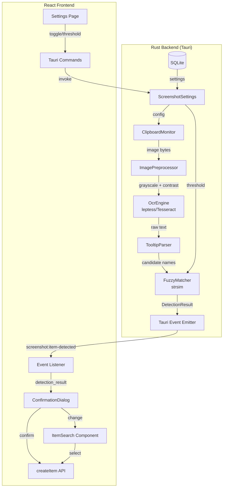
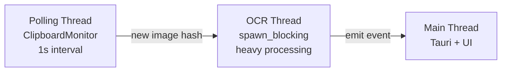

# Design Document: Screenshot Item Detection

## Overview

This design describes the architecture for OCR-based item detection from clipboard screenshots in the D2R Desktop application. The system monitors the clipboard for screenshot images, extracts text via local Tesseract OCR, matches extracted text against the item database using fuzzy string matching, and presents results to the user for confirmation before logging.

The pipeline flows entirely within the local machine:

```
Clipboard → Rust Monitor → Image Preprocessing → Tesseract OCR → Text Parser → Fuzzy Matcher → Frontend Event → Confirmation UI → Item Logging
```

Key design decisions:
- **All OCR in Rust**: Using `leptess` crate (Tesseract + Leptonica bindings) for reliable OCR with image preprocessing
- **Clipboard via `arboard`**: Cross-platform clipboard reading maintained by 1Password, supports image data
- **Fuzzy matching via `strsim`**: Normalized Levenshtein distance for confidence scoring
- **Event-driven frontend**: Rust emits Tauri events on detection; React listens and renders the confirmation UI
- **No game interaction**: Only reads OS clipboard placed by user-initiated PrintScreen

## Architecture



### Component Communication

| Source | Target | Mechanism | Payload |
|--------|--------|-----------|---------|
| ClipboardMonitor | OcrEngine | Direct Rust call (background thread) | `Vec<u8>` image bytes |
| OcrEngine | FuzzyMatcher | Direct Rust call | Parsed candidate strings |
| FuzzyMatcher | Frontend | Tauri event `screenshot:item-detected` | `DetectionResult` JSON |
| Frontend | Backend (settings) | Tauri command `get_screenshot_settings` / `update_screenshot_settings` | Settings struct |
| Frontend | Backend (manual trigger) | Tauri command `detect_from_clipboard` | None |
| Frontend | Backend (item log) | Existing `create_item` command | `CreateItemInput` |

### Threading Model



- **Polling thread**: A dedicated `tokio::spawn` task polls the clipboard every 1 second using `arboard::Clipboard`. Compares image hash (SHA-256) against last processed hash.
- **OCR thread**: When a new image is detected, processing is dispatched via `tokio::task::spawn_blocking` to avoid blocking the async runtime. At most 1 pending image is queued.
- **Main thread**: Receives detection results and emits them as Tauri events to the frontend.

## Components and Interfaces

### Rust Modules

#### `screenshot/mod.rs` — Module root
Exports the public API and re-exports submodules.

#### `screenshot/monitor.rs` — ClipboardMonitor
```rust
pub struct ClipboardMonitor {
    running: Arc<AtomicBool>,
    last_hash: Arc<Mutex<Option<[u8; 32]>>>,
    pending_image: Arc<Mutex<Option<Vec<u8>>>>,
    processing: Arc<AtomicBool>,
}

impl ClipboardMonitor {
    pub fn start(app_handle: AppHandle, settings: ScreenshotSettings) -> Self;
    pub fn stop(&self);
    pub fn is_running(&self) -> bool;
}
```

#### `screenshot/ocr.rs` — OcrEngine
```rust
pub struct OcrEngine {
    // Tesseract instance reused across calls
}

impl OcrEngine {
    pub fn new() -> Result<Self, OcrError>;
    pub fn extract_text(image_data: &[u8]) -> Result<String, OcrError>;
    fn preprocess(image_data: &[u8]) -> Result<Vec<u8>, OcrError>;
}
```

#### `screenshot/parser.rs` — TooltipParser
```rust
pub struct ParsedCandidate {
    pub text: String,
    pub line_index: usize,
}

pub fn parse_tooltip_text(raw_text: &str) -> Vec<ParsedCandidate>;
pub fn normalize_text(text: &str) -> String;
```

#### `screenshot/matcher.rs` — FuzzyMatcher
```rust
pub struct MatchCandidate {
    pub item_name: String,
    pub category: String,
    pub subcategory: String,
    pub confidence: u8, // 0-100
}

pub fn match_items(
    candidates: &[ParsedCandidate],
    item_database: &[GameItemEntry],
    threshold: u8,
) -> Vec<MatchCandidate>;

pub fn normalize_ocr_chars(text: &str) -> String;
pub fn calculate_confidence(extracted: &str, item_name: &str) -> u8;
```

#### `screenshot/settings.rs` — ScreenshotSettings
```rust
#[derive(Debug, Serialize, Deserialize, Clone)]
pub struct ScreenshotSettings {
    pub monitoring_enabled: bool,    // default: false
    pub auto_detection_enabled: bool, // default: true
    pub confidence_threshold: u8,    // default: 80, range: 50-100
}

pub fn get_settings(conn: &Connection) -> ScreenshotSettings;
pub fn update_settings(conn: &Connection, settings: &ScreenshotSettings) -> Result<(), String>;
```

### Tauri Commands

```rust
#[tauri::command]
pub fn get_screenshot_settings(state: State<DbState>) -> Result<ScreenshotSettings, String>;

#[tauri::command]
pub fn update_screenshot_settings(
    state: State<DbState>,
    monitor_state: State<MonitorState>,
    settings: ScreenshotSettings,
) -> Result<ScreenshotSettings, String>;

#[tauri::command]
pub async fn detect_from_clipboard(
    app: AppHandle,
    state: State<'_, DbState>,
) -> Result<(), String>;
```

### Frontend Components

#### `ConfirmationDialog.tsx`
```typescript
interface DetectionResult {
  topMatch: MatchCandidate | null;
  candidates: MatchCandidate[];
  rawText: string;
  isAutoSuggested: boolean;
}

interface MatchCandidate {
  itemName: string;
  category: string;
  subcategory: string;
  confidence: number;
}

// Props
interface ConfirmationDialogProps {
  result: DetectionResult;
  profileId: string;
  runId: string | null;
  onConfirm: (item: MatchCandidate) => void;
  onDismiss: () => void;
  onChange: () => void;
}
```

#### `ScreenshotSettings.tsx`
Settings panel rendered within the existing Settings page under a "Screenshot Detection" section.

#### Event Listener Hook: `useScreenshotDetection.ts`
```typescript
function useScreenshotDetection(profileId: string | null): {
  detection: DetectionResult | null;
  dismiss: () => void;
  confirm: (item: MatchCandidate) => void;
  triggerManual: () => void;
}
```

### API Layer Extensions (`src/api.ts`)

```typescript
// Screenshot Detection
export const getScreenshotSettings = () =>
  invoke<ScreenshotSettings>("get_screenshot_settings");

export const updateScreenshotSettings = (settings: ScreenshotSettings) =>
  invoke<ScreenshotSettings>("update_screenshot_settings", { settings });

export const detectFromClipboard = () =>
  invoke<void>("detect_from_clipboard");
```

## Data Models

### Rust — DetectionResult (emitted via event, not persisted)

```rust
#[derive(Debug, Serialize, Deserialize, Clone)]
pub struct DetectionResult {
    pub top_match: Option<MatchCandidate>,
    pub candidates: Vec<MatchCandidate>,  // max 5
    pub raw_text: String,
    pub is_auto_suggested: bool,
    pub detected_at: String,  // RFC 3339
}

#[derive(Debug, Serialize, Deserialize, Clone)]
pub struct MatchCandidate {
    pub item_name: String,
    pub category: String,
    pub subcategory: String,
    pub confidence: u8,  // 0-100
}
```

### Rust — GameItemEntry (in-memory item database for matching)

```rust
#[derive(Debug, Clone)]
pub struct GameItemEntry {
    pub name: String,
    pub normalized_name: String,  // pre-computed for matching
    pub category: String,
    pub subcategory: String,
}
```

The item database is loaded once at startup from a static list embedded in the Rust binary (mirroring `src/data/items.ts`). Normalized names are pre-computed with OCR character substitution applied.

### SQLite — Screenshot Settings Table

```sql
CREATE TABLE IF NOT EXISTS screenshot_settings (
    id INTEGER PRIMARY KEY CHECK (id = 1),
    monitoring_enabled INTEGER NOT NULL DEFAULT 0,
    auto_detection_enabled INTEGER NOT NULL DEFAULT 1,
    confidence_threshold INTEGER NOT NULL DEFAULT 80
        CHECK (confidence_threshold >= 50 AND confidence_threshold <= 100)
);
```

Single-row settings table with constraints matching requirements.

### TypeScript — Frontend Types

```typescript
interface ScreenshotSettings {
  monitoringEnabled: boolean;
  autoDetectionEnabled: boolean;
  confidenceThreshold: number;
}

interface DetectionResult {
  topMatch: MatchCandidate | null;
  candidates: MatchCandidate[];
  rawText: string;
  isAutoSuggested: boolean;
  detectedAt: string;
}

interface MatchCandidate {
  itemName: string;
  category: string;
  subcategory: string;
  confidence: number;
}
```

### Crate Dependencies (additions to Cargo.toml)

```toml
leptess = "0.14"          # Tesseract + Leptonica bindings
arboard = { version = "3", features = ["image-data"] }  # Clipboard with image support
image = "0.25"            # Image preprocessing (grayscale, contrast)
strsim = "0.11"           # Levenshtein distance for fuzzy matching
sha2 = "0.10"             # SHA-256 for image hashing
```


## Correctness Properties

*A property is a characteristic or behavior that should hold true across all valid executions of a system — essentially, a formal statement about what the system should do. Properties serve as the bridge between human-readable specifications and machine-verifiable correctness guarantees.*

### Property 1: Confidence score range and count invariants

*For any* input string (including empty, whitespace, Unicode, and valid item names), calling `match_items` SHALL return a list of at most 5 candidates where every candidate's `confidence` field is an integer in the range [0, 100].

**Validates: Requirements 3.3, 3.4**

### Property 2: Match results sorted by confidence descending

*For any* non-empty input string and item database, the list of candidates returned by `match_items` SHALL be ordered by `confidence` descending (each element's confidence ≥ the next element's confidence), subject only to tiebreaker reordering within a 5-point band.

**Validates: Requirements 3.1, 3.2**

### Property 3: Category tiebreaker ordering within confidence band

*For any* set of match candidates where two or more candidates have confidence scores within 5 points of each other, candidates with category "Unique", "Set", or "Rune" SHALL appear before candidates of other categories within that band.

**Validates: Requirements 3.5**

### Property 4: OCR character normalization is idempotent

*For any* input string, applying `normalize_ocr_chars` twice SHALL produce the same result as applying it once: `normalize_ocr_chars(normalize_ocr_chars(s)) == normalize_ocr_chars(s)`.

**Validates: Requirements 3.6**

### Property 5: Text normalization produces valid canonical output

*For any* input string, the output of `normalize_text` SHALL: contain no leading or trailing whitespace, contain no consecutive space characters, contain no line break characters, and contain only characters matching the pattern `[A-Za-z0-9 \-']`.

**Validates: Requirements 12.4**

### Property 6: Detection routing by confidence threshold

*For any* `DetectionResult` with a configured threshold T (50 ≤ T ≤ 100): if the top candidate's confidence > T, then `is_auto_suggested` SHALL be true; if the top candidate's confidence is in (30, T], then `is_auto_suggested` SHALL be false and `candidates` SHALL be non-empty; if all candidates have confidence ≤ 30 or there are zero candidates, the result SHALL trigger the ItemSearch fallback.

**Validates: Requirements 4.1, 4.2, 4.4, 4.5**

### Property 7: Settings threshold validation

*For any* integer value V, `update_screenshot_settings` SHALL succeed if and only if 50 ≤ V ≤ 100 for the `confidence_threshold` field. Values outside this range SHALL be rejected and the previously persisted value SHALL remain unchanged.

**Validates: Requirements 7.3, 7.4**

### Property 8: Settings persistence round-trip

*For any* valid `ScreenshotSettings` (monitoring_enabled: bool, auto_detection_enabled: bool, confidence_threshold: 50–100), saving settings to the database and then loading them SHALL produce an identical `ScreenshotSettings` value.

**Validates: Requirements 7.5**

### Property 9: Tooltip parser first-line extraction

*For any* multi-line text input, the tooltip parser SHALL produce a candidate list where the first candidate contains the first line of the input text (trimmed), and if that first-line candidate does not match any item in the database, a second candidate containing the concatenation of the first two lines SHALL also be present.

**Validates: Requirements 12.1**

### Property 10: Label stripping from tooltip candidates

*For any* extracted text where a known rarity label ("Unique", "Set", "Rare", "Magic", "Crafted") or base type label appears on a separate adjacent line, the parser SHALL produce candidates that do not contain those labels as part of the item name.

**Validates: Requirements 12.2**

### Property 11: Empty and whitespace-only input returns no candidates

*For any* string composed entirely of whitespace characters (spaces, tabs, newlines, or the empty string), `match_items` SHALL return an empty candidate list without performing any matching operations.

**Validates: Requirements 3.7**

## Error Handling

### Clipboard Monitor Errors

| Error Condition | Response | Recovery |
|----------------|----------|----------|
| Clipboard read fails (OS error) | Log warning, skip cycle | Continue polling on next 1s tick |
| Image data corrupt/undecodable | Log error, discard image | Wait for next clipboard change |
| OCR forwarding fails | Log error, discard image | Retry on next poll if image still present |
| Hash computation fails | Log error, skip | Continue on next cycle |

### OCR Engine Errors

| Error Condition | Response | Recovery |
|----------------|----------|----------|
| Tesseract initialization fails | Return `OcrError::InitFailed` | Feature disabled until restart |
| Image format unsupported | Return `OcrError::UnsupportedFormat` | No event emitted |
| No text extracted (blank image) | Return empty string | No event emitted |
| Processing timeout (>5s) | Abort, return `OcrError::Timeout` | Show transient notification |
| Memory allocation failure | Return `OcrError::Internal` | Feature continues, image discarded |

### Matcher Errors

| Error Condition | Response | Recovery |
|----------------|----------|----------|
| Item database empty | Return empty candidates | Feature non-functional (should not happen) |
| Normalization produces empty string | Treat as whitespace input | Return empty candidates |

### Frontend Errors

| Error Condition | Response | Recovery |
|----------------|----------|----------|
| `create_item` command fails | Show error toast | Dialog remains open for retry |
| Event deserialization fails | Log error, ignore event | Wait for next valid event |
| Settings save fails | Show error, retain previous values | User can retry |

### Error Propagation Strategy

- Rust errors use a custom `ScreenshotError` enum implementing `std::fmt::Display`
- Tauri commands return `Result<T, String>` where the error string is user-readable
- The frontend displays errors via toast notifications (transient, non-blocking)
- No error in the screenshot pipeline should crash the application or affect other features

## Testing Strategy

### Unit Tests (Vitest + Rust `#[cfg(test)]`)

**Frontend (Vitest):**
- ConfirmationDialog renders correctly for each detection state
- Auto-dismiss timer fires at 30 seconds
- Event listener hook manages state correctly
- Settings component validates threshold range
- Correction flow state transitions

**Rust (`#[cfg(test)]`):**
- `normalize_text` edge cases (empty, Unicode, special chars)
- `normalize_ocr_chars` substitution table
- `parse_tooltip_text` with various line formats
- `calculate_confidence` boundary values (identical strings = 100, completely different = low)
- Settings CRUD operations
- `match_items` with known item names

### Property-Based Tests (Rust: `proptest`, Frontend: `fast-check`)

**Library:** `proptest` (already in dev-dependencies) for Rust, `fast-check` (already in devDependencies) for TypeScript.

**Configuration:** Minimum 100 iterations per property test.

**Tag format:** `Feature: screenshot-item-detection, Property {N}: {description}`

Each correctness property from the design maps to a single property-based test:

| Property | Module Under Test | Generator Strategy |
|----------|-------------------|-------------------|
| 1: Score range & count | `matcher.rs` | Arbitrary UTF-8 strings |
| 2: Sorted results | `matcher.rs` | Arbitrary UTF-8 strings |
| 3: Category tiebreaker | `matcher.rs` | Strings producing close-score matches |
| 4: Normalization idempotent | `matcher.rs` | Arbitrary strings with OCR-confusable chars |
| 5: Valid canonical output | `parser.rs` | Arbitrary strings including special chars |
| 6: Detection routing | `detection logic` | (threshold: 50-100, scores: Vec<0-100>) |
| 7: Threshold validation | `settings.rs` | Arbitrary i32 values |
| 8: Settings round-trip | `settings.rs` | (bool, bool, 50-100) |
| 9: First-line extraction | `parser.rs` | Multi-line strings with \n separators |
| 10: Label stripping | `parser.rs` | Item names + random label combinations |
| 11: Empty input | `matcher.rs` | Whitespace-only strings |

### Integration Tests

- Full pipeline: clipboard image → OCR → match → event emission (requires Tesseract installed)
- Monitor start/stop lifecycle
- Settings persistence across simulated restart
- Manual detection trigger command
- Concurrent image submission (queue behavior)

### Test Environment

- Rust property tests run via `cargo test` (proptest discovers them automatically)
- Frontend property tests run via `vitest run` (fast-check integrates with vitest)
- Integration tests require Tesseract `eng.traineddata` in the test environment
- CI can skip OCR integration tests if Tesseract is not available (feature-gate)
