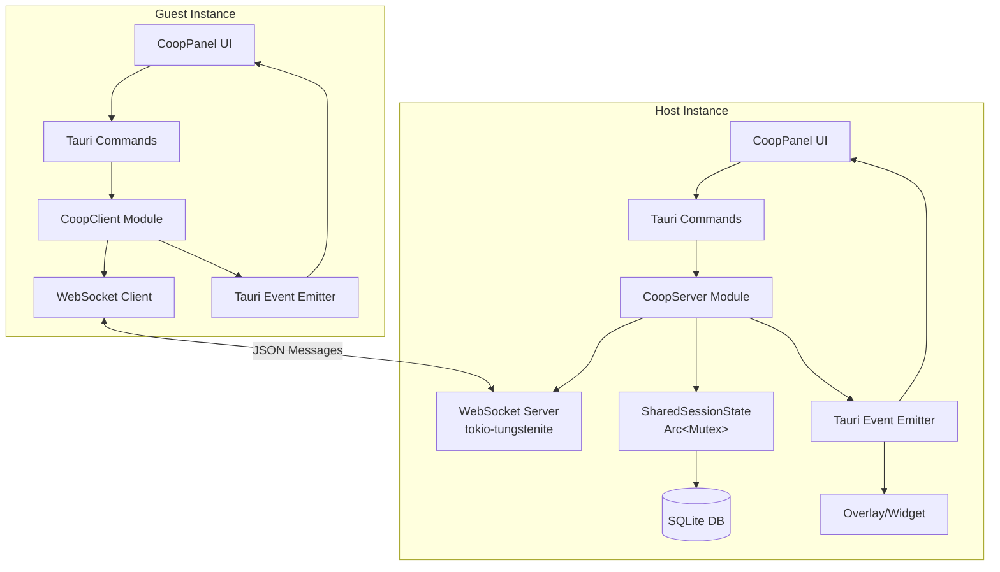
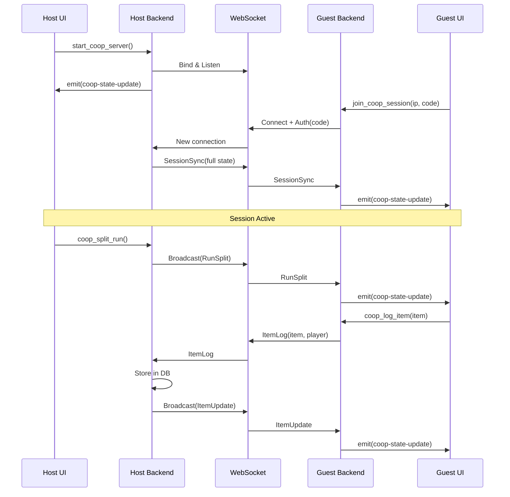
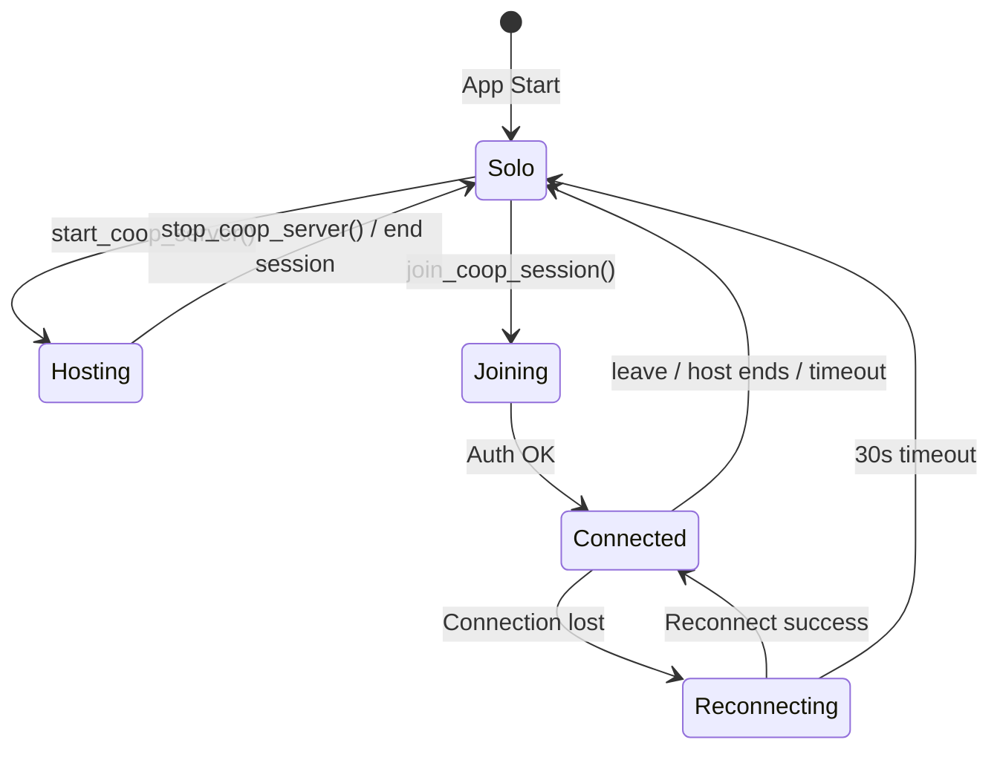

# Design Document: Shared Co-op Tracking

## Overview

This feature adds a local network co-op session system to D2R Tracker, enabling multiple app instances on the same LAN to share a farming session in real-time. The architecture follows a host-authoritative model: one instance runs an embedded WebSocket server (the "Host"), and other instances connect as thin clients ("Guests"). All session data (items, runs, timing) flows through the Host and is persisted only in the Host's SQLite database.

The design integrates with the existing Tauri 2 architecture:
- **Backend**: New Rust module (`coop.rs`) manages the WebSocket server lifecycle, protocol handling, and shared state via `Arc<Mutex<>>`
- **Frontend**: New `CoopPanel` page accessible from sidebar, plus co-op state emission alongside existing `overlay-state-update` events
- **Communication**: Tauri commands for server lifecycle; Tauri events for real-time state updates to the frontend

### Key Design Decisions

| Decision | Choice | Rationale |
|----------|--------|-----------|
| WebSocket library | `tokio-tungstenite` | Lightweight, async, works with Tauri's tokio runtime, well-maintained |
| Protocol format | JSON over WebSocket | Matches existing serde patterns, debuggable, low complexity |
| Port selection | Try 9876, then scan upward | Predictable default, auto-fallback avoids manual config |
| State authority | Host-only | Single source of truth prevents conflicts, simplifies sync |
| Session code | 6-char alphanumeric | Easy to share verbally, sufficient entropy for LAN use |
| Data storage | Host DB only | Guests are thin clients; avoids merge conflicts |
| Async runtime | Tauri's built-in tokio | No additional runtime needed; spawn tasks directly |

## Architecture



### Data Flow



## Components and Interfaces

### Backend Rust Components

#### 1. `coop.rs` — Co-op Server/Client Module

New module added to `src-tauri/src/`. Contains:

- **`CoopServer`** — Manages WebSocket server lifecycle
- **`CoopClient`** — Manages WebSocket client connection (guest mode)
- **`SessionState`** — Shared session state struct
- **`ProtocolMessage`** — Enum of all WebSocket message types

#### 2. New Tauri Commands

```rust
// Server lifecycle (Host)
#[tauri::command] start_coop_server(state, player_name) -> Result<CoopServerInfo, String>
#[tauri::command] stop_coop_server(state) -> Result<(), String>

// Client lifecycle (Guest)
#[tauri::command] join_coop_session(state, host_ip, port, session_code, player_name) -> Result<(), String>
#[tauri::command] leave_coop_session(state) -> Result<(), String>

// Session actions
#[tauri::command] coop_split_run(state) -> Result<(), String>  // Host only
#[tauri::command] coop_pause(state) -> Result<(), String>      // Host only
#[tauri::command] coop_end_session(state) -> Result<(), String> // Host only
#[tauri::command] coop_log_item(state, item) -> Result<(), String> // Guest sends to host

// State query
#[tauri::command] get_coop_state(state) -> Result<Option<CoopSessionView>, String>
```

#### 3. Managed State

```rust
pub struct CoopState {
    pub server: Option<CoopServer>,   // Active when hosting
    pub client: Option<CoopClient>,   // Active when guest
    pub session: Arc<Mutex<SessionState>>,
}
```

Added to Tauri's managed state alongside existing `DbState`.

### Frontend Components

#### 1. `CoopPanel.tsx` — New Page

- Hosts the "Host Session" / "Join Session" UI
- Displays connected players, combined stats, item log with attribution
- Accessible from sidebar navigation (new `"coop"` page type)

#### 2. New Types (`src/types.ts` additions)

```typescript
interface CoopSessionView {
  role: "host" | "guest";
  session_code: string;
  host_ip: string;
  port: number;
  players: CoopPlayer[];
  combined_stats: CoopCombinedStats;
  items: CoopItem[];
  session_elapsed_secs: number;
  run_count: number;
  paused: boolean;
}

interface CoopPlayer {
  name: string;
  profile_id: string;
  status: "connected" | "disconnected";
  items_found: number;
  runs_contributed: number;
}

interface CoopItem {
  id: string;
  name: string;
  item_type: string;
  rarity: string;
  player_name: string;
  found_at: string;
}

interface CoopCombinedStats {
  total_runs: number;
  total_items: number;
  session_time_secs: number;
  items_per_hour: number;
}
```

#### 3. New API functions (`src/api.ts` additions)

```typescript
export const startCoopServer = (playerName: string) =>
  invoke<CoopServerInfo>("start_coop_server", { playerName });

export const stopCoopServer = () =>
  invoke<void>("stop_coop_server");

export const joinCoopSession = (hostIp: string, port: number, sessionCode: string, playerName: string) =>
  invoke<void>("join_coop_session", { hostIp, port, sessionCode, playerName });

export const leaveCoopSession = () =>
  invoke<void>("leave_coop_session");

export const coopSplitRun = () => invoke<void>("coop_split_run");
export const coopPause = () => invoke<void>("coop_pause");
export const coopEndSession = () => invoke<void>("coop_end_session");
export const coopLogItem = (item: CoopItemInput) =>
  invoke<void>("coop_log_item", { item });

export const getCoopState = () =>
  invoke<CoopSessionView | null>("get_coop_state");
```

### WebSocket Protocol Messages

```rust
#[derive(Serialize, Deserialize)]
#[serde(tag = "type")]
pub enum ProtocolMessage {
    // Client → Host
    Auth { session_code: String, player_name: String, profile_id: String },
    ItemLog { name: String, item_type: String, rarity: String, player_name: String, profile_id: String },
    
    // Host → Client
    AuthOk,
    AuthFail { reason: String },
    SessionSync { state: SessionState },
    RunSplit { run_count: u32, timestamp: String },
    Pause { paused: bool },
    SessionEnd,
    ItemUpdate { items: Vec<CoopItemData> },
    TimerTick { elapsed_secs: u64 },
    PlayerUpdate { players: Vec<PlayerInfo> },
}
```

## Data Models

### New Rust Structs (`models.rs` additions)

```rust
#[derive(Debug, Serialize, Deserialize, Clone)]
pub struct CoopServerInfo {
    pub session_code: String,
    pub host_ip: String,
    pub port: u16,
}

#[derive(Debug, Serialize, Deserialize, Clone)]
pub struct SessionState {
    pub session_code: String,
    pub host_player: String,
    pub players: Vec<PlayerInfo>,
    pub run_count: u32,
    pub elapsed_secs: u64,
    pub paused: bool,
    pub items: Vec<CoopItemData>,
}

#[derive(Debug, Serialize, Deserialize, Clone)]
pub struct PlayerInfo {
    pub name: String,
    pub profile_id: String,
    pub status: String,  // "connected" | "disconnected"
    pub items_found: u32,
    pub runs_contributed: u32,
}

#[derive(Debug, Serialize, Deserialize, Clone)]
pub struct CoopItemData {
    pub id: String,
    pub name: String,
    pub item_type: String,
    pub rarity: String,
    pub player_name: String,
    pub found_at: String,
}

#[derive(Debug, Serialize, Deserialize, Clone)]
pub struct CoopItemInput {
    pub name: String,
    pub item_type: String,
    pub rarity: String,
}
```

### Database Schema (Host only)

Items logged during co-op sessions are stored in the existing `items` table with an additional context. The `notes` field stores `"[coop] PlayerName"` for attribution, or a new column is added:

```sql
ALTER TABLE items ADD COLUMN coop_player_name TEXT DEFAULT NULL;
```

This approach:
- Keeps backward compatibility (NULL for solo items)
- Allows filtering co-op vs solo items in History/Statistics
- No schema change needed for guests (they don't store co-op items)

### State Lifecycle



## Correctness Properties

*A property is a characteristic or behavior that should hold true across all valid executions of a system — essentially, a formal statement about what the system should do. Properties serve as the bridge between human-readable specifications and machine-verifiable correctness guarantees.*

### Property 1: Session Code Format Validity

*For any* generated session code, the code SHALL be exactly 6 characters long and every character SHALL be alphanumeric (A-Z, 0-9).

**Validates: Requirements 1.2**

### Property 2: Initial State Sync Completeness

*For any* valid session state (with arbitrary players, items, run count, and elapsed time), serializing it as a `SessionSync` protocol message and deserializing it SHALL produce an equivalent session state containing all players, all items, the correct run count, and the correct elapsed time.

**Validates: Requirements 2.3**

### Property 3: Session Code Authentication

*For any* pair of session codes where the provided code does not equal the host's code, the authentication check SHALL return a rejection result.

**Validates: Requirements 2.5**

### Property 4: Broadcast Delivery Completeness

*For any* host action (split, pause, end) and any set of connected guest IDs, the broadcast function SHALL produce one outgoing message per connected guest, and each message SHALL contain the action payload.

**Validates: Requirements 3.2, 6.2**

### Property 5: Item Message Serialization with Attribution

*For any* valid item (with arbitrary name, type, rarity) and any player name, serializing an `ItemLog` message and deserializing it SHALL preserve all item fields and the player name exactly.

**Validates: Requirements 3.3, 5.1, 7.2**

### Property 6: Combined Run Count Aggregation

*For any* list of players with non-negative individual run counts, the combined total run count SHALL equal the sum of all individual player run counts.

**Validates: Requirements 4.1**

### Property 7: Per-Player Item Grouping

*For any* list of items each with a `player_name` field, grouping items by player SHALL produce groups where: (a) each group's item count equals the number of items with that player name in the input, and (b) the union of all groups equals the original item list.

**Validates: Requirements 4.2, 5.3**

### Property 8: Host-Only Session Control Permission

*For any* session control action (start, split, pause, end) and any role (host or guest), the permission check SHALL allow the action if and only if the role is "host".

**Validates: Requirements 6.1, 6.3**

### Property 9: Item Queue Retry Completeness

*For any* sequence of items queued during disconnection, upon successful reconnection, all queued items SHALL be sent to the host and the queue SHALL be empty afterward.

**Validates: Requirements 7.4**

### Property 10: Disconnected Player Contribution Retention

*For any* session state with players and items, when a player is marked as disconnected, the player's previously logged items SHALL remain in the session item list and the player's entry SHALL remain in the player list with status "disconnected".

**Validates: Requirements 8.4**

### Property 11: Guest Database Isolation

*For any* item logged during a co-op session by a guest, the guest's local database SHALL NOT contain that item. Only the host's database stores co-op items.

**Validates: Requirements 10.4**

## Error Handling

### WebSocket Server Errors

| Error | Handling | User Feedback |
|-------|----------|---------------|
| Port bind failure | Try next port (up to 10 attempts), then fail | "Could not start server: all ports busy" |
| Server crash | Notify all connected guests via TCP RST detection | Guests: "Host disconnected" |
| Invalid message format | Log warning, ignore malformed message | No user-visible error (protocol resilience) |

### WebSocket Client Errors

| Error | Handling | User Feedback |
|-------|----------|---------------|
| Connection timeout (5s) | Surface error, allow retry | "Could not connect to host. Check IP and try again." |
| Auth rejection | Close socket, show reason | "Invalid session code" |
| Unexpected disconnect | Auto-reconnect (3s intervals, 30s window) | "Reconnecting..." status indicator |
| Reconnection timeout | Fall back to solo mode | "Connection lost. Returned to solo mode." |

### Data Integrity

- **Item delivery**: Guest queues items locally if WebSocket is temporarily down; retry on reconnect
- **State conflicts**: Host is authoritative — guest always accepts host state on resync
- **Concurrent writes**: `Arc<Mutex<SessionState>>` serializes all state mutations on the host
- **DB writes**: Existing `DbState(Mutex<Connection>)` pattern ensures thread-safe SQLite access

## Testing Strategy

### Property-Based Tests (Rust)

Using the `proptest` crate for Rust property-based testing:

- **Library**: `proptest = "1"` added to `[dev-dependencies]`
- **Minimum iterations**: 256 per property (proptest default, exceeds the 100 minimum)
- **Tag format**: `// Feature: shared-coop-tracking, Property {N}: {title}`

Properties to implement:
1. Session code format validity — generate codes, assert format
2. SessionSync round-trip — generate random states, serialize/deserialize
3. Session code auth — generate code pairs, verify rejection on mismatch
4. Broadcast delivery — generate guest lists, verify message count
5. Item serialization round-trip — generate items + names, verify preservation
6. Combined run count — generate player counts, verify sum
7. Per-player grouping — generate item lists with attributions, verify grouping
8. Permission check — enumerate actions × roles, verify host-only
9. Queue retry — generate item sequences, verify all sent after reconnect
10. Disconnected player retention — generate states, disconnect player, verify
11. Guest DB isolation — verify guest DB untouched (integration-level, mock DB)

### Unit Tests (TypeScript — Vitest)

- CoopPanel rendering in host/guest/idle states
- Combined stats display with mock data
- Per-player breakdown rendering
- Connection form validation
- State transitions (solo → hosting → solo, solo → connected → solo)

### Integration Tests

- Full WebSocket handshake: start server → connect client → auth → disconnect
- Item flow: guest logs item → host receives → host broadcasts → other guests receive
- Reconnection: disconnect guest → auto-reconnect → state resync
- Timer broadcast: verify periodic messages arrive

### What NOT to Property-Test

- WebSocket binding/networking (OS-level, use integration tests)
- Timer tick intervals (timing-dependent, use integration tests)
- UI rendering (use example-based unit tests)
- SQLite writes (use integration tests with real DB)
