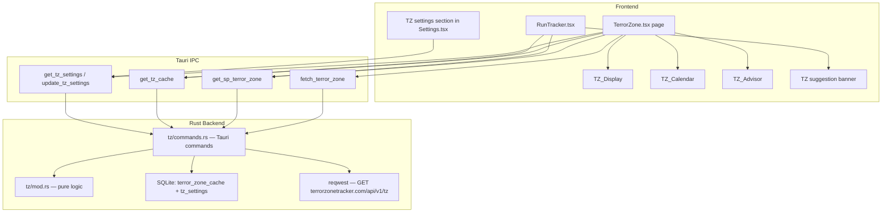

# Design Document: Terror Zone API Integration

## Overview

This feature integrates live Terror Zone (TZ) data into D2R Tracker by routing all outbound HTTP through the Rust/Tauri backend, persisting the last known TZ to SQLite, and surfacing it across three new UI surfaces: a dedicated TerrorZone page, a suggestion banner in the Run Tracker, and a TZ Advisor section. Single Player mode uses a deterministic UTC-based rotation that requires no network access.

The key constraint driving the architecture is that Tauri's webview CSP policy forbids direct `fetch()` calls from JavaScript to external hosts; all HTTP must originate from Rust `reqwest` commands that are then invoked through the IPC bridge.

## Architecture



The TerrorZone page owns polling and countdown state. The Run Tracker reads TZ state passively via `get_tz_cache` (plus SP fallback) without driving any polling. All rate-limiting logic lives in the frontend TZ_Scheduler state in `TerrorZone.tsx`.

## Components and Interfaces

### Rust: `src-tauri/src/tz/`

Mirrors the `screenshot/` module pattern: a `mod.rs` for pure logic and a `commands.rs` for Tauri command wrappers. The module is added to `lib.rs` as `mod tz;` and all five commands are added to `invoke_handler!`.

**`tz/mod.rs`** — pure, no Tauri dependencies, fully unit- and proptest-testable:

```rust
pub const TERROR_ZONES: [&str; 63] = [ /* 63 D2R v3.2 zone names in rotation order */ ];

/// Returns the TERROR_ZONES index active at the given UTC Unix second.
pub fn rotation_index(unix_secs: i64) -> usize {
    // Handles negative timestamps (pre-epoch) via wrapping arithmetic.
    let hour = unix_secs.div_euclid(3600) as usize;
    hour % TERROR_ZONES.len()
}

/// Returns the zone name active at the given UTC Unix second.
pub fn zone_at(unix_secs: i64) -> &'static str {
    TERROR_ZONES[rotation_index(unix_secs)]
}

/// Returns the UTC Unix second at which the next hourly boundary after `unix_secs` occurs.
pub fn next_boundary(unix_secs: i64) -> i64 {
    (unix_secs.div_euclid(3600) + 1) * 3600
}

/// Returns `count` upcoming zone names and their UTC start times,
/// starting from the hour immediately following `unix_secs`.
pub fn upcoming_zones(unix_secs: i64, count: usize) -> Vec<(i64, &'static str)> {
    let base = (unix_secs.div_euclid(3600) + 1) * 3600;
    (0..count as i64)
        .map(|i| {
            let t = base + i * 3600;
            (t, zone_at(t))
        })
        .collect()
}

/// Rate limit state used in tests (mirrors frontend logic in pure Rust).
pub struct RateLimiter {
    pub last_fetch_secs: Option<i64>,
    pub cooldown_secs: i64,
}

impl RateLimiter {
    pub fn new(cooldown_secs: i64) -> Self {
        Self { last_fetch_secs: None, cooldown_secs }
    }

    /// Returns true if a fetch should be dispatched at `now_secs`.
    pub fn should_fetch(&mut self, now_secs: i64) -> bool {
        match self.last_fetch_secs {
            None => { self.last_fetch_secs = Some(now_secs); true }
            Some(last) if now_secs - last >= self.cooldown_secs => {
                self.last_fetch_secs = Some(now_secs);
                true
            }
            _ => false,
        }
    }
}

pub fn tier_for_zone(zone: &str) -> &'static str {
    // Static HashMap<&str, &str> mapping zone names to "S"/"A"/"B"/"C"
}
```

**`tz/commands.rs`** — thin Tauri command layer:

```rust
#[tauri::command]
pub async fn fetch_terror_zone(state: State<'_, DbState>) -> Result<TerrorZoneApiResponse, String>

#[tauri::command]
pub fn get_sp_terror_zone(timestamp_unix: i64) -> Result<TerrorZoneInfo, String>

#[tauri::command]
pub fn get_tz_cache(state: State<'_, DbState>) -> Result<Option<TerrorZoneInfo>, String>

#[tauri::command]
pub fn get_tz_settings(state: State<'_, DbState>) -> Result<TzSettings, String>

#[tauri::command]
pub fn update_tz_settings(state: State<'_, DbState>, settings: TzSettings) -> Result<TzSettings, String>
```

### Frontend Pages and Components

**`src/pages/TerrorZone.tsx`** (new, lazy-imported in App.tsx)

Owns all polling, countdown, and TZ page state. Three sub-sections: `TzDisplaySection`, `TzCalendarSection`, `TzAdvisorSection`. Lazy-loaded like all other pages.

**`src/components/TzSuggestionBanner.tsx`** (new)

Rendered inside RunTracker above the area selector. Accepts `tzInfo: TerrorZoneInfo | null` and `isGoodTz: boolean` as props. Pure presentational component with a "click to apply" callback.

**`src/hooks/useTerrorZone.ts`** (new)

Custom hook that reads the current TZ from `get_tz_cache()` with SP-mode fallback to `get_sp_terror_zone(Date.now() / 1000)`. Used by RunTracker to get TZ data without owning polling logic.

**`src/api.ts`** additions:

```typescript
export const fetchTerrorZone = () =>
    invoke<TerrorZoneApiResponse>("fetch_terror_zone");

export const getSpTerrorZone = (timestampUnix: number) =>
    invoke<TerrorZoneInfo>("get_sp_terror_zone", { timestampUnix: Math.floor(timestampUnix) });

export const getTzCache = () =>
    invoke<TerrorZoneInfo | null>("get_tz_cache");

export const getTzSettings = () =>
    invoke<TzSettings>("get_tz_settings");

export const updateTzSettings = (settings: TzSettings) =>
    invoke<TzSettings>("update_tz_settings", { settings });
```

**`src/App.tsx`** changes:

- Add `"terrorzone"` to the `Page` union type.
- Add `const TerrorZone = lazy(() => import("./pages/TerrorZone"))` alongside existing lazy imports.
- Add nav button `⚡ Terror Zone` (disabled when no profile).
- Add `case "terrorzone"` to `renderPage()`.

## Data Models

### Rust Structs (`tz/commands.rs`)

```rust
#[derive(Debug, Serialize, Deserialize, Clone)]
pub struct TerrorZoneApiResponse {
    pub current_zone: String,
    pub next_zone: String,
    pub upcoming: Vec<String>,
}

#[derive(Debug, Serialize, Deserialize, Clone)]
pub struct TerrorZoneInfo {
    pub zone_name: String,
    pub tier: String,           // "S" | "A" | "B" | "C"
    pub fetched_at: Option<String>, // ISO-8601 UTC, None for SP-computed
}

#[derive(Debug, Serialize, Deserialize, Clone)]
pub struct TzSettings {
    pub polling_enabled: bool,
    pub good_tz_tier: String,  // "S" | "A" | "B" | "C"
}
```

### TypeScript Types (`src/types.ts` additions)

```typescript
export interface TerrorZoneApiResponse {
  current_zone: string;
  next_zone: string;
  upcoming: string[];
}

export interface TerrorZoneInfo {
  zone_name: string;
  tier: "S" | "A" | "B" | "C";
  fetched_at: string | null;
}

export interface TzSettings {
  polling_enabled: boolean;
  good_tz_tier: "S" | "A" | "B" | "C";
}

export interface UpcomingZoneEntry {
  zone_name: string;
  tier: "S" | "A" | "B" | "C";
  utc_start_secs: number;   // Unix epoch seconds
}
```

### SQLite Schema (added to `db.rs` `init_db`)

```sql
CREATE TABLE IF NOT EXISTS terror_zone_cache (
    id      INTEGER PRIMARY KEY CHECK(id = 1),
    current_zone  TEXT NOT NULL,
    next_zone     TEXT NOT NULL,
    upcoming      TEXT NOT NULL,   -- JSON array of zone name strings
    fetched_at    TEXT NOT NULL    -- ISO-8601 UTC
);

CREATE TABLE IF NOT EXISTS tz_settings (
    id              INTEGER PRIMARY KEY CHECK(id = 1),
    polling_enabled INTEGER NOT NULL DEFAULT 1,
    good_tz_tier    TEXT    NOT NULL DEFAULT 'A'
);
```

Both tables use `id = 1` singleton constraint (same pattern as other settings tables in this codebase). The `terror_zone_cache` row is upserted with `INSERT OR REPLACE`, ensuring at most one row exists.

## Correctness Properties

*A property is a characteristic or behavior that should hold true across all valid executions of a system — essentially, a formal statement about what the system should do. Properties serve as the bridge between human-readable specifications and machine-verifiable correctness guarantees.*

The five properties below are implemented as `proptest!` blocks in `src-tauri/src/tz/mod.rs` using the `proptest` crate already present in `[dev-dependencies]`. Per the Rust conventions steering file, all `proptest!` invocations are preceded by `//` comments (never `///` doc comments).

### Property 1: Zone membership

*For any* valid i64 UTC Unix timestamp `t`, `zone_at(t)` SHALL return a value that is a member of the `TERROR_ZONES` array (no out-of-bounds access, no panic, no empty string).

**Validates: Requirements 11.1, 5.1**

### Property 2: Same-hour determinism

*For any* UTC Unix timestamp `t` and any offset `d` in the range `[0, 3599]`, `zone_at(t)` SHALL equal `zone_at(t + d - (t % 3600))` — that is, all timestamps within the same UTC hour map to the same zone.

Equivalently: if `floor(T1 / 3600) == floor(T2 / 3600)`, then `zone_at(T1) == zone_at(T2)`.

**Validates: Requirements 11.2, 5.3**

### Property 3: Hourly boundary zone change

*For any* UTC Unix timestamp `T` that is an exact hourly boundary (`T mod 3600 == 0`), `zone_at(T)` SHALL differ from `zone_at(T - 1)`. This holds because consecutive rotation indices always reference different slots in the 63-element array.

**Validates: Requirements 11.3**

### Property 4: Rate limit enforcement

*For any* sequence of fetch-attempt timestamps `[t0, t1, …, tN]` where every consecutive difference `t_{i+1} - t_i < 600` seconds, passing all timestamps through a `RateLimiter` (cooldown = 600s) SHALL result in exactly one dispatched fetch for the entire sequence — all subsequent calls within the window are dropped.

**Validates: Requirements 11.4, 3.1, 3.3**

### Property 5: Upcoming zones strict monotonicity

*For any* UTC Unix timestamp `t` and count `n ≥ 2`, the list returned by `upcoming_zones(t, n)` SHALL have scheduled start times that are strictly monotonically increasing by exactly 3600 seconds per entry: `times[i+1] - times[i] == 3600` for all consecutive pairs.

**Validates: Requirements 11.5, 5.5, 7.5**

### Property 6: Cache upsert round-trip (last-write-wins)

*For any* two distinct `TerrorZoneApiResponse` values A and B, upserting A then upserting B into `terror_zone_cache`, then reading back with `get_tz_cache`, SHALL return a value whose `current_zone` equals B's `current_zone` (the last upsert wins and is fully retrievable).

**Validates: Requirements 4.1, 4.2**

## Error Handling

### HTTP Failures (Requirement 1.4)

`fetch_terror_zone` uses a `match` on the `reqwest` result:

- Network error or timeout → `Err("Network error: {detail}")` — frontend shows stale cache data with a "last updated" timestamp.
- Non-200 HTTP status → `Err("API returned status {code}")` — frontend does not update display, preserves last known value.
- 200 with unparseable JSON → `Err("Parse error: {serde_error}; raw body: {raw}")` — raw body attached for diagnostics (Requirement 1.5).

The frontend `catch` block in `TerrorZone.tsx` handles all error variants by logging to console and displaying a non-blocking toast. The displayed TZ is never cleared on a fetch error — stale data is preferred over an empty state.

### SQLite Failures (Requirement 10.4)

`update_tz_settings` returns `Err(String)` on DB failure. The frontend `TzAdvisorSection` catches this, retains the in-memory setting change (applied to React state immediately before the invoke call), and shows a temporary warning banner: "Settings not saved — database error."

### SP Fallback Chain (Requirements 4.3, 4.4)

When the frontend needs a current TZ and no profile is in Online_Mode or the cache is empty, it falls back in this order:

1. `get_tz_cache()` — returns `Some(TerrorZoneInfo)` if previously fetched.
2. If null, call `get_sp_terror_zone(Math.floor(Date.now() / 1000))`.
3. If that also fails (structural error), show loading skeleton with "Unable to determine TZ" text.

### Rate Limiting Guard

Before every call to `fetch_terror_zone`, the frontend checks:

```typescript
const now = Date.now();
const elapsed = now - lastSuccessfulFetchAt;
const isHourBoundary = /* detected via countdown reaching 0 */;
if (!isHourBoundary && elapsed < 10 * 60 * 1000) return; // drop
```

The hour-boundary flag bypasses the cooldown (Requirement 3.5).

## Testing Strategy

### Unit Tests (TypeScript / Vitest)

- `useTerrorZone.test.ts` — mock Tauri invoke, verify SP fallback chain, verify null returned when both fail.
- `TzSuggestionBanner.test.tsx` — render with active TZ, verify banner text; render with null TZ, verify no render; render with `isGoodTz=true`, verify star label.
- `TerrorZone.test.tsx` — countdown timer fires `setInterval(1 minute)`; polling is skipped when `elapsed < 10 * 60 * 1000`; polling fires on hour boundary regardless of elapsed time.

Unit tests are focused on specific examples. The rate-limit logic is covered more thoroughly by the Rust property test (P4) since it is pure logic.

### Property-Based Tests (Rust / proptest)

All five `proptest!` blocks live in `src-tauri/src/tz/mod.rs` inside a `#[cfg(test)] mod tests` block. Run with `cargo test` as part of the standard verification checklist.

Per the project's Rust conventions, all `proptest!` invocations are preceded by `//` comments (never `///` doc comments). Each test is configured to run a minimum of 256 cases to catch boundary behaviour.

```rust
#[cfg(test)]
mod tests {
    use super::*;
    use proptest::prelude::*;

    // P1 — zone membership: zone_at(t) is always in TERROR_ZONES
    proptest! {
        #[test]
        fn prop_zone_membership(t in any::<i64>()) {
            let name = zone_at(t);
            prop_assert!(TERROR_ZONES.contains(&name));
        }
    }

    // P2 — same-hour determinism
    proptest! {
        #[test]
        fn prop_same_hour_same_zone(t in any::<i64>(), offset in 0i64..3600) {
            let hour_start = t.div_euclid(3600) * 3600;
            let t2 = hour_start + offset;
            prop_assert_eq!(zone_at(t), zone_at(t2));
        }
    }

    // P3 — hourly boundary produces a zone change
    proptest! {
        #[test]
        fn prop_boundary_zone_changes(hour in any::<i64>()) {
            let t = hour.saturating_mul(3600);
            prop_assert_ne!(zone_at(t), zone_at(t.saturating_sub(1)));
        }
    }

    // P4 — rate limit enforcement
    proptest! {
        #[test]
        fn prop_rate_limit_enforcement(
            start in 0i64..1_000_000,
            gaps in proptest::collection::vec(1i64..599, 1..20)
        ) {
            let mut limiter = RateLimiter::new(600);
            let mut dispatched = 0usize;
            let mut t = start;
            if limiter.should_fetch(t) { dispatched += 1; }
            for gap in gaps {
                t += gap;
                if limiter.should_fetch(t) { dispatched += 1; }
            }
            prop_assert_eq!(dispatched, 1);
        }
    }

    // P5 — upcoming zones list is strictly monotonically increasing by 3600s
    proptest! {
        #[test]
        fn prop_upcoming_monotonic(t in any::<i64>(), n in 2usize..8) {
            let zones = upcoming_zones(t, n);
            prop_assert_eq!(zones.len(), n);
            for i in 0..zones.len() - 1 {
                prop_assert_eq!(zones[i + 1].0 - zones[i].0, 3600);
            }
        }
    }
}
```

Property 6 (cache upsert round-trip) is tested as an integration test using `tempfile` to create an in-memory SQLite instance, exercising the actual `upsert_tz_cache` and `get_tz_cache` DB functions.

### Integration Tests

- `fetch_terror_zone` command with a `mockito` or `wiremock` HTTP mock server — verifies the correct URL is requested, 10-second timeout is configured, and a 404 produces `Err`.
- CSP assertion test — reads `tauri.conf.json` and asserts `terrorzonetracker.com` appears in `connect-src`.
- DB migration test — verifies `terror_zone_cache` and `tz_settings` tables are created correctly and that `id = 1` constraint rejects a second row.

### Tag Format for Property Tests

Each property test is tagged in its surrounding comment: `// Feature: terror-zone-api, Property N: <property_text>` to match the project convention for tracing tests back to design properties.
