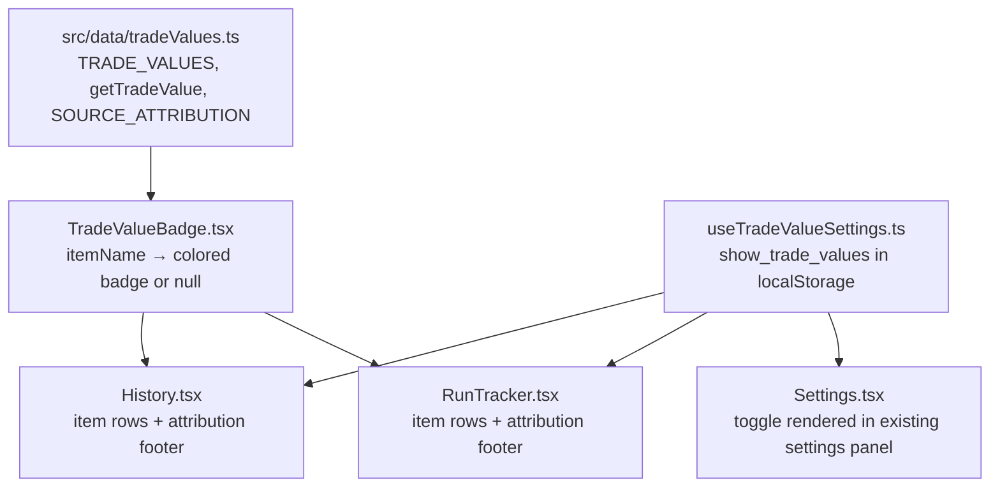

# Design Document: Trade Value Estimation

## Overview

The Trade Value Estimation feature adds static, community-sourced trade value information to item rows in the RunTracker and History pages. Items are labeled with one of four categories — **HR+**, **Mid**, **Low**, or **Self-use** — pulled from a statically embedded data file sourced from diablo2.io. A settings toggle lets players who don't trade hide these indicators entirely.

This is a pure frontend feature. No Rust/Tauri changes, no database schema changes, no network requests. All trade value data lives in a single TypeScript file compiled into the app bundle.

The design mirrors the existing `item-values.ts` / `TierBadge.tsx` pattern: a pure data module with a lookup function, a small display component, and a localStorage-backed settings hook.

---

## Architecture

The feature is composed of four concerns, each mapping to a dedicated file:

```
src/
  data/
    tradeValues.ts          ← static map + lookup function + SOURCE_ATTRIBUTION
  components/
    TradeValueBadge.tsx     ← display component (renders nothing if no entry)
  hooks/
    useTradeValueSettings.ts ← read/write show_trade_values from localStorage
  pages/
    History.tsx             ← existing; add <TradeValueBadge> + attribution
    RunTracker.tsx          ← existing; add <TradeValueBadge> + attribution
    Settings.tsx            ← existing; add toggle via <TradeValueSettings>
```

No new pages. No routing changes. No Tauri commands.



---

## Components and Interfaces

### `src/data/tradeValues.ts`

Pure data and logic module. No React imports.

```typescript
export type TradeValueCategory = "HR+" | "Mid" | "Low" | "Self-use";

export interface TradeValueEntry {
  category: TradeValueCategory;
}

// Format: "Values based on diablo2.io price data as of YYYY-MM-DD"
export const SOURCE_ATTRIBUTION: string = "Values based on diablo2.io price data as of 2025-07-01";

export const TRADE_VALUES: Record<string, TradeValueEntry> = {
  // HR+ runewords
  "Enigma":          { category: "HR+" },
  "Infinity":        { category: "HR+" },
  "Fortitude":       { category: "HR+" },
  "Call to Arms":    { category: "HR+" },
  "Chains of Honor": { category: "HR+" },
  "Last Wish":       { category: "HR+" },
  "Faith":           { category: "HR+" },
  "Grief":           { category: "HR+" },
  "Phoenix":         { category: "HR+" },
  "Dream":           { category: "HR+" },
  "Ice":             { category: "HR+" },
  "Brand":           { category: "HR+" },
  // HR+ unique items / jewelry
  "Harlequin Crest":        { category: "HR+" },
  "Arachnid Mesh":          { category: "HR+" },
  "Stone of Jordan":        { category: "HR+" },
  "Tyrael's Might":         { category: "HR+" },
  "Griffon's Eye":          { category: "HR+" },
  "Death's Fathom":         { category: "HR+" },
  "Death's Web":            { category: "HR+" },
  "Windforce":              { category: "HR+" },
  "Nightwing's Veil":       { category: "HR+" },
  "Mara's Kaleidoscope":    { category: "HR+" },
  // HR+ runes
  "Ber Rune":  { category: "HR+" },
  "Jah Rune":  { category: "HR+" },
  "Cham Rune": { category: "HR+" },
  "Zod Rune":  { category: "HR+" },
  "Sur Rune":  { category: "HR+" },
  // HR+ charms / jewels
  "Annihilus":                          { category: "HR+" },
  "Hellfire Torch":                     { category: "HR+" },
  "Small Charm 3 Max/20 AR/20 Life":    { category: "HR+" },
  "Jewel 15% IAS / 40 ED":             { category: "HR+" },
  // Mid runewords
  "Heart of the Oak": { category: "Mid" },
  "Exile":            { category: "Mid" },
  "Doom":             { category: "Mid" },
  "Death":            { category: "Mid" },
  "Dragon":           { category: "Mid" },
  "Pride":            { category: "Mid" },
  "Famine":           { category: "Mid" },
  "Plague":           { category: "Mid" },
  // Mid unique items
  "The Oculus":             { category: "Mid" },
  "Andariel's Visage":      { category: "Mid" },
  "War Traveler":           { category: "Mid" },
  "Highlord's Wrath":       { category: "Mid" },
  "Verdungo's Hearty Cord": { category: "Mid" },
  "Arreat's Face":          { category: "Mid" },
  "Raven Frost":            { category: "Mid" },
  "Wisp Projector":         { category: "Mid" },
  "Sandstorm Trek":         { category: "Mid" },
  "Dracul's Grasp":         { category: "Mid" },
  "String of Ears":         { category: "Mid" },
  "Herald of Zakarum":      { category: "Mid" },
  "Shadow Dancer":          { category: "Mid" },
  "Bul-Kathos' Wedding Band": { category: "Mid" },
  "Nosferatu's Coil":       { category: "Mid" },
  "Eschuta's Temper":       { category: "Mid" },
  "Kira's Guardian":        { category: "Mid" },
  // Mid runes
  "Ohm Rune": { category: "Mid" },
  "Lo Rune":  { category: "Mid" },
  "Vex Rune": { category: "Mid" },
  "Gul Rune": { category: "Mid" },
  // Mid charms / jewels
  "Gheed's Fortune":                  { category: "Mid" },
  "Black Cleft (Magic Sunder)":       { category: "Mid" },
  "Bone Break (Physical Sunder)":     { category: "Mid" },
  "Cold Rupture (Cold Sunder)":       { category: "Mid" },
  "Crack of the Heavens (Lightning Sunder)": { category: "Mid" },
  "Flame Rift (Fire Sunder)":         { category: "Mid" },
  "Rotting Fissure (Poison Sunder)":  { category: "Mid" },
  "Jewel -5/+5 Fire Facet (Die)":     { category: "Mid" },
  "Jewel -5/+5 Lightning Facet (Die)": { category: "Mid" },
  "Jewel -5/+5 Cold Facet (Die)":     { category: "Mid" },
  "Jewel 40 ED / 15 Max":             { category: "Mid" },
  // Low runewords
  "Spirit":     { category: "Low" },
  "Insight":    { category: "Low" },
  "Treachery":  { category: "Low" },
  "Obedience":  { category: "Low" },
  "Mosaic":     { category: "Low" },
  "Chaos":      { category: "Low" },
  "Hustle":     { category: "Low" },
  // Low unique items
  "Skin of the Vipermagi": { category: "Low" },
  "Magefist":              { category: "Low" },
  "Chance Guards":         { category: "Low" },
  "Vampire Gaze":          { category: "Low" },
  "Stormshield":           { category: "Low" },
  "Skullder's Ire":        { category: "Low" },
  "Gore Rider":            { category: "Low" },
  "Shaftstop":             { category: "Low" },
  "Jalal's Mane":          { category: "Low" },
  "Thundergod's Vigor":    { category: "Low" },
  "Homunculus":            { category: "Low" },
  "Titan's Revenge":       { category: "Low" },
  "Thunderstroke":         { category: "Low" },
  "Goldwrap":              { category: "Low" },
  // Low runes
  "Ist Rune": { category: "Low" },
  "Mal Rune": { category: "Low" },
  "Um Rune":  { category: "Low" },
  "Pul Rune": { category: "Low" },
  // Self-use items (personal gameplay value, low trade demand)
  "Peasant Crown":  { category: "Self-use" },
  "Frostburn":      { category: "Self-use" },
  "Razortail":      { category: "Self-use" },
  "Waterwalk":      { category: "Self-use" },
  "Silkweave":      { category: "Self-use" },
  "Guardian Angel": { category: "Self-use" },
  "Rockstopper":    { category: "Self-use" },
  "Infernostride":  { category: "Self-use" },
};

export function getTradeValue(itemName: string): TradeValueEntry | null {
  return TRADE_VALUES[itemName] ?? null;
}
```

Design decisions:
- `getTradeValue` returns `null` (not `undefined`) for consistency with the requirements spec.
- The `??` operator ensures that an empty string and any unknown key both return `null`.
- `SOURCE_ATTRIBUTION` is exported so all display components import it — no component hardcodes the string.
- No imports from `items.ts` or any other module: the file is self-contained.

---

### `src/components/TradeValueBadge.tsx`

Display component. Returns `null` if the item has no trade value entry, keeping item rows clean for untracked items.

```typescript
import { getTradeValue } from "../data/tradeValues";
import { SOURCE_ATTRIBUTION } from "../data/tradeValues";

interface Props {
  readonly itemName: string;
}

const CATEGORY_CSS: Record<string, string> = {
  "HR+":       "trade-badge-hr",
  "Mid":       "trade-badge-mid",
  "Low":       "trade-badge-low",
  "Self-use":  "trade-badge-selfuse",
};

export default function TradeValueBadge({ itemName }: Props) {
  const entry = getTradeValue(itemName);
  if (!entry) return null;

  return (
    <span
      className={`trade-badge ${CATEGORY_CSS[entry.category]}`}
      title={`~${entry.category} trade value — ${SOURCE_ATTRIBUTION}`}
      aria-label={`Estimated trade value: ${entry.category}`}
    >
      ~{entry.category}
    </span>
  );
}
```

Design decisions:
- The `~` prefix on both the visible label and the tooltip satisfies the "Estimated" disclaimer requirement.
- CSS class mapping is a local constant — no magic strings scattered through the component.
- `aria-label` provides screen reader context without duplicating the visible badge text.
- The component does not accept a `showTradeValues` prop; callers conditionally render it (`{showTradeValues && <TradeValueBadge ... />}`), which is the existing pattern used for `TierBadge`.

---

### `src/hooks/useTradeValueSettings.ts`

Thin hook wrapping `localStorage`. Follows the same pattern as `useTheme` in the project.

```typescript
import { useState } from "react";

const STORAGE_KEY = "show_trade_values";

export function useTradeValueSettings() {
  const [showTradeValues, setShowTradeValues] = useState<boolean>(() => {
    const stored = localStorage.getItem(STORAGE_KEY);
    if (stored === null) return true; // default on
    return stored === "true";
  });

  const toggle = () => {
    setShowTradeValues((prev) => {
      const next = !prev;
      localStorage.setItem(STORAGE_KEY, String(next));
      return next;
    });
  };

  return { showTradeValues, toggle };
}
```

Design decisions:
- Default is `true` (show trade values) when the key is absent — matches Requirement 4.4.
- Boolean serialized as the string `"true"` / `"false"` — same convention used elsewhere in the codebase (`d2r_obs_prefs`, `d2r_hotkeys`).
- A `toggle` function rather than a raw setter keeps the API minimal for the settings panel.

---

### Settings panel integration

A new sub-component `TradeValueSettings` added to `Settings.tsx`, rendered alongside the other settings sections:

```typescript
function TradeValueSettings() {
  const { showTradeValues, toggle } = useTradeValueSettings();

  return (
    <div className="settings-section">
      <h2>Trade Value Display</h2>
      <p className="settings-description">
        Show estimated trade value categories next to items in Run Tracker and History.
        Values are sourced from diablo2.io and embedded at build time.
      </p>
      <div className="hotkey-row">
        <label className="hotkey-label" htmlFor="trade-values-toggle">
          Show Trade Values
        </label>
        <button
          id="trade-values-toggle"
          className={`hotkey-btn toggle-btn ${showTradeValues ? "recording" : ""}`}
          onClick={toggle}
          aria-pressed={showTradeValues}
        >
          {showTradeValues ? "ON" : "OFF"}
        </button>
      </div>
    </div>
  );
}
```

This follows the identical pattern of `SoundSettings`, `ObsSettings`, and `ScreenshotSettingsPanel` already in `Settings.tsx`.

---

### History page integration

In the existing `items-list` render loop inside the detail panel:

```tsx
import TradeValueBadge from "../components/TradeValueBadge";
import { SOURCE_ATTRIBUTION } from "../data/tradeValues";
import { useTradeValueSettings } from "../hooks/useTradeValueSettings";

// Inside History component:
const { showTradeValues } = useTradeValueSettings();

// In the items-list render:
{runItems[selectedRun.id]
  .filter(...)
  .map((item) => (
    <div key={item.id} className={`item-row rarity-${item.rarity.toLowerCase()}`}>
      <span className="item-name">{item.name}</span>
      <TierBadge itemName={item.name} category={item.rarity} />
      {showTradeValues && <TradeValueBadge itemName={item.name} />}
      <span className="item-type">{item.item_type}</span>
      <span className="item-rarity">{item.rarity}</span>
      <button className="btn-icon" onClick={() => handleDeleteItem(item.id, selectedRun.id)}>✕</button>
    </div>
  ))}

// Attribution footer — shown only when trade values are enabled and items exist:
{showTradeValues && runItems[selectedRun.id]?.length > 0 && (
  <p className="trade-attribution">{SOURCE_ATTRIBUTION}</p>
)}
```

---

### RunTracker integration

Same pattern applied to the session items list inside `RunTracker.tsx`:

```tsx
import TradeValueBadge from "../components/TradeValueBadge";
import { SOURCE_ATTRIBUTION } from "../data/tradeValues";
import { useTradeValueSettings } from "../hooks/useTradeValueSettings";

// Inside RunTracker component:
const { showTradeValues } = useTradeValueSettings();

// In items.map():
<div key={item.id} className={`item-row rarity-${item.rarity.toLowerCase()}`}>
  <span className="item-name">{item.name}</span>
  <TierBadge itemName={item.name} category={item.rarity} />
  {showTradeValues && <TradeValueBadge itemName={item.name} />}
  <span className="item-type">{item.item_type}</span>
  <span className="item-rarity">{item.rarity}</span>
  <button className="btn-icon" onClick={() => removeItem(item.id)}>✕</button>
</div>

// Attribution footer below items-list:
{showTradeValues && items.length > 0 && (
  <p className="trade-attribution">{SOURCE_ATTRIBUTION}</p>
)}
```

---

## Data Models

### `TradeValueCategory`

```typescript
type TradeValueCategory = "HR+" | "Mid" | "Low" | "Self-use";
```

This union is the single source of truth. No other file may hardcode these strings.

### `TradeValueEntry`

```typescript
interface TradeValueEntry {
  category: TradeValueCategory;
}
```

Intentionally minimal. Future fields (e.g., `notes`, `lastUpdated`) can be added without breaking existing consumers.

### `TRADE_VALUES` map

`Record<string, TradeValueEntry>` — approximately 80–100 entries at launch. Keys are exact item name strings matching `GameItem.name` values in `items.ts`. The map is compiled into the app bundle; no lazy-loading, no async fetch.

### `localStorage` key

| Key | Type | Default | Description |
|-----|------|---------|-------------|
| `show_trade_values` | `"true"` \| `"false"` | `"true"` (absent = true) | Controls badge visibility |

---

## CSS Classes

Added to `App.css`:

```css
/* Trade value badges */
.trade-badge {
  display: inline-block;
  padding: 1px 6px;
  border-radius: 3px;
  font-size: 0.72rem;
  font-weight: 600;
  letter-spacing: 0.02em;
  margin-left: 4px;
  vertical-align: middle;
  cursor: default;
}

.trade-badge-hr {
  background-color: #b8860b;
  color: #fff9e6;
}

.trade-badge-mid {
  background-color: #707070;
  color: #f0f0f0;
}

.trade-badge-low {
  background-color: #7a4a1e;
  color: #fde8c8;
}

.trade-badge-selfuse {
  background-color: #3a3a3a;
  color: #aaa;
}

/* Attribution footer */
.trade-attribution {
  font-size: 0.72rem;
  color: var(--text-muted, #888);
  margin-top: 0.5rem;
  font-style: italic;
}
```

Color choices mirror D2R's item quality palette: gold for high-value (HR+), silver-gray for mid, bronze-brown for low, charcoal for self-use.

---

## Correctness Properties

*A property is a characteristic or behavior that should hold true across all valid executions of a system — essentially, a formal statement about what the system should do. Properties serve as the bridge between human-readable specifications and machine-verifiable correctness guarantees.*

### Property 1: Valid Category Invariant

*For any* key-value pair in `TRADE_VALUES`, the `category` field SHALL be one of exactly `"HR+"`, `"Mid"`, `"Low"`, or `"Self-use"`. No entry may have a category outside this set.

**Validates: Requirements 1.3, 3.1**

### Property 2: Lookup Determinism

*For any* string `s`, calling `getTradeValue(s)` twice SHALL return structurally equal results. The function is pure and free of side effects.

**Validates: Requirements 2.4**

### Property 3: Null for Absent Keys

*For any* string `s` that is not a key in `TRADE_VALUES`, `getTradeValue(s)` SHALL return `null`. This must hold for arbitrary strings including the empty string, whitespace-only strings, and strings resembling item names with minor variations.

**Validates: Requirements 2.3, 2.5**

### Property 4: Item DB Coverage Consistency

*For every* key `k` in `TRADE_VALUES`, `k` SHALL match the `name` field of at least one `GameItem` in `ALL_ITEMS` from `src/data/items.ts`. No orphaned trade value entries are permitted.

**Validates: Requirements 6.1, 6.3**

### Property 5: Badge Renders for Known Items

*For any* item name `k` that is a key in `TRADE_VALUES`, rendering `<TradeValueBadge itemName={k} />` SHALL produce a non-null element containing a CSS class corresponding to `TRADE_VALUES[k].category`.

**Validates: Requirements 5.1, 5.2, 5.4**

---

**Property Reflection:**

- Property 1 (valid category) and Property 4 (item DB coverage) are independent invariants over different sets — both are needed.
- Property 2 (determinism) and Property 3 (null for absent) are independent: Property 2 applies to all inputs (including present keys); Property 3 applies specifically to absent keys.
- Property 5 (badge renders for known items) cannot be merged into Properties 1–4 because it tests the UI component layer, not the data layer.
- No redundancies identified. All five properties provide unique validation value.

---

## Error Handling

### Lookup function

`getTradeValue` cannot throw. The `??` null-coalescing operator handles any missing key gracefully. No try/catch required.

### Badge component

`TradeValueBadge` cannot throw. If `getTradeValue` returns `null` (which it always does for unknown items), the component returns `null` and renders nothing. This matches the existing `TierBadge` behavior for `"worthless"` tier items.

### Settings hook

`useTradeValueSettings` reads `localStorage` inside a `useState` initializer. If `localStorage` is unavailable (unusual in Tauri's WebView), the initializer returns the default `true`, which is safe.

### Data file

`tradeValues.ts` has no I/O, no async operations, and no external dependencies. It cannot fail at runtime.

---

## Testing Strategy

### Test files

| File | Test type | Scope |
|------|-----------|-------|
| `src/data/tradeValues.test.ts` | Unit + property-based | `TRADE_VALUES`, `getTradeValue`, `SOURCE_ATTRIBUTION` |
| `src/components/TradeValueBadge.test.tsx` | Unit (render) | `TradeValueBadge` component |
| `src/hooks/useTradeValueSettings.test.ts` | Unit | `useTradeValueSettings` hook |

### Property-based tests (`fast-check`)

The project already uses `fast-check` (v4.9.0 in `devDependencies`). Each property test runs a minimum of 100 iterations.

**Property 1 test** — valid category invariant:
```typescript
// Feature: trade-values, Property 1: Valid Category Invariant
it("every entry in TRADE_VALUES has a valid category", () => {
  const validCategories = new Set(["HR+", "Mid", "Low", "Self-use"]);
  for (const [, entry] of Object.entries(TRADE_VALUES)) {
    expect(validCategories.has(entry.category)).toBe(true);
  }
});
```
This is a deterministic exhaustive check over the full map — fast-check isn't needed here; a direct loop over all entries is more appropriate and more readable.

**Property 2 test** — lookup determinism:
```typescript
// Feature: trade-values, Property 2: Lookup Determinism
fc.assert(
  fc.property(fc.string(), (s) => {
    const a = getTradeValue(s);
    const b = getTradeValue(s);
    expect(a).toEqual(b);
  }),
  { numRuns: 200 }
);
```

**Property 3 test** — null for absent keys:
```typescript
// Feature: trade-values, Property 3: Null for Absent Keys
const knownKeys = new Set(Object.keys(TRADE_VALUES));
fc.assert(
  fc.property(
    fc.string().filter((s) => !knownKeys.has(s)),
    (s) => {
      expect(getTradeValue(s)).toBeNull();
    }
  ),
  { numRuns: 200 }
);
```

**Property 4 test** — item DB coverage:
```typescript
// Feature: trade-values, Property 4: Item DB Coverage Consistency
it("every key in TRADE_VALUES exists in ALL_ITEMS", () => {
  const itemNames = new Set(ALL_ITEMS.map((i) => i.name));
  for (const key of Object.keys(TRADE_VALUES)) {
    expect(itemNames.has(key)).toBe(true);
  }
});
```
Like Property 1, this is an exhaustive deterministic check over a finite, static set.

**Property 5 test** — badge renders for known items:
```typescript
// Feature: trade-values, Property 5: Badge Renders for Known Items
const entries = Object.entries(TRADE_VALUES);
fc.assert(
  fc.property(
    fc.constantFrom(...entries),
    ([name, entry]) => {
      const { container } = render(<TradeValueBadge itemName={name} />);
      const badge = container.querySelector(".trade-badge");
      expect(badge).not.toBeNull();
      const cssMap = {
        "HR+":      "trade-badge-hr",
        "Mid":      "trade-badge-mid",
        "Low":      "trade-badge-low",
        "Self-use": "trade-badge-selfuse",
      };
      expect(badge?.classList.contains(cssMap[entry.category])).toBe(true);
    }
  ),
  { numRuns: Math.min(entries.length, 100) }
);
```

### Unit tests

- `SOURCE_ATTRIBUTION` matches `"Values based on diablo2.io price data as of \d{4}-\d{2}-\d{2}"`.
- `getTradeValue("")` returns `null` (empty string edge case).
- `getTradeValue("Enigma")?.category` equals `"HR+"` (spot-check for required item).
- `getTradeValue("Sur Rune")?.category` equals `"HR+"` (rune spot-check).
- `<TradeValueBadge itemName="unknown-xyz" />` renders nothing.
- `useTradeValueSettings` defaults to `true` when key is absent.
- `useTradeValueSettings` round-trips: toggle once → reads `false`; toggle again → reads `true`.
- Settings panel renders a toggle for trade values.
- Item row renders both `TierBadge` and `TradeValueBadge` as separate elements for a known item when `showTradeValues` is true.
- Attribution text is present in the view when `showTradeValues` is true and items include a trade-valued item.
