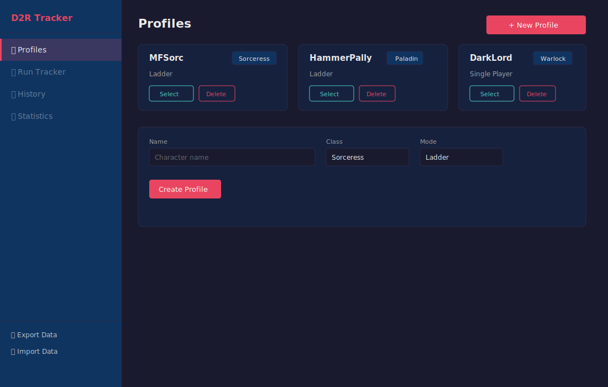
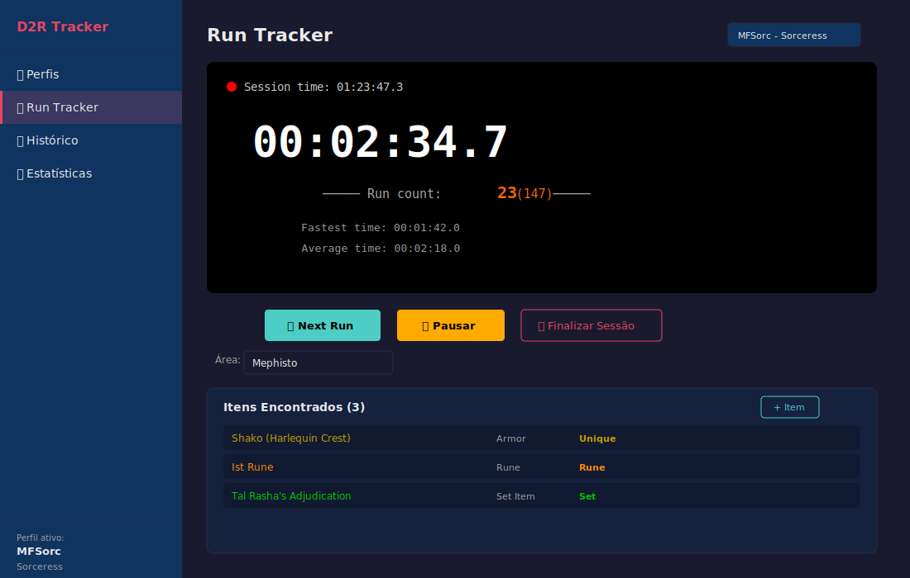
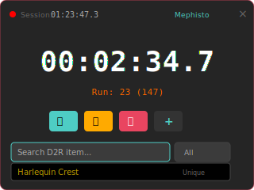
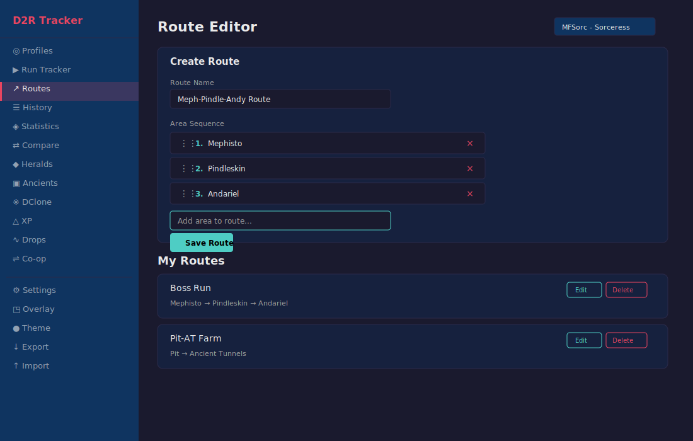
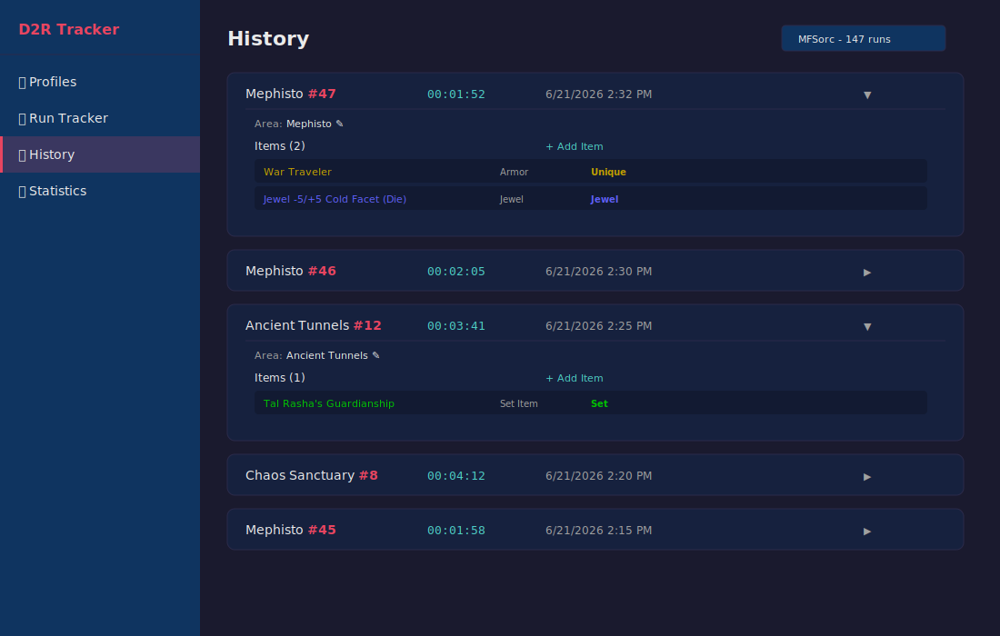
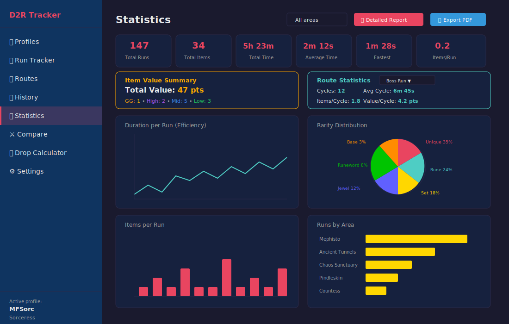
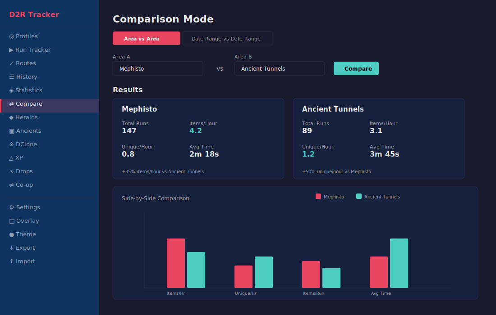
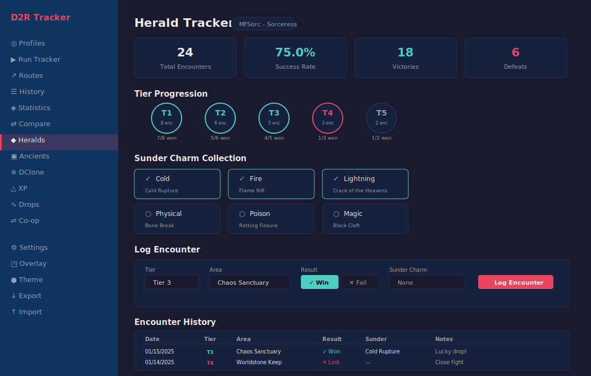
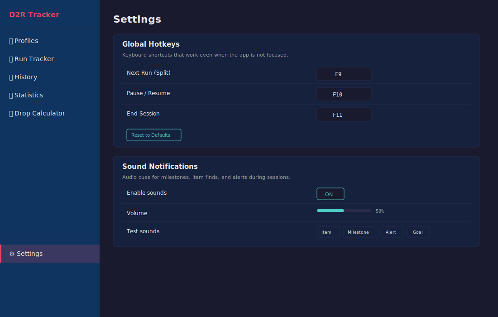

# D2R Tracker

A desktop application for tracking Magic Find runs in **Diablo II: Resurrected** (v3.2 — Reign of the Warlock). Built with Tauri, React, and Rust with a local SQLite database.

## Download


| Platform | Installer |
|----------|-----------|
| Windows (.exe) | [d2r-desktop_3.2.1_x64-setup.exe](https://github.com/murilobc/d2r-desktop/releases/latest/download/d2r-desktop_3.2.1_x64-setup.exe) |
| Windows (.msi) | [d2r-desktop_3.2.1_x64_en-US.msi](https://github.com/murilobc/d2r-desktop/releases/latest/download/d2r-desktop_3.2.1_x64_en-US.msi) |

> [All releases](https://github.com/murilobc/d2r-desktop/releases/latest)

---

## User Manual

---

### Profiles



The Profiles screen is your starting point. Here you manage your characters.

- **+ New Profile** — Opens the creation form
- **Name** — Your character name (e.g. "MFSorc", "HammerPally")
- **Class** — Select from all 8 D2R classes (Amazon, Necromancer, Barbarian, Sorceress, Paladin, Druid, Assassin, Warlock)
- **Mode** — Ladder, Non-Ladder, or Single Player
- **MF %** — Optional Magic Find value (used for effective MF calculator)
- **Select** — Activates the profile and navigates to Run Tracker
- **Delete** — Permanently removes the profile and all associated data

Each profile has independent run history, items, statistics, herald encounters, and boss progress.

---

### Run Tracker



The core of the application. Manages your farming sessions with precision timing.

**Before starting:**
- **Area selector** — Choose which area you're farming (remembers last selection, supports custom areas)
- **Players** (Single Player only) — Set /players 1-8
- **Session Goal** — Set a run count or time target
- **Route Mode** — Toggle between single-area and route mode (select from saved routes)
- **MF Calculator** — Shows effective MF with diminishing returns
- **Terror Zone display** — Shows the currently active Terror Zone; auto-tags runs when area matches

**During an active session:**
- **Session timer** — Total time since session started, with recording indicator
- **Run timer** — Current run elapsed time in HH:MM:SS.T format
- **Run count** — Session runs + total all-time in parentheses
- **Fastest / Average time** — Best and average run duration this session
- **Dry streak** — Runs since last item found
- **Goal progress** — Progress toward run count or time goal (if set)
- **Next Run (Split)** — Finishes current run and starts the next
- **Pause / Resume** — Pauses both timers
- **End Session** — Finishes last run and stops session
- **Quick Tags** — Tag runs with predefined labels (GG, Death, Fast, etc.) for filtering later
- **Route step indicator** — Shows current area during route sessions with auto-advance
- **+ Item** — Opens searchable item combobox (895+ items from D2R v3.2, filterable by category)

**Item Value Tiers** — Each logged item displays a color-coded badge:
| Tier | Color | Points | Examples |
|------|-------|--------|----------|
| GG | Gold | 20 | Sur-Zod runes, Tyrael's Might, Griffon's Eye |
| High | Purple | 8 | Gul-Lo runes, Shako, Arachnid Mesh, SoJ |
| Mid | Blue | 3 | Pul-Ist runes, Spirit, Vipermagi, skillers |
| Low | Green | 1 | Hel-Lem runes, Stealth, basic usable items |
| Worthless | Gray | 0 | El-Dol runes, low-level uniques |

---

### In-Game Overlay



A compact, always-on-top window that floats over D2R while you play. Toggle from the sidebar with the **Overlay** button.

- **Session timer** — Session elapsed time with recording dot
- **Run timer** — Current run time, identical to main window
- **Run count** — Session + total
- **Controls** — Next Run, Pause/Resume, End Session, Add Item
- **Drag anywhere** — Reposition the overlay on screen
- **Hide** — Close the overlay without stopping the session

**Requirements:** D2R must be in Windowed or Windowed Fullscreen mode.

**Linux (Wayland) Tiling Compositors:**

On Hyprland, Niri, and similar tiling compositors, add window rules for the overlay:

```
# Hyprland (~/.config/hypr/hyprland.conf)
windowrulev2 = float, title:^(D2R Overlay)$
windowrulev2 = pin, title:^(D2R Overlay)$
windowrulev2 = noborder, title:^(D2R Overlay)$
windowrulev2 = noshadow, title:^(D2R Overlay)$
windowrulev2 = nofocus, title:^(D2R Overlay)$
```

For the Widget window, add these additional rules:

```
# Hyprland (~/.config/hypr/hyprland.conf)
windowrulev2 = float, title:^(D2R Widget)$
windowrulev2 = pin, title:^(D2R Widget)$
windowrulev2 = noborder, title:^(D2R Widget)$
windowrulev2 = noshadow, title:^(D2R Widget)$
windowrulev2 = nofocus, title:^(D2R Widget)$
windowrulev2 = size 200 50, title:^(D2R Widget)$
```

---

### Route Editor



Define multi-area farming routes and use them in the Run Tracker for auto-advancing through areas.

- **Route list** — All routes for the active profile with edit/delete actions
- **Create route** — Name your route and add areas from the picker (minimum 2 areas)
- **Area sequence** — Drag-and-drop to reorder areas
- **Route Mode in Run Tracker** — On split, automatically advances to the next area; counts cycles when route completes
- **Route Statistics** — Total completed cycles, average cycle time, items per cycle

---

### History



All completed runs with full details.

- **Run list** — Sorted newest first, showing area, run number, duration, player count badge, and date
- **Pagination** — Loads 50 runs at a time with "Load More" for performance
- **Auto-expand** — Runs with items found are automatically expanded
- **Click to expand/collapse** — Toggle run details manually
- **Edit area** — Change a run's area retroactively
- **Items list** — All items found in that run with rarity color and value tier badge
- **+ Add Item** — Add items to a past run
- **Filter by tier** — Filter visible items by value tier (All / Low / Mid / High / GG)
- **Delete** — Remove a run and its items permanently

---

### Statistics



Analytics and reporting on your farming data.

- **Area filter** — Filter all stats by a specific area or view all combined
- **Summary cards** — Total Runs, Items, Time, Average, Fastest, Slowest, Items/Run, Items/Hour
- **Item Value Summary** — Total points with tier breakdown
- **Top 10 Most Valuable** — Highest-tier items ranked by point value
- **Duration per Run** — Line chart showing run time trends
- **Items per Run** — Bar chart of drops per run
- **Rarity Distribution** — Pie chart by rarity type
- **Runs by Area** — Horizontal bar chart of farming distribution
- **Top 10 Most Found** — Most common drops table
- **TZ Performance** — Terror Zone vs normal runs comparison (items/hour, items/run)
- **Route Statistics** — Cycles, average time, items per cycle for selected routes
- **Detailed Report** — Expandable table with every run listed
- **Export PDF** — Full PDF report with stats, charts, and run details

---

### Comparison



Compare farming efficiency between two areas or two time periods side-by-side.

- **Area vs Area** — Select two areas to compare metrics
- **Date Range vs Date Range** — Compare two time periods to track improvement
- **Metrics** — Items/hour, unique items/hour, avg time per run, fastest, slowest, items/run
- **Winner highlighting** — Green border on the better-performing subject
- **Percentage difference badges** — Shows improvement with gold emphasis when >20%
- **Grouped bar chart** — Visual side-by-side comparison

---

### Herald Tracker



Track Herald of Terror encounters and Sunder Charm farming progress.

- **Stats panel** — Total encounters, success rate, victories, defeats
- **Tier progression** — T1-T5 badges showing encounters and win rate per tier
- **Sunder Charm collection** — Grid of 6 elements (Cold, Fire, Lightning, Physical, Poison, Magic) with found/unfound status
- **Log encounter** — Form to record tier, area, result, optional sunder charm drop, notes
- **History table** — All past encounters with date, tier, area, result, drops

---

### Colossal Ancients

Track attempts against the 5 Colossal Ancient bosses and monitor your progression.

- **Boss grid** — Visual status of each boss (Baal, Diablo, Mephisto, Duriel, Andariel) with defeated checkmarks
- **Per-boss statistics** — Attempts, success rate, best time, average time
- **Summary stats** — Total attempts, victories, bosses defeated (X/5), overall success rate
- **Log attempt** — Form with boss selection, result (success/fail), duration, drops, notes
- **Attempt history** — Table of all attempts with date, boss, attempt number, result, time, drops

---

### Diablo Clone Tracker

Track Diablo Clone progress per region and log Annihilus charms.

- **Progress per region** — Americas, Europe, Asia with 1-6 scale progress bars
- **Status labels** — Color-coded: Calm, Restless, Agitated, Frenzied, Terrorizing, Diablo Walks!
- **Manual update** — Click buttons to set current progress from community reports
- **Notification settings** — Preferred region and notification threshold (notify at progress 5+)
- **Annihilus collection** — Log obtained charms with stats (e.g., "10/18/9") and notes
- **History table** — All logged Annihilus charms with date and stats

---

### XP Tracker

Track experience gain rates and estimate time to level up.

- **Stats cards** — Total XP tracked, average XP/hour, total time, sessions logged
- **Level info** — Current level, XP to next level, estimated time to level up (based on avg rate)
- **XP Rate Trend chart** — Line chart showing XP/hour over sessions
- **Log XP session** — Form with character level, XP gained, duration, area, notes
- **History table** — All XP sessions with date, level, XP gained, duration, XP/hour, area

---

### Drop Calculator

Shows what items can drop in each D2R farming area.

- **Filter buttons** — All / TC85+ (areas that can drop every item) / Bosses
- **Area list** — All farming areas with area level and TC badge
- **Area details** — Monster types, notable drops, farming tips
- **TC85+ badge** — Green badge on areas where every item can drop

No profile selection required — accessible anytime.

---

### Settings



Configure hotkeys, sounds, OBS integration, and Terror Zone preferences.

**Global Hotkeys:**
- **Next Run** — Default: F9 (works even when D2R is focused)
- **Pause / Resume** — Default: F10
- **End Session** — Default: F11
- Click to rebind, Reset to Defaults available

**Sound Notifications:**
- Enable/disable toggle, volume slider (0-100%)
- Triggers: item found, every 10 runs (milestone), goal reached

**OBS Integration:**
- Write live stats to file for OBS Studio stream overlays
- Output format: Plain Text or JSON
- Updates every 1 second during active sessions

**Terror Zones:**
- Sound notification when a preferred zone becomes active
- Checkbox grid to select favorite zones

**Theme:**
- Dark/Light toggle from the sidebar

---

### Sidebar Navigation

Always visible, provides navigation and utilities:

- **Profiles** — Manage characters
- **Run Tracker** — Active farming session
- **Routes** — Multi-area farming routes
- **History** — Past runs
- **Statistics** — Analytics and reports
- **Compare** — Area/date efficiency comparison
- **Heralds** — Herald of Terror tracking
- **Ancients** — Colossal Ancients boss tracker
- **DClone** — Diablo Clone progress and Annihilus log
- **XP** — Experience rate tracking
- **Drops** — Drop calculator
- **Settings** — Configuration
- **Overlay** — Toggle in-game overlay
- **Theme** — Dark/Light switch
- **Export / Import** — JSON backup and restore

---

## Data Safety

- All data stored locally in SQLite (`%APPDATA%/com.muh.d2r-desktop/` on Windows, `~/.local/share/com.muh.d2r-desktop/` on Linux)
- Updates only replace the application executable — your database is never touched
- Export/Import allows full portability between machines
- Auto-updater checks GitHub Releases and installs updates without data loss

---

## Tech Stack

| Layer | Technology |
|-------|-----------|
| Frontend | React 19, TypeScript, Recharts, jsPDF |
| Backend | Rust, Tauri 2, SQLite (rusqlite) |
| Desktop | Tauri (native webview, no Electron) |
| Build | Vite, Cargo |
| CI/CD | GitHub Actions, automated tests |

---

## Getting Started (Development)

### Prerequisites

- [Node.js](https://nodejs.org/) 20+
- [Rust](https://rustup.rs/) stable
- Tauri prerequisites for your OS ([see docs](https://v2.tauri.app/start/prerequisites/))

### Development

```bash
npm install
npm run tauri dev
```

### Testing

```bash
npm test
```

### Build

```bash
npm run tauri build
```

Installers are output to `src-tauri/target/release/bundle/`.

---

## Project Structure

```
d2r-desktop/
├── src/                       # React frontend
│   ├── api.ts                 # Tauri command bindings
│   ├── types.ts               # TypeScript interfaces and constants
│   ├── data/
│   │   ├── items.ts           # D2R v3.2 item database (895+ items)
│   │   ├── item-values.ts     # Item value tier estimation
│   │   ├── areas.ts           # Area metadata (alvl, TC, drops, tips)
│   │   ├── terror-zones.ts    # Terror Zone definitions and preferences
│   │   └── xp-table.ts        # D2R XP requirements per level (1-99)
│   ├── components/
│   │   ├── ItemSearch.tsx      # Searchable combobox
│   │   ├── MFCalculator.tsx    # Effective MF widget
│   │   ├── TierBadge.tsx       # Item value tier badge
│   │   ├── TerrorZoneDisplay.tsx # Active Terror Zone indicator
│   │   ├── QuickTags.tsx       # Quick tag buttons
│   │   └── UpdateChecker.tsx   # Auto-update banner
│   ├── hooks/
│   │   └── useTheme.ts        # Dark/light theme toggle
│   ├── overlay/                # In-game overlay window
│   ├── pages/
│   │   ├── Profiles.tsx
│   │   ├── RunTracker.tsx
│   │   ├── RouteEditor.tsx
│   │   ├── History.tsx
│   │   ├── Statistics.tsx
│   │   ├── Comparison.tsx
│   │   ├── HeraldTracker.tsx
│   │   ├── ColossalAncients.tsx
│   │   ├── DCloneTracker.tsx
│   │   ├── XPTracker.tsx
│   │   ├── DropCalculator.tsx
│   │   └── Settings.tsx
│   └── utils/
│       ├── audio.ts            # Sound notification system
│       └── comparison.ts       # Comparison helper functions
├── src-tauri/                  # Rust backend
│   └── src/
│       ├── lib.rs              # App setup & plugin registration
│       ├── db.rs               # SQLite connection & migrations
│       ├── models.rs           # Data structs
│       └── commands.rs         # Tauri commands
├── .github/workflows/          # CI/CD
│   ├── ci.yml                  # PR checks
│   └── build.yml               # Release builds (signed, with updater)
└── docs/mockups/               # SVG mockups for README
```

---

## License

MIT
