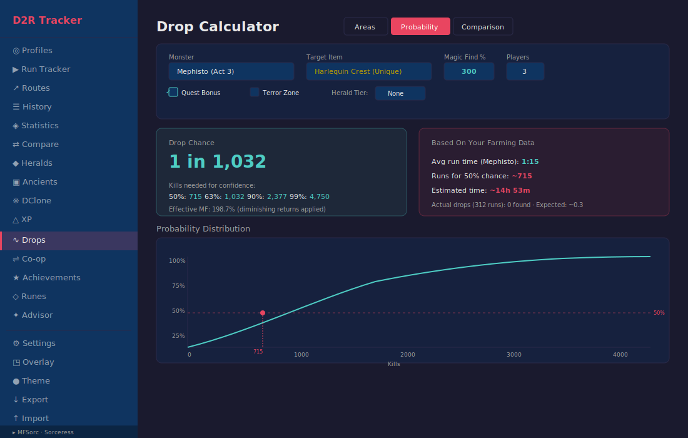

# D2R Tracker

A desktop application for tracking Magic Find runs in **Diablo II: Resurrected** (v3.2 — Reign of the Warlock). Built with Tauri, React, and Rust with a local SQLite database.

## Download


| Platform | Installer |
|----------|-----------|
| Windows (.exe) | [d2r-desktop_2.0.1_x64-setup.exe](https://github.com/murilobc/d2r-desktop/releases/latest/download/d2r-desktop_2.0.1_x64-setup.exe) |
| Windows (.msi) | [d2r-desktop_2.0.1_x64_en-US.msi](https://github.com/murilobc/d2r-desktop/releases/latest/download/d2r-desktop_2.0.1_x64_en-US.msi) |

> [All releases](https://github.com/murilobc/d2r-desktop/releases/latest)

---

## User Manual

> Note: The images below are SVG mockups representing the application layout. Actual appearance may vary slightly.

---

### Profiles


The Profiles screen is your starting point. Here you manage your characters.

**Functions:**
- **+ New Profile** — Opens the creation form
- **Name** — Your character name (e.g. "MFSorc", "HammerPally")
- **Class** — Select from all 8 D2R classes (Amazon, Necromancer, Barbarian, Sorceress, Paladin, Druid, Assassin, Warlock)
- **Mode** — Ladder, Non-Ladder, or Single Player
- **MF %** — Optional Magic Find value (used for effective MF calculator)
- **Create Profile** — Saves the new profile
- **Select** — Activates the profile and navigates to Run Tracker
- **Delete** — Permanently removes the profile and all associated runs/items (asks for confirmation)

Each profile has independent run history, items, and statistics.

---

### Run Tracker


The Run Tracker is the core of the application. It manages your farming sessions.

**Functions:**
- **Area selector** — Choose which area you're farming (remembers your last selection)
- **▶ Start Session** — Begins a new farming session with timer and first run

**During an active session:**
- **Session timer** (top, small) — Total time since session started, with recording indicator
- **Run timer** (center, large) — Current run elapsed time in HH:MM:SS.T format
- **Run count** — Current session runs + total all-time runs in parentheses
- **Fastest time** — Best run time in this session
- **Average time** — Average run duration in this session
- **Dry streak** — Runs since last item found (resets when you log an item)
- **Goal progress** — Shows progress toward run count or time goal (if set)
- **⏭ Next Run** — Finishes the current run (saves duration) and immediately starts the next one
- **⏸ Pause / ▶ Resume** — Pauses both session and run timers
- **⏹ End Session** — Finishes the last run and stops the session
- **Area selector** (during session) — Change area mid-session if needed
- **+ Item** — Opens the item search to log a drop found during the current run
- **Item search** — Searchable combobox with the full D2R v3.2 item database (895+ items), filterable by category (Rune, Runeword, Unique, Set, Base, Charm, Jewel, Rare/Magic)
- **✕** — Remove an item from the current run

**Item Value Tiers:**
Each logged item automatically displays a color-coded value tier badge based on community pricing (d2jsp, traderie, diablo2.io):
- **GG** (gold) — Sur-Zod runes, Tyrael's Might, Griffon's Eye, perfect rares (20 pts)
- **High** (purple) — Gul-Lo runes, Shako, Arachnid Mesh, SoJ (8 pts)
- **Mid** (blue) — Pul-Ist runes, Vipermagi, Spirit, skillers (3 pts)
- **Low** (green) — Hel-Lem runes, Stealth, basic usable items (1 pt)
- **Worthless** (hidden) — El-Dol runes, low-level uniques (0 pts)

**Session start options:**
- **Area** — Choose farming area (remembers last used, supports custom areas)
- **Add custom area** — Type a new area name to add to your list
- **Players** (Single Player only) — Set /players 1-8
- **Session Goal** — Set a run count or time target
- **MF Calculator** — Shows effective MF with diminishing returns (if MF is set in profile)

---

### In-Game Overlay


A compact, always-on-top window that floats over D2R while you play. Toggle it from the sidebar with the **🖥️ Overlay** button.

**Functions:**
- **Session timer** (top left) — Shows session elapsed time with recording dot
- **Area** (top right) — Current farming area
- **Run timer** (center, large) — Current run time, identical to main window
- **Run count** — Session runs + total
- **⏭** — Next Run (split)
- **⏸** — Pause / Resume
- **⏹** — End Session
- **+** — Add item (opens the same searchable combobox as the main window)
- **×** — Hide the overlay
- **Drag anywhere** — Reposition the overlay on screen

**Requirements:** D2R must be in Windowed or Windowed Fullscreen mode (Fullscreen Exclusive blocks all overlays).

**Linux (Wayland) — Tiling Compositors:**

On Hyprland, Niri, and similar tiling Wayland compositors, the overlay may not stay on top by default. Add these window rules to your compositor config:

**Hyprland** (`~/.config/hypr/hyprland.conf`):
```
windowrulev2 = float, title:^(D2R Overlay)$
windowrulev2 = pin, title:^(D2R Overlay)$
windowrulev2 = noborder, title:^(D2R Overlay)$
windowrulev2 = noshadow, title:^(D2R Overlay)$
windowrulev2 = nofocus, title:^(D2R Overlay)$
```

**Niri** (`~/.config/niri/config.kdl`):
```
window-rule {
    match title="D2R Overlay"
    open-floating true
    default-column-display "floating"
}
```

---

### History


The History screen shows all completed runs with full details.

**Functions:**
- **Run list** — Completed runs sorted newest first, showing area + run number (e.g. "Mephisto #47"), duration, player count badge, and date/time
- **Pagination** — Loads 50 runs at a time with "Load More" button for performance
- **Auto-expand** — Runs that have items found are automatically expanded for quick viewing
- **Click to expand/collapse** — Toggle run details manually
- **Area: [name] ✎** — Click to change the run's area retroactively
- **Items list** — Shows all items found in that run with color-coded rarity
- **+ Add Item** — Add items to a past run (uses the full searchable item database)
- **✕** — Remove an item from the run
- **Delete** — Permanently remove a run and its items
- **Filter by tier** — Dropdown to filter visible items within runs by value tier (All / Worthless / Low / Mid / High / GG)

---

### Statistics


The Statistics screen provides analytics and reporting on your farming data.

**Functions:**
- **Area filter** — Filter all stats and charts by a specific area, or view all areas combined
- **Summary cards** — Total Runs, Total Items, Total Time, Average Time, Fastest, Slowest, Items/Run, Items/Hour
- **Item Value Summary** — Total value points from all items found, with a breakdown showing count per tier (GG, High, Mid, Low)
- **Duration per Run chart** — Line chart showing run time over time (efficiency trend)
- **Items per Run chart** — Bar chart showing drops per run
- **Rarity Distribution** — Pie chart of items by rarity type
- **Runs by Area** — Horizontal bar chart showing farming distribution
- **Top 10 Most Found Items** — Table ranking your most common drops
- **📊 Detailed Report** — Expandable table with every run listed (date, area, duration, items found)
- **📄 Export PDF** — Generates a full PDF report with all stats, charts data, and run-by-run details (opens native Save dialog)

---

### Drop Calculator



The Drop Calculator shows what items can drop in each D2R farming area.

**Functions:**
- **Filter buttons** — All / TC85+ (areas that can drop every item) / Bosses
- **Area list** — All farming areas with area level and TC badge
- **Area Level** — Determines which items can drop from monsters
- **Treasure Class** — Max item tier that the area supports
- **Monster Types** — What enemies spawn in the area
- **Notable Drops** — High-value items known to drop here
- **Tips** — Community farming strategies for the area
- **TC85+ badge** — Green badge on areas where every item in the game can drop

No profile selection required — accessible anytime from the sidebar.

---

### Settings


The Settings page lets you configure global hotkeys and sound notifications.

**Global Hotkeys:**
- **Next Run (Split)** — Default: F9. Works even when D2R is focused.
- **Pause / Resume** — Default: F10
- **End Session** — Default: F11
- **Click to rebind** — Click a hotkey button, then press your desired key/combo
- **Reset to Defaults** — Restores F9/F10/F11

**Sound Notifications:**
- **Enable/disable toggle** — Master on/off for all sounds
- **Volume slider** — 0-100%
- **Test buttons** — Preview each sound type (Item, Milestone, Alert, Goal)
- **Triggers:** Item found → beep, every 10 runs → milestone, goal reached → celebration

---

### Sidebar

The sidebar is always visible and provides navigation and utilities.

**Navigation:**
- 👤 **Profiles** — Manage characters
- 🎮 **Run Tracker** — Active farming session
- 🗺️ **Routes** — Define and manage multi-area farming routes
- 📜 **History** — Past runs
- 📊 **Statistics** — Analytics and reports
- ⚔️ **Compare** — Compare farming efficiency between areas or time periods
- 🎲 **Drop Calculator** — Area drop information

**Utilities:**
- ⚙️ **Settings** — Hotkeys, sound, and OBS configuration
- 🖥️ **Overlay** — Toggle the in-game overlay window
- 💾 **Export Data** — Save all profiles, runs, and items as JSON backup (native Save dialog)
- 📂 **Import Data** — Load a JSON backup file (native Open dialog, skips duplicates)

**Active profile indicator** — Shows the currently selected profile name and class at the bottom.

---

### Route Editor (v2.0.0)


Define multi-area farming routes and use them in the Run Tracker for auto-advancing through steps.

**Functions:**
- **Route list** — Shows all routes for the active profile with edit/delete actions
- **Create route** — Name your route and add areas from the picker
- **Area sequence** — Drag-and-drop to reorder areas in the route
- **Add/Remove areas** — Build your route from all available areas (built-in + custom)
- **Minimum 2 areas** — Save button disabled until route has at least 2 areas

**Route Mode in Run Tracker:**
- **Toggle** — Switch between single-area and route mode before starting a session
- **Route selector** — Choose which route to run
- **Auto-advance** — On split, automatically moves to the next area in the route
- **Cycle tracking** — Wraps back to the first area when the route completes, counting cycles
- **Step indicator** — Shows "Step 2/4: Pindleskin" during the session

**Route Statistics:**
- Total completed cycles, average cycle time, items per cycle

---

### Comparison Mode (v2.0.0)


Compare farming efficiency between two areas or two time periods side-by-side.

**Functions:**
- **Area vs Area** — Select two areas to compare efficiency metrics
- **Date Range vs Date Range** — Compare two time periods to track improvement
- **Metrics** — Items/hour, unique items/hour, average time per run, fastest, slowest, items/run
- **Winner highlighting** — Green border on the better-performing subject
- **Percentage difference badges** — Shows how much better/worse one is vs the other
- **Significance emphasis** — Bold gold color when difference exceeds 20%
- **Grouped bar chart** — Visual side-by-side comparison (Recharts)
- **Sample size warning** — Badge when a subject has fewer than 5 completed runs

---

### OBS Integration (v2.0.0)

Write live session stats to a text file for OBS Studio stream overlays.

**Setup:**
1. Go to Settings → OBS Integration → Enable
2. Choose format: Plain Text or JSON
3. Copy the file path shown
4. In OBS: Add "Text (GDI+)" source → Check "Read from file" → Paste the path

**Output content:**
- Run Count, Session Time, Current Area, Last 3 Items Found
- Updates every 1 second during active sessions
- Atomic writes (no partial reads by OBS)

---

### Item Value Tiers (v2.0.0)

Color-coded value badges on items based on D2R community trading values.

**Tiers:**
| Tier | Color | Points | Examples |
|------|-------|--------|----------|
| GG | Gold | 20 | Sur-Zod runes, Enigma, Griffon's Eye, Tyrael's Might |
| High | Purple | 8 | Gul-Lo runes, Shako, HotO, CTA, Stone of Jordan |
| Mid | Blue | 3 | Pul-Ist runes, Spirit, Vipermagi, Goldwrap |
| Low | Green | 1 | Hel-Lem runes, Stealth, Peasant Crown |
| Worthless | Gray | 0 | El-Dol runes, low-level uniques |

**Integration:**
- **Run Tracker** — Badge shown next to each logged item
- **History** — Badge on items + filter dropdown to show only valuable finds
- **Statistics** — "Item Value Summary" with total points and tier breakdown

---

## Data Safety

- All data is stored locally in SQLite at `%APPDATA%/com.muh.d2r-desktop/`
- Updates only replace the application executable — your database is never touched
- Export/Import allows full portability between machines
- The auto-updater checks GitHub Releases and installs updates without data loss

---

## Tech Stack

| Layer | Technology |
|-------|-----------|
| Frontend | React 19, TypeScript, Recharts, jsPDF |
| Backend | Rust, Tauri 2, SQLite (rusqlite) |
| Desktop | Tauri (native webview, no Electron) |
| Build | Vite, Cargo |
| CI/CD | GitHub Actions, automated tests |

---

## Getting Started (Development)

### Prerequisites

- [Node.js](https://nodejs.org/) 20+
- [Rust](https://rustup.rs/) stable
- Tauri prerequisites for your OS ([see docs](https://v2.tauri.app/start/prerequisites/))

### Development

```bash
npm install
npm run tauri dev
```

### Testing

```bash
npm test
```

### Build

```bash
npm run tauri build
```

Installers are output to `src-tauri/target/release/bundle/`.

---

## Project Structure

```
d2r-desktop/
├── src/                       # React frontend
│   ├── api.ts                 # Tauri command bindings
│   ├── types.ts               # TypeScript interfaces and constants
│   ├── data/
│   │   ├── items.ts           # D2R v3.2 item database (895+ items)
│   │   ├── item-values.ts     # Item value tier estimation (Worthless/Low/Mid/High/GG)
│   │   └── areas.ts           # Area metadata (alvl, TC, drops, tips)
│   ├── components/            # Reusable components
│   │   ├── ItemSearch.tsx     # Searchable combobox
│   │   ├── MFCalculator.tsx   # Effective MF widget
│   │   ├── TierBadge.tsx      # Item value tier badge
│   │   └── UpdateChecker.tsx  # Auto-update banner
│   ├── overlay/               # In-game overlay window
│   │   ├── Overlay.tsx
│   │   ├── overlay.css
│   │   └── main.tsx
│   ├── pages/                 # App pages
│   │   ├── Profiles.tsx
│   │   ├── RunTracker.tsx
│   │   ├── RouteEditor.tsx    # Multi-area route management
│   │   ├── History.tsx
│   │   ├── Statistics.tsx
│   │   ├── Comparison.tsx     # Area/date range efficiency comparison
│   │   ├── DropCalculator.tsx
│   │   └── Settings.tsx
│   ├── utils/
│   │   ├── audio.ts           # Sound notification system
│   │   └── comparison.ts      # Comparison helper functions
│   └── test/                  # Test setup and mocks
├── src-tauri/                 # Rust backend
│   └── src/
│       ├── lib.rs             # App setup & plugin registration
│       ├── db.rs              # SQLite connection & migrations
│       ├── models.rs          # Data structs
│       └── commands.rs        # Tauri commands (CRUD, stats, routes, comparison, OBS)
├── .github/workflows/         # CI/CD
│   ├── ci.yml                 # PR checks (tests, tsc, cargo, vite)
│   └── build-windows.yml     # Release builds (signed, with updater)
└── docs/mockups/              # SVG mockups for README
```

---

## License

MIT
